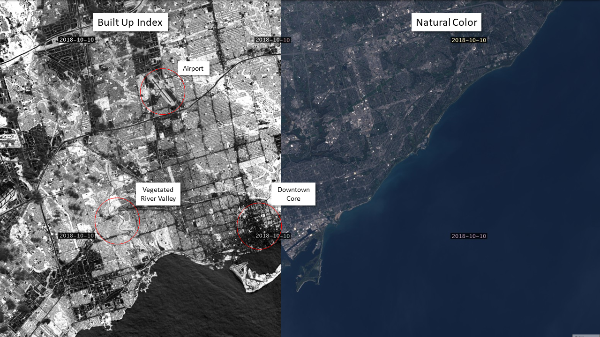

# Build Up Index Script

<a href="#" id='togglescript'>Show</a> script or [download](script.js){:target="_blank"} it.


      


## Evaluate and visualize
 - [Sentinel Playground](https://apps.sentinel-hub.com/sentinel-playground/?source=L8&lat=43.67072749862282&lng=-79.36901092529297&zoom=12&preset=CUSTOM&layers=B01,B02,B03&maxcc=20&gain=1.0&gamma=1.0&time=2018-12-01%7C2019-06-07&atmFilter=&showDates=false&evalscript=LyoKQXV0aG9yOiBLYXJsIENoYXN0a28KKi8KCmxldCBuZHZpID0gKEIwNSAtIEIwNCkgLyAoQjA1ICsgQjA0KTsKCmxldCBuZGJpID0gKEIwNiAtIEIwNSkgLyAoQjA2ICsgQjA1KTsKCmxldCBCVSA9IChuZHZpIC0gbmRiaSkKCnJldHVybltCVV07Cg%3D%3D){:target="_blank"}    
 - [EO Browser](https://apps.sentinel-hub.com/eo-browser/?lat=43.6531&lng=-79.3621&zoom=12&time=2019-05-06&preset=CUSTOM&datasource=Landsat%208%20USGS&layers=B01,B02,B03&evalscript=LyoKQXV0aG9yOiBLYXJsIENoYXN0a28KKi8KCmxldCBuZHZpID0gKEIwNSAtIEIwNCkgLyAoQjA1ICsgQjA0KTsKCmxldCBuZGJpID0gKEIwNiAtIEIwNSkgLyAoQjA2ICsgQjA1KTsKCmxldCBCVSA9IChuZHZpIC0gbmRiaSkKCnJldHVybltCVV07Cg%3D%3D){:target="_blank"} 

## General description of the script

This is a simple script used to visualize and automatically map urban/built-up areas using NDVI and NDBI indices. This method works well for identifying urban areas during summer months but is less effective during periods of snow cover. Typically lower values represent developed land and higher values represent vegetation. This index is great for monitoring urban development through time and estimating the percent of impervious surfaces in urban areas.

## Author of the script

Karl Chastko

## Description of representative images

Toronto Ontario Canada developed areas shown in dark grey, vegetation shown in white/light grey.

## Credits

Y. Zha, J. Gao & S. Ni (2003) Use of normalized difference built-up index in automatically mapping urban areas from TM imagery, International Journal of Remote Sensing, 24:3, 583-594, DOI: 10.1080/01431160304987
