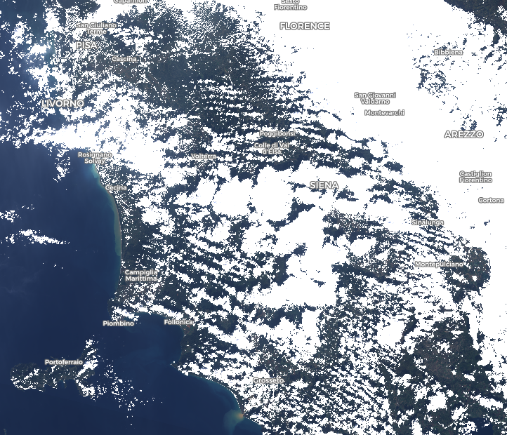
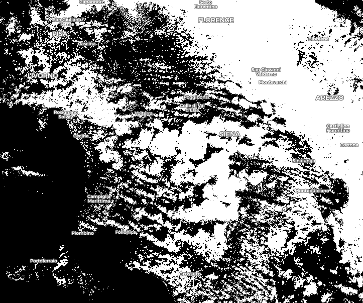
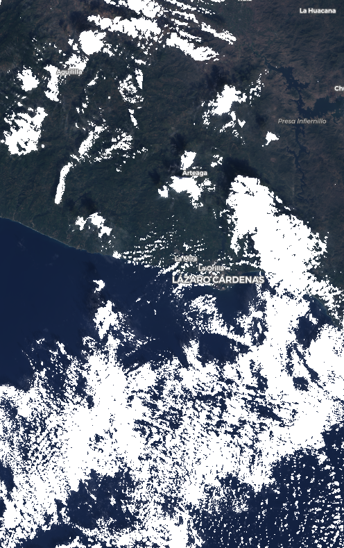

# Landsat 8 Clouds Segmentation Script

<a href="#" id='togglescript'>Show</a> script or [download](script.js){:target="_blank"} it.


      


## Evaluate and visualize   
 - [EO Browser](https://apps.sentinel-hub.com/eo-browser/?zoom=9&lat=43.69369&lng=4.89441&themeId=DEFAULT-THEME&datasetId=AWS_L8L1C&fromTime=2020-09-19T00%3A00%3A00.000Z&toTime=2020-09-19T23%3A59%3A59.999Z&visualizationUrl=https%3A%2F%2Fservices.sentinel-hub.com%2Fogc%2Fwms%2F950dce10-3931-4504-9376-f64772c7d151&evalscript=Ci8vIDEtIGRlZmluaXRpb24gb2YgbWF0aCBmdW5jdGlvbnMKdmFyIGFicyA9IE1hdGguYWJzOwp2YXIgY2VpbGluZyA9IE1hdGguY2VpbDsKdmFyIGNvcyA9IE1hdGguY29zOwp2YXIgZXhwID0gTWF0aC5leHA7CnZhciBmbG9vciA9IE1hdGguZmxvb3I7CnZhciBsb2cgPSBNYXRoLmxvZzsKdmFyIHNpbiA9IE1hdGguc2luOwp2YXIgc3FydCA9IE1hdGguc3FydDsKdmFyIHRydW5jYXRlID0gTWF0aC50cnVuYzsKdmFyIHJvdW5kPU1hdGgucm91bmQ7CgovLyAyLSBkZWZpbml0aW9uIG9mIG91dHB1dCBjb2xvcnMgZm9yIHJlcHJlc2VudGF0aW9uIG9mIHBpeGVscyAoY2FuIGJlIG1vZGlmaWVkKSAKdmFyIFdISVRFPSBbMSwxLDFdOwp2YXIgQkxBQ0sgPSBbMC4wLCAwLjAsIDAuMF07CnZhciBSR0IgPSBbMi41KkIwNCwyLjUqQjAzLDIuNSpCMDJdCnZhciBjdXN0b20gPSBbMi41KkIwMywyLjUqQjA0LDIuNSpCMDJdOyAvL3RoaXMgb25lIGNhbiBiZSBtb2RpZmllZCBhY2NvcmRpbmcgdG8gdXNlcidzIHdpc2ggCgovLyAzLSBhY3R1YWwgcmVwcmVzZW50YXRpb24gb2YgdGhlIHR3byBjbGFzc2VzIChjYW4gYmUgY2hhbmdlZCBhY2NvcmRpbmcgdG8gdXNlciB3aXNoKQp2YXIgY2xvdWQgPSBXSElURTsKdmFyIG5vX2Nsb3VkID0gUkdCOwoKLy8gNC0gZm9ybXVsYXMgZ2VuZXJhdGVkIGJ5IHRoZSBhbGdvcml0aG0gCi8vIGZvcm11bGEgZm9yIGZpcnN0IGNsYXNzIApmdW5jdGlvbiBvdXRwdXRfZmlyc3QoYmFuZDQsIGJhbmQ3LCBiYW5kMSkKewpyZXR1cm4gMi4xNjI0Njc0MTU5MzQxMiAtIDAuNzk2NDA5MTY1MDU0OTQ5KmJhbmQ0ICsgMC45NzE3NzY1MjAzMDI1ODcqc3FydChhYnMoMC4wMjg3MDIyMjAxODc2ODYqYmFuZDcqYmFuZDEgKyAwLjk3MTI5Nzc3OTgxMjMxNCpzaW4oYmFuZDEpKSkgKyAwLjAyMzU1OTkyOTgwODQ5OTMqZmxvb3IoMC45OTUyMjM5MjYxNDYzMzQqc3FydChhYnMoMC4wMjg3MDIyMjAxODc2ODYqYmFuZDcqYmFuZDEgKyAwLjk3MTI5Nzc3OTgxMjMxNCpzaW4oYmFuZDEpKSkgKyAwLjAwNDc3NjA3Mzg1MzY2NTk4KmFicygwLjAyODcwMjIyMDE4NzY4NipiYW5kNypiYW5kMSArIDAuOTcxMjk3Nzc5ODEyMzE0KnNpbihiYW5kMSkpKSAtIDAuMTgwMDMwOTA1MTM2NTUyKmNvcyhiYW5kNCkgKyAwLjAwNDY2MzU0OTg4ODkxMzQqYWJzKDAuMDI4NzAyMjIwMTg3Njg2KmJhbmQ3KmJhbmQxICsgMC45NzEyOTc3Nzk4MTIzMTQqc2luKGJhbmQxKSk7Cn07CgoKLy8gZm9ybXVsYSBmb3Igc2Vjb25kIGNsYXNzIApmdW5jdGlvbiBvdXRwdXRfc2Vjb25kKGJhbmQ3KQp7CnJldHVybiBiYW5kNzsKfTsKCi8vIDUtIHRyYW5zZm9ybWF0aW9uIG9mIGJhbmRzIHZhbHVlcyBpbnRvIDE2Yml0cyB2YWx1ZXMgCnZhciBCMDRfMTYgPSByb3VuZChCMDQqNjU1MzUpOwp2YXIgQjAxXzE2ID0gcm91bmQoQjAxKjY1NTM1KTsKdmFyIEIwN18xNiA9IHJvdW5kKEIwNyo2NTUzNSk7CgovLyA2LSBjb21wYXJpc29uIG9mIHRoZSB0d28gZm9ybXVsYXMgYW5kIHJldHVybiBvZiB0aGUgY2xhc3MgCmlmIChvdXRwdXRfZmlyc3QoQjA0XzE2LEIwN18xNiwgQjAxXzE2KSA8IG91dHB1dF9zZWNvbmQoQjA3XzE2KSkKewoJcmV0dXJuKG5vX2Nsb3VkKTsKfQplbHNlCnsKCXJldHVybihjbG91ZCk7Cn0K#custom-script){:target="_blank"} 

## General description of the script

This script enables highlighting clouds in the Landsat 8 images by applying the results of a machine learning model that performs segmentation / masking: it shows in WHITE the pixels that are considered as "cloud" and in RGB (or BLACK) the ones that are not.

More precisely, the script is the result of a binary classification model which classifies each individual pixel of an image into "cloud" or "no cloud" class, based on the intensity values measured for the 9 bands of the electromagnetic spectrum available in the Landsat 8 satellite sensor. The classification is obtained by comparing two mathematical formulas respectively corresponding to the two classes. These formulas are the results of a proprietary genetic algorithm which is the core of the Automated Machine Learning software called TADA, provided by the French company MyDataModels (https://www.mydatamodels.com/).

In that specific case, the two formulas are using the values of only three spectral bands - band 1 (Coastal/Aerosol), band 4 (Red) and band (SWIR2) - to perform the classification.

One can note that some advantages of this script are its ease of use, its interpretability (here it informs that the most important bands to segment clouds are Coastal/Aerosol, Red and SWIR2) and its low complexity enabling fast execution. 

Several applications can be envisioned for the use of this script. As an example, the script can be used to quickly look for cloudy (or unclouded) regions on Earth or to estimate cloud coverage in images in order to assess if they can be part of a database. For example, if one aims at collecting images to look at the vegetation on Earth, images with a high cloud coverage will not be useful and therefore not considered. Indeed, this "cloud contamination" is a well known problem for landscape studies and ways of identifying clouds are welcomed by the community (Irish et al. 2006, Hughes and Hayes 2014). Another application could be to apply image processing on images with clouds in order to either mitigate or enhance their intensity. Moreover, this kind of script could be directly embedded in a satellite to perform image selection (according to cloud coverage for example) directly on-board and therefore remove useless images. In particular, thanks to its simplicity, this script is quite easy to implement on embedded systems. 

To obtain the two formulas corresponding to the two classes, a genetic algorithm has been trained on a subset of around a hundred of 16-bits images from the Landsat 8 database. The training set was composed of 10000 observations (i.e pixels) described by nine values corresponding to the nine electromagnetic bands of Landsat 8 sensor. During the learning process, the algorithm tries to combine the variables (here the electromagnetic bands) and some constant values into rather simple mathematical formulas in order to explain the output variable (here the class of the pixel). This process enables the selection of the most relevant variables to perform the considered classification. In that case, from the nine available bands, only three have been found as relevant for the classification between "cloud" and "no cloud" (i.e bands 1, 4 and 7).

When a new pixel is considered, the output of the two formulas (output_first and output_second in the script) are computed according to the values of the electromagnetic bands for that pixel. Since the training of the model has been performed on 16-bits images (i.e values range from 0 to 65535) and the values available in EO browser range from 0 to 1, it is necessary to multiply them by 65535 before computing the outputs. Then, a comparison of the two outputs is performed to return the final classification and therefore the color of the pixel in the image (WHITE or RGB). Note that these colors can be changed according to the user's wish.

## Details of the script

The script should be applied to Landsat 8 images since it uses the values measured in the 9 spectral bands of the Landsat 8 sensor.

The biggest limitation of the script concerns its false predictions. First, false positive predictions are made on snow since the model is not totally able to distinguish between white clouds and snow. Actually, another script based on thermal infrared bands would have been able to clearly differentiate snow and clouds, but these bands are not available in the EO browser visualize tool. Indeed, two types of models have been generated using TIRS bands: a first one performing a binary classification between clouds and snow and another one performing multi classification for three classes: clouds, snow and others (i.e: land, water, etc). The latter is accurately able to distinguish between the different classes but unfortunately it can not be used in the EO browser.

Regarding false negative predictions, most of them are made on really thin clouds and on cloud borders. In order to improve this, a new model could be generated using more of this type of pixels in the training set. 

Here is a detailed description of the script (please refer to the different section in the script):

1) Definition of math functions: import of the math functions used in the two formulas; 

2) Definition of output colors: each color is represented by a list of 3 values corresponding to the RGB channels. Here are already defined WHITE, BLACK and RGB. The ìcustomî color is an example of another color and can be modified according to the userís wish;

3) Actual representation of the two classes: instantiation of a variable for each of the two classes and attribution of a color defined in 2). This part can also be modified according to the userís wish;

4) Formulas generated by the algorithm: the two formulas corresponding to the two classes are defined in two different functions. The arguments of these functions are the values of the spectral bands which are then combined in the formulas;

5) Transformation of bands values into 16-bits values: multiplication of the values of each band by 65365 to get 16-bits values comparable to the ones used to train the model;

6) Comparison of the two formulas and return of the class: the two functions defined in 4) are used to compute the output of the two formulas for the values of the spectral bands transformed into 16bits. The two outputs are compared and the predicted class (no cloud or cloud) is returned according to this comparison.

## Authors of the script

Ingrid Grenet, Houssem Farhat

## Description of representative images

This image is a screenshot of a *True Image* from the Landsat 8 (USGS archive) database dating from October 2020 and taken in the region of Siena in Italy.

This is the same image as image1 visualized using the custom script showing pixels predicted as *cloud* in white and pixels predicted as *no clouds* in RGB.

This is the same image as image1 visualized using the custom script showing pixels predicted as *clouds* in white and pixels predicted as *no clouds* in black.

This image is another screenshot of an image from the Landsat 8 (USGS archive) database taken in the region of Lazaro Cardenas in Mexico, in December 2018 and visualized as *True Color* in EO Browser.

This is the same image as image2 visualized using the custom script showing pixels predicted as *cloud* in white and pixels predicted as *no clouds* in RGB.

## References

[1] Irish, Richard R., John L Barker, Samuel N Goward, and Terry Arvidson. "Characterization of the Landsat-7 ETM+ Automated Cloud-Cover Assessment (ACCA) Algorithm" Photogrammetric engineering and remote sensing 72, no. 10 (2006): 1179-1188.

[2] Hughes, M. J.; Hayes, Daniel J. 2014. "Automated Detection of Cloud and Cloud Shadow in Single-Date Landsat Imagery Using Neural Networks and Spatial Post-Processing." Remote Sens. 6, no. 6: 4907-4926.

## Credits

This work is part of the CIAR project from Saint-ExupÈry Institute of Technological Research (www.irt-saintexupery.com). This project involves the following academic and industrial partners: ActiveEon, Avisto, Elsys Design, GEO4i, Inria, LEAT/CNRS, MyDataModels, Thales Alenia Space and TwinswHeel.
