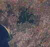
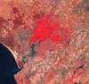

# Simple RGB Composites (Landsat 8)

## True Color

### RGB (4, 3, 2)

True color composite uses visible light bands red (B04), green (B03) and blue (B02) in the corresponding red, green and blue color channels, resulting in a natural colored result, that is a good representation of the Earth as humans would see it naturally.

Custom script: **return [B04, B03, B02];**

 - [Reference](https://landsat.gsfc.nasa.gov/landsat-8/landsat-8-bands/)
 
## False Color

### RGB (2,3,4)

False color imagery is displayed in a combination of standard near infra-red, red and green band. 
False color composite using near infrared, red and green bands is very popular. It is most commonly used to assess plant density and healht, as plants reflect near infrared and green light, while absorbing red. Since they reflect more near infrared than green, plant-covered land appears deep red. Denser plant growth is darker red. Cities and exposed ground are gray or tan, and water appears blue or black.

Custom script: **return [B02, B03, B04];**

 - [Reference](https://earthobservatory.nasa.gov/features/FalseColor/page6.php)

