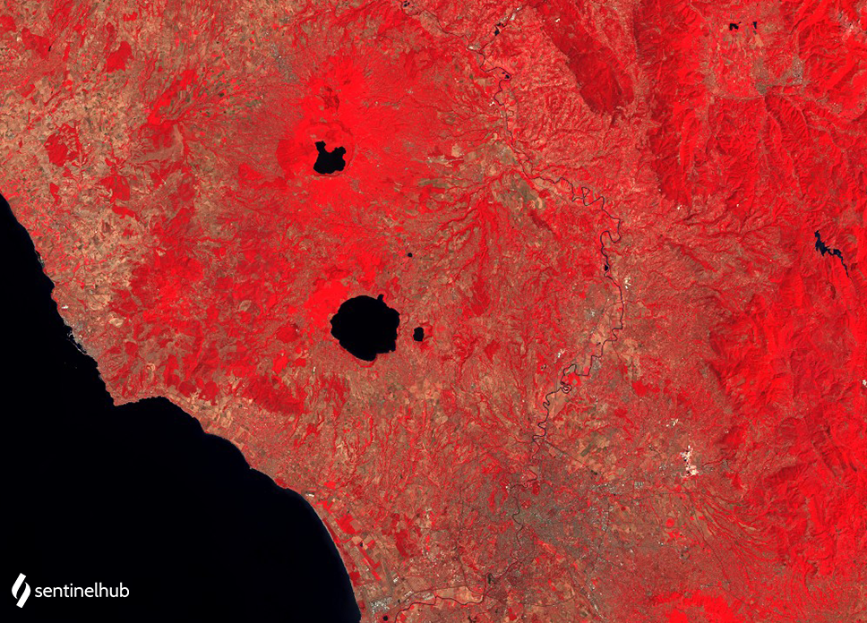

# Landsat 8 False Color Composite
<a href="#" id='togglescript'>Show</a> script or [download](script.js){:target="_blank"} it.





## Evaluate and visualize

- [EO Browser](https://sentinelshare.page.link/FUVS){:target="_blank"}   

## Description

This is a simple RGB composite with NIR band B05 in the red channel, red band B04 in the green channel and green band B03 in the blue channel. The script is useful for plant density and health monitoring, as vegetation (displayed in red) heavily reflects NIR light while absorbing red. Vegetation is colored red, cities and exposed ground are grey or tan, and water appears blue or black.

## Description of representative images

Landsat 8 false color composite of Rome. Acquired on 2020-07-30, processed by Sentinel Hub. 

 