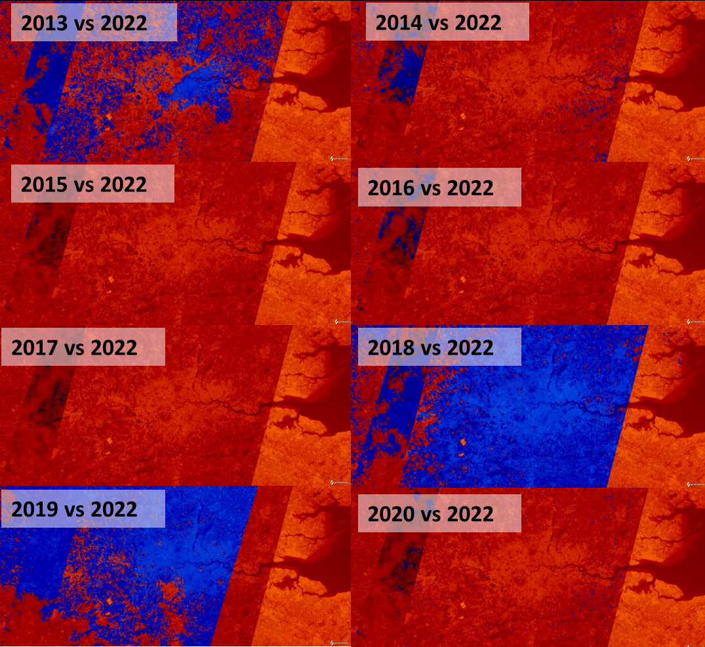
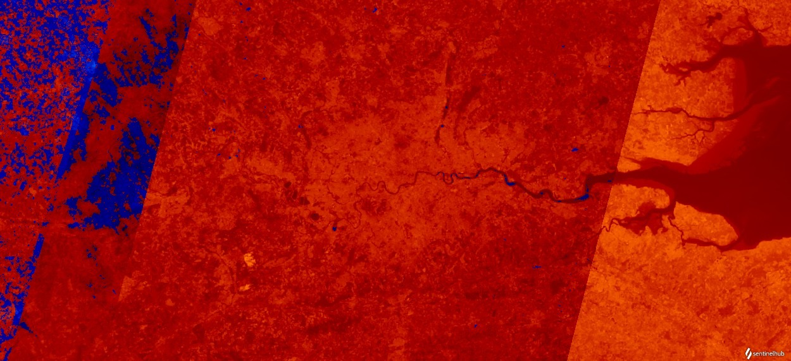
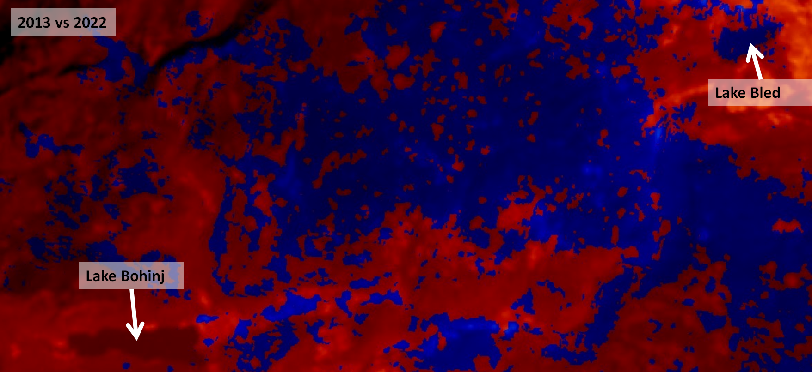
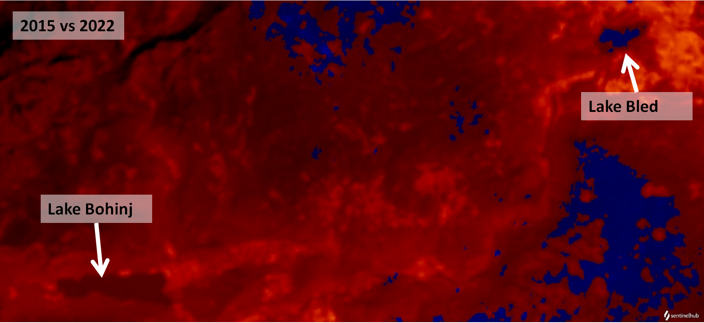
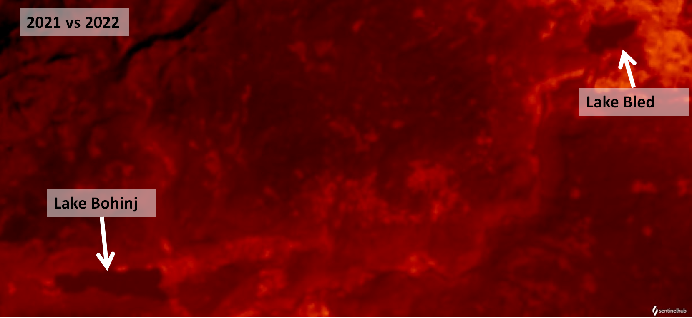

# Land Surface Temperature Comparison
<a href="#" id='togglescript'>Show</a> script or [download](script.js){:target="_blank"} it.
<div id='script_view' style="display:none">



</div>

## Evaluate and visualize

- [EO Browser - London, UK, comparing July of 2013 with July of 2022](https://sentinelshare.page.link/PYgA){:target="_blank"}   

## Description

### General description

The main purpose of the script is to compare maximum land surface temperature (LST) of a primary selected time period with one or multiple additional time periods. The result tells us if maximum LST was higher in primary or in any of the additional time periods. For every time period, an individual data source should be selected (primary or additional).

Climate change has an impact on extreme heat waves and record high temperatures, making them more frequent. For example, summer of 2022 brought record high temperatures in Europe. One can compare maximum LST for summer months of 2022 in relation to previous years for the period of the same months. In addition, maximum LST of two specific images can also be compared.

The script is a simplified version of the Land Surface Temperature Mapping Script [1] calculating only maximum LST for a selected time period or land surface temperature for a specific satellite image. Average and standard deviation LST are not included, as they have a problem of detecting cloud coverage into the calculation. In order to enable comparison of LST, the functionality of adding multiple data sources was used.

How exactly LST is calculated is explained in the Land Surface Temperature Mapping Script [1], which is based on multiple scientific articles [2,3,4]. Calculation is done on the basis of bands 4, 5 and 10. If the user chooses so, it can be also calculated on the basis of band 11 for Landsat 8 L1. Preselected coefficients and indices are used (surface roughness, NDVI, etc.). Nevertheless, user can adjust that according to the scene.

In this script, maximum LST is calculated for at least two instances of Landsat L8 data sources. The color of the output tells us if (maximum) LST was higher in primary (red) or additional data source(s) (blue). For each color a gradient is used in order to have visible areas with higher and lower LST.

### Applicabiltiy

The script is globally applicable. As the analysis is multi-temporal, it should be somewhat resilient to clouds, when there is s significant number of images with no cloud coverage. 

### False detection problems and limitations
LST calculation is based on preselected coefficients and indices, which are approximate in land type detection (bare soil, water, etc.). This then affects calculation of LST.

When comparing data sources with non-significant LST temperature differences, result on which data source for specific time period had higher maximum LST can be mixed. This could be because of already mentioned approximate land type detection. In addition, there could be also other reasons. Usage of this script is limited by how many images are actually available and in which part of the day satellite recorded the image. This means short heat wave could be easily missed, image was not recorded at the hour of the peak for specific day or it was recorded right after a short storm which cooled down surface. This was not tested, but probably fires and snow coverage affect the result as well.

Also if in selected time period there are only images with cloud cover, script is not applicable.

Script should easily work with 2 data sources and for both selected timespan of 1 year. User can also add as many additional data source as they want. However, we it was not tested what is the limit of OE Browser.

Even with mentioned limitations script can be used at least for fast comparison of (maximum) LST between selected periods as a basis for further detailed analysis.

### How the script works
In EO Browser, the user must select Landsat 8-9 source, preferably L1, but also L2 can be used. At least one additional data source must be added for Landsat 8-9. For all data sources, a desired time period is selected, to compare maximum LST. Alternately, users can also compare specific images (non multitemporal) or even a mix of both - LST from a single image with the maximum LST for a specific time period.

The user then configures settings in the script. Below is an example of primary and one additional data source.

```javascript
var dataSourcesNames = ["LOTL1", "LOTL1-1"];
```

Primary data source should be element “0” of the above list!

The next option is band selection for calculation of LST. B10 is usually used:

```javascript
var band = "B10";
```

However for Landsat 8 L1, B11 could be used as well. 

The last setting is the expected minimum and maximum temperature of the scene. For example, if analysis would be for summer months, settings could be:

```javascript
var minC = 0;
var maxC = 60;
```

This affects the color generation for the output.

Optionally, user can also adjust coefficients and indices (NDVI, emissivity, etc.).

The script loops through all the available samples for each data source. It includes some filtering for invalid data (bands values limits, data mask of the source). LST is calculated for each sample. In each iteration it checks if current LST is higher than the maximum LST from the previous part of the loop. If so, this becimes the new maximum LST. At the end of the samples loop, the maximum LST values for each data source are saved to an array. If maximum LST is in the primary data source, maximum LST of the primary data source will be shown in the output as a red gradient. Otherwise, if the maximum LST is equal or lower in an additional data source(s), the output will be the maximum LST of the additional data source in blue gradient. If there are multiple additional data sources, it can't be known from the image which additional data source (data period) has the maximum LST.

## Description of representative images

**London, UK**

_Landsat 8-9 L1, July 2013-2022_

The highest temperature was observed at Heathrow Airport on 19.7.2022. On the basis of this information, the maximum LST can be compared for the July 2022 (primary data source) with the maximum LST in July for previous years.

_EO Browser settings:_

- timespan for the primary data source: 2022-07-01 – 2022-07-31
- timespan for the additional data source: July for years 2013 to 2020

_Input parameters of the script:_

```javascript
var dataSourcesNames = ["LOTL1", "LOTL1-1"];
var band = "B10";
var minC = 0;
var maxC = 60;
```

Generally, it is expected that the output would be a red gradient, which would mean that the maximum LST was in 2022. However, as there were also other heat waves present from 2013 till 2020, that is not always the case. In addition, as explained in the _limitations_ chapter of the script, the preselected coefficients and not-available satellite images at the peak can also affect the result.

Comparing with an additional data source for July:

- 2013: In July 2013 there was a heat wave. Therefore, we can see mixed maximum LST, some from 2013 (blue) and some from 2022 (red). In addition, it can be seen on the right of the image that other pass of the satellite indicates maximum temperatures only for 2022. As mentioned, this is probably an effect of limitations related to data availability.
- 2014, 2015, 2016, 2017, 2020: Maximum LST from 2022 is predominant (red)
- 2018: UK experienced a heat wave, where for many areas in UK, temperatures exceeded 30 C for over 15 days in a row. This could be one reason for the predominantly maximum LST for 2018 (blue). However, again as in 2013, we can see on the right side of the image another pass of the satellite, where maximum LST from 2022 is predominant (red).
- 2019: Till 2019, temperature records were broken in many locations in the UK. Therefore, as temperature differences between 2019 in 2022 is not significant, we can see a predominant maximum LST from 2019. And again we can see on the right side of the image a predominant maximum LST from 2022.



- 2021 (image below)– the maximum LST from 2022 is predominant (red). An exception is the left side of the scene, which could be an effect of the script limitations.



From the analysis above, it could be said that just looking at the comparison of maximum LST, July had the highest temperatures in 2013, 2018, 2019 and 2022.

**Lake Bohinj & Lake Bled, Slovenia**

_Landsat 8-9 L1, July and August 2013-2022._

As for the rest of the Europe, summer 2022 brought an extreme heat wave to Slovenia as well. The monthly mean temperature of Lake Bohinj was measured as the highest in the time period between 1939 and 2022 [11]. The focus of this example is therefore to compare maximum LST of 2022 with previous years in July and August. As there is Lake Bled nearby, that one was also added to the example.

_EO Browser settings:_
- timespan for primary data source: 2022-07-01 – 2022-08-31
- timespan for additional data source: July and August for years 2013 to 2020

_Input parameters of the script:_

```javascript
var dataSourcesNames = ["LOTL1", "LOTL1-1"];
var band = "B10";
var minC = 15;
var maxC = 50;
```

In 2013 there was an extreme heat wave. The comparison of maximum LST between 2013 and 2022 shows that Lake Bohinj had higher temperatures in 2022 (image below). 



However, for Lake Bled the opposite is true; higher temperatures were in 2013. In addition, the surrounding non-water surface is split between higher temperature in 2022 (red) and higher temperature in 2013 (blue). A similar situation occurs when comparing 2015 with 2022 (image below). 



A comparison with other years (2014-2020) shows predominantly higher maximum LST in year 2022, as shown in the example for 2021 (image below).

Part of the reason for high temperatures of Lake Bohinj in 2022 is also amount of snowfall in mountains [11]. This means less melted water in the watershed of Lake Bohinj and faster warming of the lake in spring. "



## Author of the script
- Mohor Gartner

## Credits
- [1] Gartner, M. 2018. Land Surface Temperature (LST) Mapping Script. https://custom-scripts.sentinel-hub.com/custom-scripts/landsat-8/land_surface_temperature_mapping/
- [2] Avdan, U., Kaplan, G. J., 2016. Algorithm for Automated Mapping of Land Surface Temperature Using LANDSAT 8 Satellite Data. Journal of Sensors. 2016. 1-8. 10.1155/2016/1480307. Online: https://www.researchgate.net/publication/296414003_Algorithm_for_Automated_Mapping_of_Land_Surface_Temperature_Using_LANDSAT_8_Satellite_Data.
- [3] Orhan, O., Yakar, M., 2016. Investigating Land Surface Temperature Changes Using Landsat Data in Konya, Turkey. Online: https://www.int-arch-photogramm-remote-sens-spatial-inf-sci.net/XLI-B8/285/2016/isprs-archives-XLI-B8-285-2016.pdf.
- [4] Salih, M. M., Jasim, O. Z., Hassoon, K. I., Abdalkadhum, A. J., 2018. Land Surface Temperature Retrieval from LANDSAT-8 Thermal Infrared Sensor Data and Validation with Infrared Thermometer Camera. Online: https://www.researchgate.net/publication/331047755_Land_Surface_Temperature_Retrieval_from_LANDSAT-8_Thermal_Infrared_Sensor_Data_and_Validation_with_Infrared_Thermometer_Camera.

## References

- [5] UK Breaks record for highest temperature as Europe sizzles. https://apnews.com/article/wildfires-france-fires-london-england-b9bc07c1685b76ddf377b65f19fb811b
- [6] Climate of London. https://en.wikipedia.org/wiki/Climate_of_London.
- [7] This July hottest month on record in Ljubljana. https://sloveniatimes.com/temperatures-could-climb-to-39c-as-heat-wave-peaks-on-saturday/
- [8] Ljubljana weather records. https://www.extremeweatherwatch.com/cities/ljubljana
- [9] Arhiv podatkov ARSO. https://meteo.arso.gov.si/met/.
- [10] List of heat waves. https://en.wikipedia.org/wiki/List_of_heat_waves.
- [11] Temperature Bohinjskega jezera v četrtek znašala kar 26,6 stopinje Celzija. https://n1info.si/novice/slovenija/temperatura-bohinjskega-jezera-v-cetrtek-znasala-kar-266-stopinje-celzija/ 
