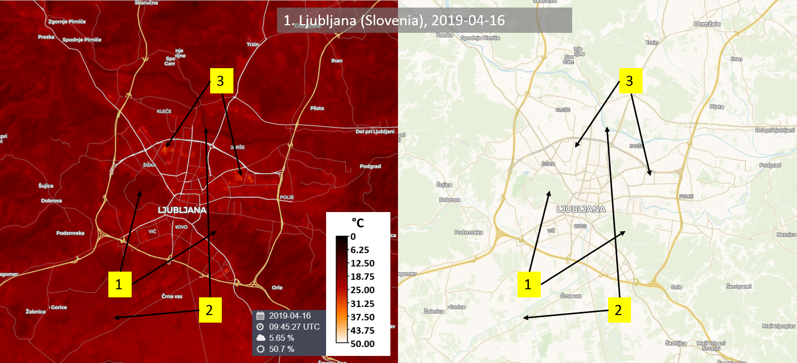
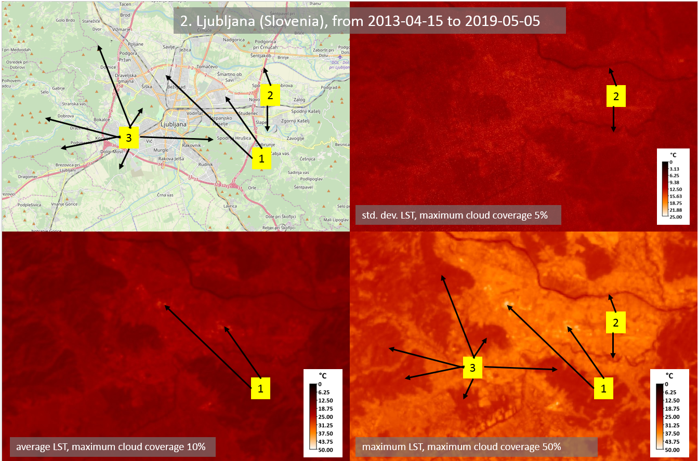

# Land Surface Temperature (LST) Mapping Script

<a href="#" id='togglescript'>Show</a> script or [download](script.js){:target="_blank"} it.


      


## Evaluate and visualize
 - [Sentinel Playground temporal](https://apps.sentinel-hub.com/sentinel-playground-temporal/?source=L8&lat=46.054054112443815&lng=14.525642395019531&zoom=12&preset=CUSTOM&layers=B01,B02,B03&maxcc=20&gain=1.0&gamma=1.0&time=2013-01-01%7C2019-04-16&atmFilter=&showDates=false&evalscript=LyoKQXV0aG9yOiBNb2hvciBHYXJ0bmVyCiovCgp2YXIgYmFuZD0iQjEwIjsKCnZhciBvcHRpb24gPSAwOwoKdmFyIG1pbkMgPSAwOwp2YXIgbWF4QyA9IDUwOwoKdmFyIE5EVklzPTAuMjsKdmFyIE5EVkl2PTAuODsJCgp2YXIgd2F0ZXJFPTAuOTkxOwp2YXIgc29pbEU9MC45NjY7CnZhciB2ZWdldGF0aW9uRT0wLjk3MzsKdmFyIEM9MC4wMDk7Cgp2YXIgYkNlbnQ9IChiYW5kPT0iQjEwIikgPyAwLjAwMDAxMDg5NSA6IDAuMDAwMDEyMDA1OwoKdmFyIHJobz0wLjAxNDM4OyAvLyBtIEsKCmlmIChvcHRpb249PTIpIHsKCW1pbkMgPSAwOwoJbWF4QyA9IDI1OwkKfQpsZXQgdml6ID0gQ29sb3JHcmFkaWVudFZpc3VhbGl6ZXIuY3JlYXRlUmVkVGVtcGVyYXR1cmUobWluQywgbWF4Qyk7CgoKZnVuY3Rpb24gc2V0dXAgKGRzcykgewoJc2V0SW5wdXRDb21wb25lbnRzKFtkc3MuQjAzLGRzcy5CMDQsZHNzLkIwNSxkc3MuQjEwLGRzcy5CMTFdKTsKCXNldE91dHB1dENvbXBvbmVudENvdW50KDMpOwp9CgpmdW5jdGlvbiBMU0VjYWxjKE5EVkksUHYpIHsKCXZhciBMU0U7CglpZiAoTkRWSSA8IDApIHsKCQkvL3dhdGVyCgkJTFNFPXdhdGVyRTsKCX0gZWxzZSBpZiAoTkRWSSA8IE5EVklzKSB7CgkJLy9zb2lsCgkJTFNFPXNvaWxFOwoJfSBlbHNlIGlmIChORFZJID4gTkRWSXYpIHsKCQkvL3ZlZ2V0YXRpb24KCQlMU0U9dmVnZXRhdGlvbkU7Cgl9IGVsc2UgewoJCS8vbWl4dHVyZXMgb2YgdmVnZXRhdGlvbiBhbmQgc29pbAoJCUxTRT12ZWdldGF0aW9uRSpQditzb2lsRSooMS1QdikrQzsgCgl9CglyZXR1cm4gTFNFOwp9CgpmdW5jdGlvbiBldmFsdWF0ZVBpeGVsKHNhbXBsZXMpIHsKCXZhciBMU1RtYXg9LTk5OTsKCXZhciBMU1Rhdmc9MDsKCXZhciBMU1RzdGQ9MDsKCXZhciByZWR1Y2VOYXZnPTA7CQoJdmFyIE49c2FtcGxlcy5sZW5ndGg7CgkKCXZhciBMU1RhcnJheSA9IFtdOwoJCglmb3IgKHZhciBpPTA7aTxOO2krKykgewoJCXZhciBCaT0gKGJhbmQ9PSJCMTAiKSA%2FIHNhbXBsZXNbaV0uQjEwIDogc2FtcGxlc1tpXS5CMTE7CgkJdmFyIEIwM2kgPSBzYW1wbGVzW2ldLkIwMzsKCQl2YXIgQjA0aSA9IHNhbXBsZXNbaV0uQjA0OwoJCXZhciBCMDVpID0gc2FtcGxlc1tpXS5CMDU7CQkKCQkKCQlpZiAoKEJpPjE3MyAmJiBCaTw2NTAwMCkgJiYgKEIwM2k%2BMCAmJiBCMDRpPjAgJiYgQjA1aT4wKSkgewoJCS8vIG9rIGltYWdlCgkJCS8vMSBLZWx2aW4gdG8gQwoJCQl2YXIgYjEwQlRpPUJpLTI3My4xNTsJCQkKCQkJLy8yIE5EVkkgLSBOb3JtYWxpemVkIERpZmZlcmVuY2UgdmVnZXRhdGlvbiBJbmRleAoJCQl2YXIgTkRWSWk9KEIwNWktQjA0aSkvKEIwNWkrQjA0aSk7CQkJCgkJCS8vMyBQViAtIHByb3BvcnRpb25hbCB2ZWdldGF0aW9uCgkJCXZhciBQVmk9TWF0aC5wb3coKChORFZJaS1ORFZJcykvKE5EVkl2LU5EVklzKSksIDIpOwkJCQoJCQkvLzQgTFNFIGxhbmQgc3VyZmFjZSBlbW1pc2l2aXR5CQoJCQl2YXIgTFNFaT1MU0VjYWxjKE5EVklpLFBWaSk7CQkJCgkJCS8vNSBMU1QKCQkJdmFyIExTVGk9KGIxMEJUaS8oMSsoKChiQ2VudCpiMTBCVGkpL3JobykqTWF0aC5sb2coTFNFaSkpKSk7CgkJCQoJCQkvLy8vdGVtcG9yYXJ5IGNhbGN1bGF0aW9uCgkJCS8vYXZnCgkJCUxTVGF2Zz1MU1RhdmcrTFNUaTsJCQkKCQkJLy9tYXgKCQkJaWYgKExTVGk%2BTFNUbWF4KSB7TFNUbWF4PUxTVGk7fQkJCQoJCQkvL2FycmF5CgkJCUxTVGFycmF5LnB1c2goTFNUaSk7CQkJCgkJfSBlbHNlIHsKCQkvLyBpbWFnZSBOT1Qgb2sKCQkJKytyZWR1Y2VOYXZnOwoJCX0JCQoJfQoJTj1OLXJlZHVjZU5hdmc7CgkKCUxTVGF2Zz1MU1RhdmcvTjsKCQoJZm9yICh2YXIgaT0wO2k8TFNUYXJyYXkubGVuZ3RoO2krKykgewoJCUxTVHN0ZD1MU1RzdGQrKE1hdGgucG93KExTVGFycmF5W2ldLUxTVGF2ZywgMikpOwoJfQkKCUxTVHN0ZD0oTWF0aC5wb3coTFNUc3RkLyhMU1RhcnJheS5sZW5ndGgtMSksIDAuNSkpOwoJCglsZXQgb3V0TFNUPSAob3B0aW9uPT0wKQoJCT8gTFNUYXZnCgkJOiAob3B0aW9uPT0xKQoJCQk%2FIExTVG1heAoJCQk6IExTVHN0ZDsKCQoJcmV0dXJuIHZpei5wcm9jZXNzKG91dExTVCk7Cn0%3D&temporal=true){:target="_blank"}     
 - [EO Browser](https://tinyurl.com/yxgnfmxs){:target="_blank"} 

## General description of the script

The goal of the script is to define land surface temperature (LST) by using data from Landsat 8. EO Browser already has Thermal rendering, however, only brightness temperature (BT) in Kelvin temperature is calculated [Sentinel Hub Forum, 2018](https://forum.sentinel-hub.com/){:target="_blank"}. Additional steps are required for LST retrieval. Salih et al. (2018) and Avdan & Kaplan (2016) have detailed description of steps with a general flowchart (in mentioned articles, Figure 5 and Figure 1). In the process, Landsat bands 4, 5, 10 (and 11) are used. In addition, values for C (surface roughness), NDVI (vegetation, soil) and average emissivity of terrestrial materials are preselected to enable calculation of LST for this custom script. However, for better results, later values should be adjusted accordingly to the specific area of analysis. Therefore, before using this custom script, the user could first analyze the specific area and adjust values accordingly.

The script can be used on a single image (EO Browser) or in the multi-temporal analysis. For later, there are 3 options (var option = 0, 1 or 2) on output values of LST for the selected timeline: average, maximum or standard deviation. In case of a single image or multi-temporal average and standard deviation analysis, cloud coverage should be as low as possible, e.g. at least 10% or if possible, lower. Here would be an option to improve this script and add (existing) cloud detection algorithm, which would improve results.

As described, the output of the script is simple. If multi-temporal input could request date-time stamp and Landsat 8 data would have representative samples for all seasons, yearly comparisons and trends could be analyzed directly by a custom script. In addition, if OE Browser could calculate the average value for the whole analyzed area, this script could be modified to identify urban heat islands (El-Hattab et al., 2018). Nevertheless, the script can be a tool to prepare data for later-described analysis. It could be used as part of analysis of already mentioned articles (Salih et al., 2018; Avdan & Kaplan 2016; Orhan & Yakar, 2016; Xiaolei et al., 2014; Saleh, 2018; Mehebud et al., 2016; El-Hattab et al., 2018) and any other research, which needs LST calculation from Landsat 8 data.

This script can be used globally as long as low % cloud images are available.

As mentioned, all examples are analyzed with preselected values of surface roughness, NDVI (vegetation, soil) and emissivity. In addition, examples were analyzed only with band 10.

## Author of the script

Mohor Gartner

## Description of representative images

1. Ljubljana (Slovenia)

Ljubljana is the capital of Slovenia. In OE Browser, the area was analyzed for the image on 16.4.2019. Vegetation coverage on the west (Roznik) and east (Golovec) can be clearly seen as it has lower LST as other areas of the city (1). The lowest LST values are seen on rivers Sava and Ljubljanica (2). The highest LST is on areas with least vegetation and most asphalt and concrete surfaces as there are shopping and business zones (3).

2. Ljubljana (Slovenia)

Area of Ljubljana city was analyzed with multi-temporal processing from 15.4.2013 to 5.5.2019. Results are images with standard deviation, average and maximum LST values with 5%, 10% and 50% cloud coverage or less. Average and maximum LST values show for possible urban heat islands in the shopping and business zones of the city (1). Maximum and Standard deviation LST show quite distinctively rivers Sava and Ljubljanica (2). Maximum LST values also point out the vegetation areas in and around the city (3).

3. Florida (USA)

West Florida was analyzed with multi-temporal processing from 23.3.2013 to 5.5.2019. Results are images with Standard deviation, average and maximum LST values with 5%, 10% and 50% cloud coverage or less. Generally, we can distinguish various land covers with maximum LST. On the east, more urban areas are quite visible with high maximum LST values. Rivers, lakes and coastal area with wildlife have lower LST values as expected. Standard deviation values clearly show the influence of clouds on the variation of values. Consequently, it is expected that average LST values were quite influenced by cloud coverage, even though that is not obvious on the image with average LST values. In addition, standard deviation and average LST values are affected by the boundary of the image.

## References

Main theory to calculate land surface temperature:

[1] Avdan, U., Kaplan, G. J., 2016. Algorithm for Automated Mapping of Land Surface Temperature Using LANDSAT 8 Satellite Data. [Journal of Sensors. 2016. 1-8. 10.1155/2016/1480307](https://www.researchgate.net/publication/296414003_Algorithm_for_Automated_Mapping_of_Land_Surface_Temperature_Using_LANDSAT_8_Satellite_Data){:target="_blank"}.

[2] Orhan, O., Yakar, M., 2016. [Investigating Land Surface Temperature Changes Using Landsat Data in Konya, Turkey](https://www.int-arch-photogramm-remote-sens-spatial-inf-sci.net/XLI-B8/285/2016/isprs-archives-XLI-B8-285-2016.pdf){:target="_blank"}.

[3] Salih, M. M., Jasim, O. Z., Hassoon, K. I., Abdalkadhum, A. J., 2018. [Land Surface Temperature Retrieval from LANDSAT-8 Thermal Infrared Sensor Data and Validation with Infrared Thermometer Camera](https://www.researchgate.net/publication/331047755_Land_Surface_Temperature_Retrieval_from_LANDSAT-8_Thermal_Infrared_Sensor_Data_and_Validation_with_Infrared_Thermometer_Camera){:target="_blank"}.

Other helpful references:

[4] El-Hattab, M., Amany, S. M., Lamia, G.E., 2018. [Monitoring and assessment of urban heat islands over the Southern region of Cairo Governorate, Egypt](https://www.sciencedirect.com/science/article/pii/S1110982317301114#b0115){:target="_blank"}.

[5] Franzpc, 2018. [How to calculate Land Surface Temperature with Landsat 8 satellite images. GeoGeek by franzpc](https://geogeek.xyz/how-to-calculate-land-surface-temperature-with-landsat-8-images.html){:target="_blank"}.

[6] Mehebud, S., Raihan, A., Haroon, S., 2016. [Analyzing land surface temperature distribution in response to land use/land cover change using split window algorithm and spectral radiance model in Sundarban Biosphere Reserve, India](https://www.researchgate.net/publication/301797360_Analyzing_land_surface_temperature_distribution_in_response_to_land_useland_cover_change_using_split_window_algorithm_and_spectral_radiance_model_in_Sundarban_Biosphere_Reserve_India){:target="_blank"}.

[7] ResearchGate, 2015. [NDVI value to extract bare soil pixels for Landsat TM](https://www.researchgate.net/post/Can_anyone_help_me_to_define_a_range_of_NDVI_value_to_extract_bare_soil_pixels_for_Landsat_TM){:target="_blank"}.

[8] Saleh, A. M., 2018. [Land Surface Temperature Retrieval of Landsat-8 Data Using Split Window Algorithm-A Case Study of Mosul District. College of Agriculture /University of Baghdad](https://www.researchgate.net/publication/325260823_Land_Surface_Temperature_Retrieval_of_Landsat-8_Data_Using_Split_Window_Algorithm-A_Case_Study_of_Mosul_District){:target="_blank"}.

[9] Sentinel-Hub Forum, 2018. [Landsat Thermal](https://forum.sentinel-hub.com/t/landsat-thermal/489){:target="_blank"}.

[10] UW-Madison, 2019. [Vegetation Index ñ NDVI. Satellite Meteorlogy, Universoty of Wisconsin-Madison](http://profhorn.meteor.wisc.edu/wxwise/satmet/lesson3/ndvi.html){:target="_blank"}.

[11] Xiaolei, Y., Xulin G., Zhaocong W., 2014. [Land Surface Temperature Retrieval from Landsat 8 TIRSóComparison between Radiative Transfer Equation-Based Method, Split Window Algorithm and Single Channel Method. Department of Geography and Planning, University of Saskatchewan; School of Remote Sensing and Information Engineering](https://www.researchgate.net/publication/266909983_Land_Surface_Temperature_Retrieval_from_Landsat_8_TIRS-Comparison_between_Radiative_Transfer_Equation-Based_Method_Split_Window_Algorithm_and_Single_Channel_Method){:target="_blank"}.
