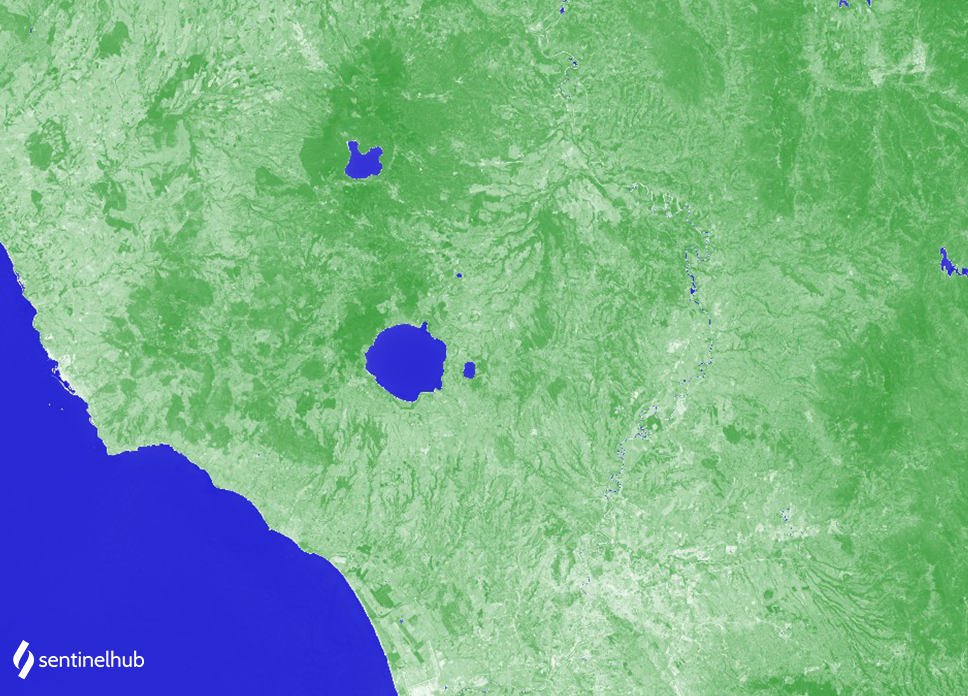

# Landsat 8 NDWI

<a href="#" id='togglescript'>Show</a> script or [download](script.js){:target="_blank"} it.





## Evaluate and Visualize

- [EO Browser](https://sentinelshare.page.link/RSLD)
 
## General description of the script
The NDWI is used to monitor changes related to water content in water bodies. As water bodies strongly absorb light in visible to infrared electromagnetic spectrum, NDWI uses green and near infrared bands to highlight water bodies. It is sensitive to built-up land and can result in over-estimation of water bodies. 

**NDWI = (GREEN - NIR) / (GREEN + NIR)**

For Landsat 7 ETM+, the index calculates as: 

**NDWI = (B03 - B05) / (B03 + B05)**

Values description: Index values greater than 0.5 usually correspond to water bodies. Vegetation usually corresponds to much smaller values and built-up areas to values between zero and 0.2.

See also [this page](https://custom-scripts.sentinel-hub.com/sentinel-2/ndwi/#).

## Description of representative images

The NDWI over Rome. Acquired on 2020-07-30.

