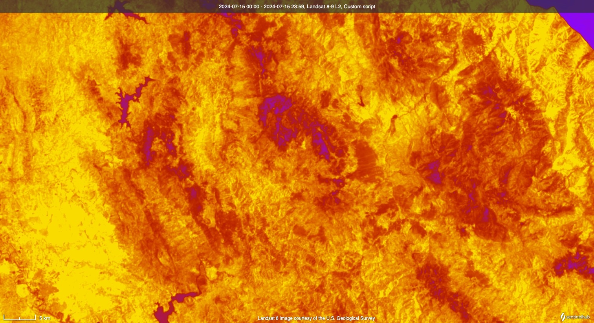

## General description

Since the inception of thermal imaging, infrared cameras have commonly employed a distinctive color palette, ranging from black to blue, magenta, orange, yellow, and culminating in bright white. This palette is frequently referred to as “Iron” or “Ironbow.” 

This script allows the visualisation of the thermal IR band of Landsat 8 (Band 10, centered on 10.895 µm) in a FLIR-like palette that was inspired by a StackOverflow post [1]. The script allows the adjustment of 3 parameters:

- **minValue**: The minimum value of the thermal band mapped to the black color.
- **maxValue**: The maximum value of the thermal band mapped to the white color.
- **numSteps**: The number of increments in the color palette.

The script returns the thermal band values in degrees Celsius, converted from Kelvin, for an easier interpretation. Furthermore, the script masks out clouds and cloud shadows using the QA band (BQA).

## Description of representative images

Thermal data over Morocco. Acquired on 15.07.2024.

## References
 [1] StackOverflow, [Thermal imaging palette](https://stackoverflow.com/questions/28495390/thermal-imaging-palette). Accessed on 19th September 2024.
