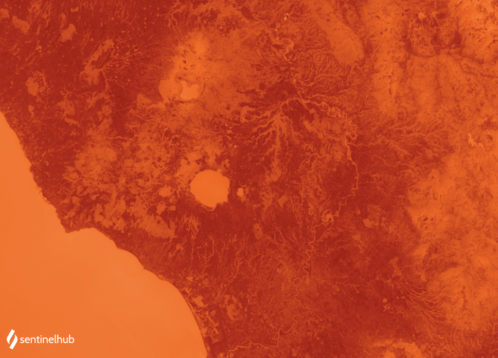

## Evaluate and visualize

- [EO Browser](https://sentinelshare.page.link/wRnZ){:target="_blank"}   

## Description

This thermal visualization is based on band 10. At the central wavelength of 10895 nm it measures in the thermal infrared, or TIR. Instead of measuring the temperature of the air, like weather stations do, band 10 reports on the ground itself, which is often much hotter. Thermal band 10 is useful in providing surface temperatures and is collected with a 100-meter resolution.

## Description of representative images

Landsat 8 thermal visualization of Rome. Acquired on 2020-07-30, processed by Sentinel Hub. 

 