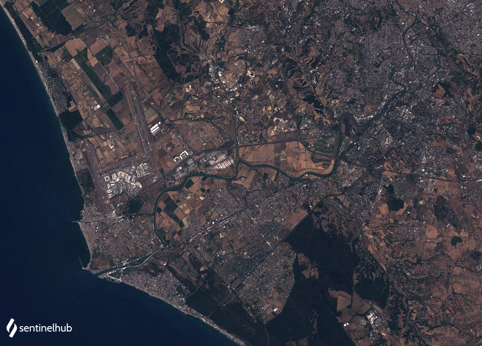

# Landsat 8 Pansharpened True Color
<a href="#" id='togglescript'>Show</a> script or [download](script.js){:target="_blank"} it.


      


## Evaluate and visualize

- [EO Browser](https://sentinelshare.page.link/BjFa){:target="_blank"}   

## Description

The true color product maps Landsat 8 band values B04, B03, and B02, which roughly correspond to red, green, and blue part of the electromagnetic spectrum, respectively, to R, G, and B components. The RGB bands with spectral resolution of 30 meters were pansharpened using the PAN band with spectral resolution of 15 meters. The result is a true color image with the resolution of 15 meters. The script can only be used with Landsat 8 Level 1, as Level 2 collection does not have a panchromatic band. 

## Description of representative images

Pansharpened true color image of Rome. Acquired on 2020-07-30, processed by Sentinel Hub. 

## References

-  [Landsat 8 bands](https://landsat.gsfc.nasa.gov/landsat-8/landsat-8-bands)
-  [Mapbox. Pansharpening for higher resolution in Landsat-live. Medium.](https://blog.mapbox.com/pansharpening-for-higher-resolution-in-landsat-live-e4717cd7c356)

 