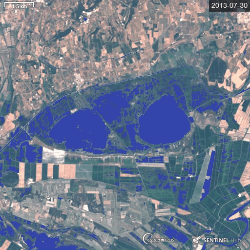

# Water In Wetlands Index - Landsat-8 Version

<a href="#" id='togglescript'>Show</a> script or [download](script.js){:target="_blank"} it.


      


## Evaluate and visualize   
 - [EO Browser](https://apps.sentinel-hub.com/eo-browser/?lat=43.61719&lng=4.33574&zoom=13&time=2020-02-24&preset=CUSTOM&datasource=Landsat%208%20USGS&layers=B01,B02,B03&evalscript=Ly8gRGV0ZWN0aW5nIHRoZSBQcmVzZW5jZSBvZiBXYXRlciBpbiBXZXRsYW5kcyB3aXRoIExhbmRzYXQtOCBTYXRlbGxpdGUgKGFiYnJ2LiBXSVcpCi8vCi8vIEdlbmVyYWwgZm9ybXVsYTogSUYgQjA1PDAuMTczNSBBTkQgQjA3PDAuMTAzNSBUSEVOIFdhdGVyIEVMU0UgTm9XYXRlcgovLwovLyBVUkwgaHR0cHM6Ly93d3cuaW5kZXhkYXRhYmFzZS5kZS9kYi94eHh4eHh4eHh4eHh4eHh4eHh4eHh4eHh4eHh4eHh4Ly8KCnJldHVybiBCMDU8MC4xNzM1JiZCMDc8MC4xMDM1P1s1MS8yNTUsNjgvMjU1LDE3MC8yNTVdOltCMDQqNSxCMDMqNSxCMDIqNV07CgovLyBjb2xvckJsZW5kIHdpbGwgcmV0dXJuIGEgYmx1ZSBjb2xvciB3aGVuIHN1cmZhY2Ugd2F0ZXIgaXMgZGV0ZWN0ZWQsIGFuZCBsaWdodGVuIHRvIGEgbmF0dXJhbCBjb2xvciB3aGVuIG5vIHdhdGVyIGlzIGRldGVjdGVk){:target="_blank"} 

## General description of the script

**Wetlands: vital and vanishing ecosystems**
Wetlands are dynamic, productive ecosystems that hold a significant part of the worldís biodiversity. They also contribute to human wellbeing in multiple ways, further offering nature-based solutions to manmade problems. In addition to holding 40% of the worldís species while occupying only 3% of the Earth surface, wetlands act as Natureís kidney by provisioning and purifying water; they contribute to reducing the level of atmospheric greenhouse gases fueling global heating; they prevent soil erosion and flood damage by dispersing and absorbing excess water; along the coast they buffer the land from waves and wind, being the first line of defence against the encroaching salt waters; they provision food stock by offering sheltered spawning, breeding and foraging areas to various shellfish, fish and game species. Yet, over 50% of wetlands have been lost over the last 50 years, mostly to agricultural and urban development, with climate change becoming an additional pressure.

**WIW: A remote-sensing tool to monitor Water In Wetlands**
Many wetlands are seasonal and their ability to provide people and planet with diverse critical services is tightly related to their inundation patterns. Against the urgent backdrop of a changing world and climate, we need to increase our capacity to routinely monitor key indicators of wetland health such as hydroperiod. A major shortcoming with current water indices is that they cannot detect water under vegetation cover and wetlands are often characterized by the presence of emergent plants of variable height and density (e.g. reed, bulrushes, cattails, Spartina, Salicornia, willow, etc.). To bridge this gap, we collected ground-truth data under various conditions of flooding and vegetation development at thousands of points in the Camargue wetland (RhÙne delta in southern France) and identified the reflectance values of the corresponding pixels from optical spectral bands of Landsat and Sentinel sensors. A data mining approach was used to identify the best match between ground-truth and optical-based data for predicting water presence/absence. The best classifier of water presence consisted of threshold values imposed to the near-infrared and shortwave infrared wavelengths, irrespective of the satellite sensor used:

Landsat 8 : WIW = NIR = 0.1735 and SWIR2 = 0.1035
Landsat 5, 7 : WIW = NIR = 0.1558 and SWIR2 = 0.0871
Sentinel 2 : WIW = NIR = 0.1804 and SWIR2 = 0.1131

Overall accuracy of the water maps built by applying the WIW ranged from 89% to 94% for both the training and validation samples. Sentinel 2 provided the highest performance with a kappa coefficient of 0.82 for both samples.

## Details of the script

**The WIW script**
The script allows one to generate water maps using the Water In Wetlands logical rule by featuring water in blue and other landscape features in natural colors.

**Applicability**
WIW is useful for mapping open-water areas and areas with water under vegetation cover.
Use of WIW with Landsat sensors can be used to collect long-term data (back to 1984) for monitoring wetland evolution. Use of WIW with Sentinel-2 sensors can help track short-term changes in water areas relative to rainfalls or floods. Considering the high temporal resolution of Sentinel 2 (every 5 days), cumulative water maps built using WIW can further be used for detecting a wide range of wetlands which are either periodically or permanently inundated.

**False detection problems and limitations**
Limitations are similar to those encountered with current indices for detecting surface waters: dark object (shadows) can be classified as water, whereas highly turbid water or those with strong waves causing foam at the surface can be misclassified as dry areas. These situations are, however, rarely encountered in seasonal shallow wetlands which are targeted by the WIW script.

## Authors of the script

WILLM Loïc, LEFEBVRE GaÎtan, DAVRANCHE AurÈlie, CAMPAGNA Julie, REDMOND Lauren, MERLE ClÈment, GUELMAMI Anis and POULIN Brigitte

## Description of representative images

Timelapse ChaSca: WIW timelapse at the largest reed marsh in southern France from July 2013 through June 2014 (monthly interval).

## References

[1] Lefebvre G., Davranche A., Willm L., Campagna J., Redmond L., Merle C., Guelmami A., Poulin B. 2019. [Introducing WIW for Detecting the Presence of Water in Wetlands with Landsat and Sentinel Satellites. Remote Sensing 11(19):18.](https://sentinels.copernicus.eu/web/sentinel/news/-/article/copernicus-sentinel-2-helps-track-changes-in-seasonal-water-of-wetlands){:target="_blank"} 
[DOI](http://dx.doi.org/10.3390/rs11192210){:target="_blank"}

## Credits

[1] Lefebvre G., Davranche A., Willm L., Campagna J., Redmond L., Merle C., Guelmami A., Poulin B. 2019. [Introducing WIW for Detecting the Presence of Water in Wetlands with Landsat and Sentinel Satellites. Remote Sensing 11(19):18.](https://sentinels.copernicus.eu/web/sentinel/news/-/article/copernicus-sentinel-2-helps-track-changes-in-seasonal-water-of-wetlands){:target="_blank"} 
[DOI](http://dx.doi.org/10.3390/rs11192210){:target="_blank"}

## Acknowledgments

The WIW script was developed within the ECOPOTENTIAL project, a H2020 European project under grant agreement No 642088.