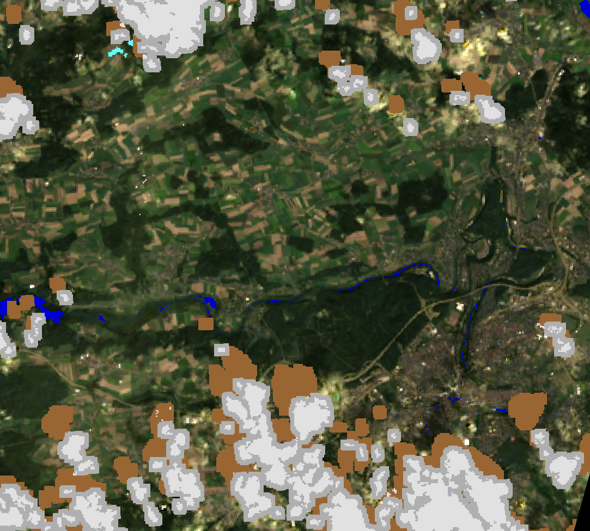

# Landsat 8 Band Quality Assessment Band
<a href="#" id='togglescript'>Show</a> script or [download](script.js){:target="_blank"} it.





## Evaluate and visualize

- [EO Browser](https://sentinelshare.page.link/uJnD){:target="_blank"}   

## Description

This script uses the `decodeL8C2Qa` [function](https://docs.sentinel-hub.com/api/latest/evalscript/functions/#landsat8c2qabandconditions) to decode the BQA band from Landsat 8/9 Collection 2. This is then split into 7 classes:
- Clear Pixels - returns the True Color image.
- Water - Dark Blue
- Snow - Pink
- Cloud - White
- Dilated Clouds - Gray
- Cloud Shadow - Brown
- Cirrus - Cyan

## Description of representative images

BQA class map of Bern. Acquired on 2022-09-01, processed by Sentinel Hub. 

## References

-  [Landsat 8 data users handbook](https://www.usgs.gov/media/files/landsat-8-data-users-handbook)
 
