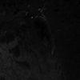
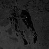
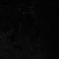
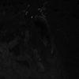
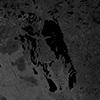
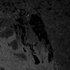
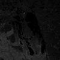

# MODIS Bands

 - [Refference](https://landsat.gsfc.nasa.gov/landsat-8/landsat-8-bands/}

## Band 1

### B01 (red)

- Resolution = 500m/px
- Wavelength = 620nm - 670nm
- Spectral Radiance = 21.8
- Required Signal-to-noise ratio = 128

Use: red light, used for Land/Cloud/Aerosols Boundaries

Custom script: ** return [B01];**

## Band 2

### B02 (Blue)

- Resolution = 500m/px
- Wavelength = 841nm - 876nm
- Spectral Radiance = 24.7
- Required Signal-to-noise ratio = 201

Use: Land/Cloud/Aerosols Boundaries

Custom script: ** return [B02];**

## Band 3

### B03 (blue)

- Resolution = 500m/px
- Wavelength = 459nm - 479nm
- Spectral Radiance = 35.3
- Required Signal-to-noise ratio = 243

Use: blue light, used for Land/Cloud/Aerosols Properties

Custom script: ** return [B03];**

## Band 4

### B04 (green)

- Resolution = 500m/px
- Wavelength = 545nm - 565nm
- Spectral Radiance = 29.0
- Required Signal-to-noise ratio = 228

Use: green light, used for Land/Cloud/Aerosols Properties

Custom script: ** return [B04];**

## Band 5

### B05

- Resolution = 500m/px
- Wavelength = 1230nm - 1250nm
- Spectral Radiance = 5.4
- Required Signal-to-noise ratio = 74

Use: Land/Cloud/Aerosols Properties

Custom script: ** return [B05];**

## Band 6

### B06

Resolution = 500m/px
Wavelength = 1628nm - 1652nm
Spectral Radiance = 7.3
Required Signal-to-noise ratio = 275

Use: Land/Cloud/Aerosols Properties

Custom script: ** return [B06];**

## Band 7

### B07

- Resolution = 500m/px
- Wavelength = 2105nm - 2155nm
- Spectral Radiance = 1.0
- Required Signal-to-noise ratio = 110

Use: Land/Cloud/Aerosols Properties

Custom script: ** return [B07];**

