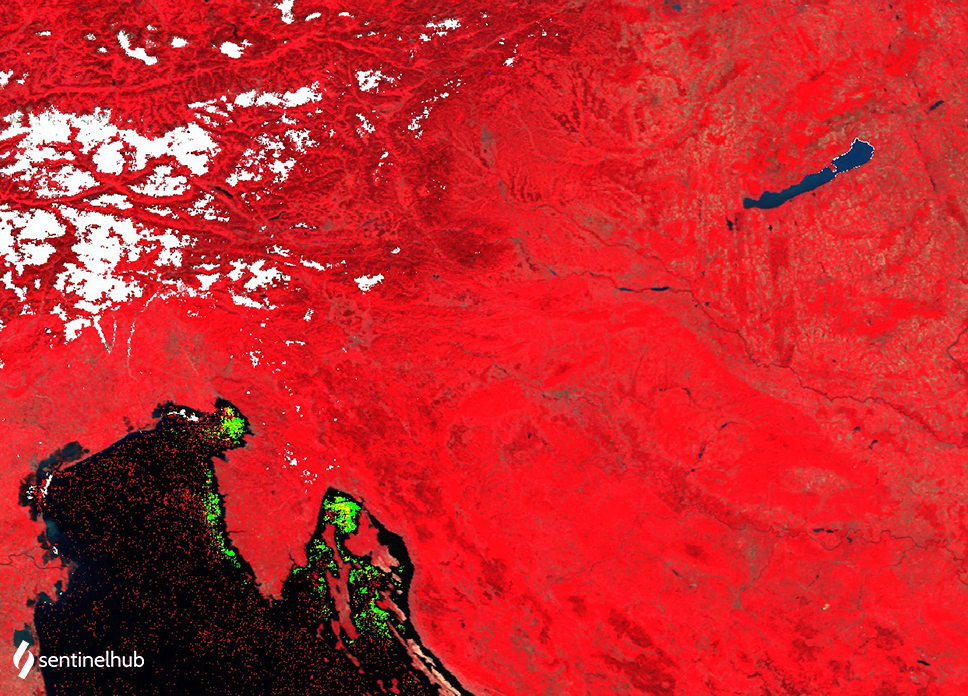

## Evaluate and visualize

- [EO Browser](https://sentinelshare.page.link/pkQi){:target="_blank"}   

## Description

This is a simple RGB composite with NIR band B02 in the red channel, red band B01 in the green channel and green band B04 in the blue channel. The script is useful for plant density and health monitoring, as vegetation (displayed in red) heavily reflects NIR light while absorbing red. The band 4 also penetrates atmospheric haze, and distinguishes between land and water. Cities and exposed ground are grey or tan, and water appears blue or black.

False color composite for MODIS: **B02, B01, B04**

## Description of representative images

MODIS false color composite of Europe. Acquired on 2021-08-02, processed by Sentinel Hub. 

 