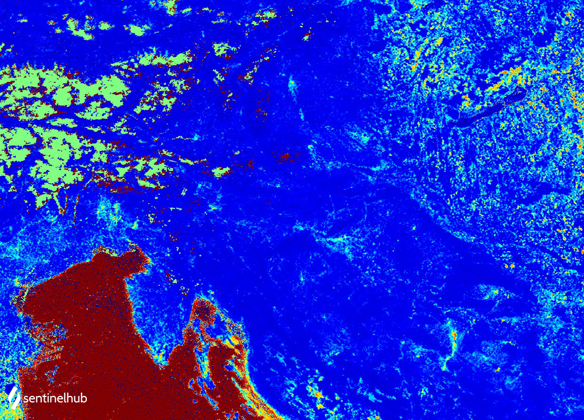

## Evaluate and visualize

- [EO Browser](https://sentinelshare.page.link/ptWU){:target="_blank"}   

## Description

The NDMI is a normalized difference moisture index, that uses NIR and SWIR bands to display moisture. 
The SWIR band reflects changes in both the vegetation water content and the spongy mesophyll structure in vegetation canopies, 
while the NIR reflectance is affected by leaf internal structure and leaf dry matter content but not by water content. 
The combination of the NIR with the SWIR removes variations induced by leaf internal structure and leaf dry matter content, improving the accuracy in retrieving the vegetation water content. 
The amount of water available in the internal leaf structure largely controls the spectral reflectance in the SWIR interval of the electromagnetic spectrum. 
SWIR reflectance is therefore negatively related to leaf water content. In short, NDMI is used to monitor changes in water content of leaves, and was [proposed by Gao.](https://www.sciencedirect.com/science/article/abs/pii/S0034425796000673){:target="_blank"}
NDMI is computed using the near infrared (NIR) and the short wave infrared (SWIR) reflectances:

**NDMI = (NIR - SWIR) / (NIR + SWIR)**

For MODIS, the NDMI is calculated using NIR band 2 and SWIR band 5: 

**NDMI = (B02 - B05) / (B02 + B05)**

{: .note}

NDWI index is often used synonymously with the NDMI index, often using NIR-SWIR combination as one of the two options. Gao, referenced above, also called the index NDWI. NDMI seems to be consistently described using NIR-SWIR combination. As the indices with these two combinations work very differently, with NIR-SWIR highlighting differences in water content of leaves, and GREEN-NIR highlighting differences in water content of water bodies, we have decided to separate the indices on our repository as NDMI using NIR-SWIR, and NDWI using GREEN-NIR.

## Description of representative images

MODIS NDMI of Europe. Acquired on 5. february of 2020, processed by Sentinel Hub. 

 
