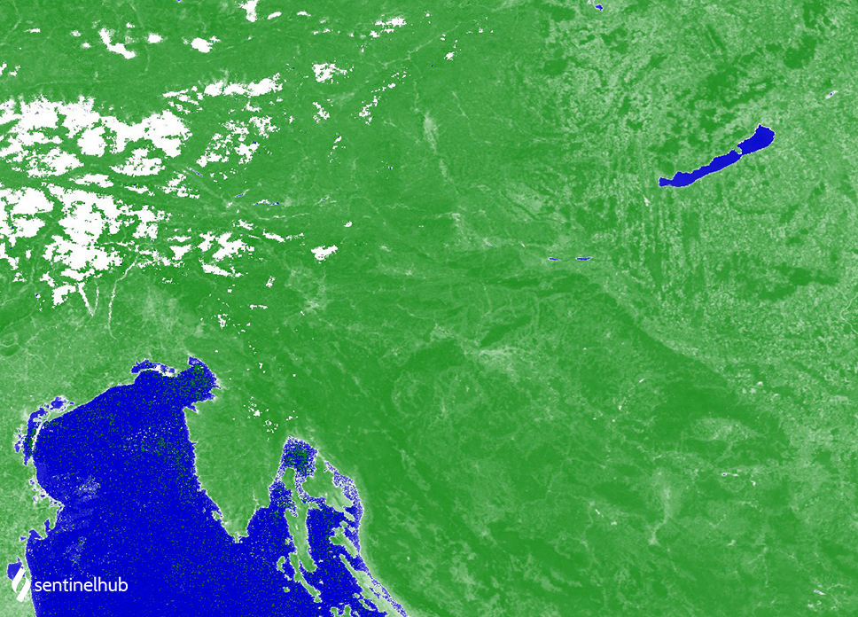

## Evaluate and visualize

- [EO Browser](https://sentinelshare.page.link/gZKV){:target="_blank"}   

## Description

The Normalized difference water index - NDWI is used to monitor changes related to water content in water bodies. As water bodies strongly absorb light in visible to infrared electromagnetic spectrum, NDWI uses green and near infrared bands to highlight water bodies. It is sensitive to built-up land and can result in over-estimation of water bodies.

NDWI = **(GREEN - NIR) / (GREEN + NIR)**

For MODIS, the index calculates as:

NDWI = **(B04 - B02) / (B04 + B02)**

Values description: Index values greater than 0.5 usually correspond to water bodies. Vegetation usually corresponds to much smaller values and built-up areas to values between zero and 0.2.

See also [this page](https://custom-scripts.sentinel-hub.com/sentinel-2/ndwi/).

## Description of representative images

MODIS NDWI of Europe. Acquired on 2021-08-02, processed by Sentinel Hub. 

 