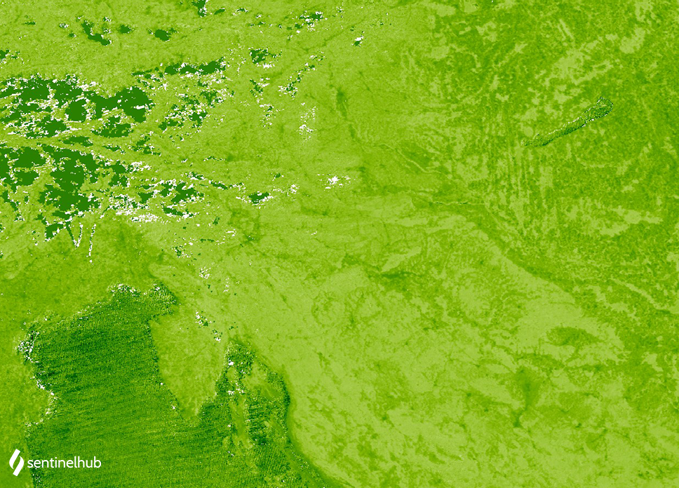

# MODIS Salinity Index

<button class="btn btn-primary" id="toggle-script" onclick="toggleScript()">Show Script</button>
[Download Script](script.js){: .btn target="_blank" download="{{paths | append: ".js"}}"}
{: .mt-lg-4 }

 




## Evaluate and visualize

- [EO Browser](https://sentinelshare.page.link/sBwx){:target="_blank"}   

## Description

The salinity index visualizes the amount of salt present in soils. Soil salinization is one of the most common land degradation processes, especially in arid and semi-arid regions, where precipitation exceeds evaporation.

Higher values indicate higher salinity and low values indicate lower salinity.

For MODIS, salinity index calculation, as proposed by the IndexDB, is calculated using SWIR16 band 6 and SWIR22 band 7: 

**NDVI = (B06 - B07) / (B06 + B07)**

## Description of representative images

MODIS salinity index of Europe. Acquired on 5. february of 2020, processed by Sentinel Hub. 

## References

- [Fouad Al-Khaier, 2003. Soil Salinity Detection Using Remote Sensing](https://webapps.itc.utwente.nl/librarywww/papers_2003/msc/wrem/khaier.pdf)
- [Normalized Difference Salinity Index](https://www.indexdatabase.de/db/i-single.php?id=57)

 