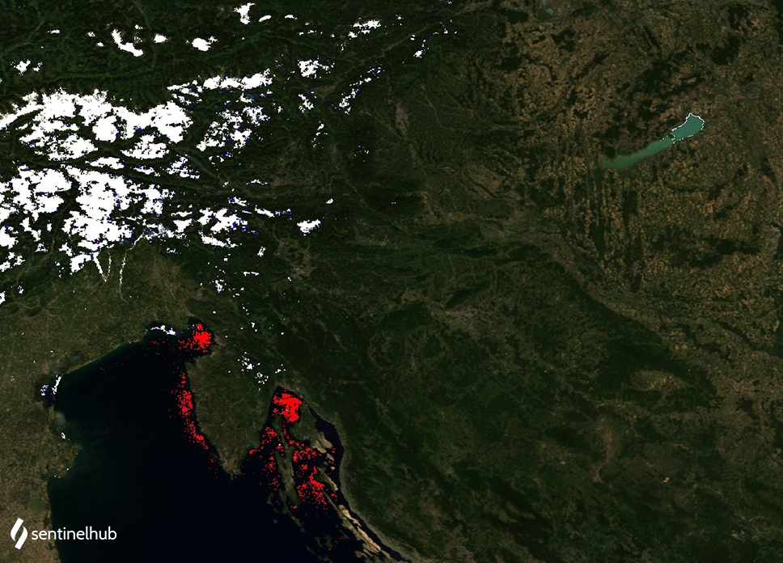

# MODIS True Color
<a href="#" id='togglescript'>Show</a> script or [download](script.js){:target="_blank"} it.


      


## Evaluate and visualize

- [EO Browser](https://sentinelshare.page.link/DJK6){:target="_blank"}   

## Description

The true color product maps MODIS band values B01, B04, and B03 which roughly correspond to red, green, and blue part of the spectrum, respectively, to R, G, and B components. The result is a true color product, that is a good representation of the Earth as humans would see it naturally.

True color composite for MODIS: **B01, B04, B03**

## Description of representative images

MODIS true color image of Europe. Acquired on 2021-08-02, processed by Sentinel Hub. 

 