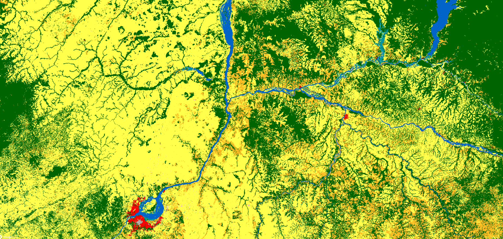

## General description of the script  
This script visualises WorldCover Map

Table 1: Color legend for WorldCover classification map 
<table>
  <thead>
    <tr>
      <th>Value</th>
      <th>Color</th>
      <th>Color Code</th>
	    <th>Class Name</th>
    </tr>
  </thead>
  <tbody>
    <tr>
      <td>10 </td>
      <td style="background-color:#006400"></td>
	    <td>0x006400 </td>
	    <td>Tree cover </td>
    </tr>
    <tr>
      <td>20</td>
      <td style="background-color:#ffbb22"></td>
	    <td>0xffbb22 </td>
	    <td>Shrubland </td>
    </tr>
    <tr>
      <td>30</td>
      <td style="background-color:#ffff4c"></td>
	    <td>0xffff4c </td>
	    <td>Grassland </td>
    </tr>
    <tr>
      <td>40</td>
      <td style="background-color:#f096ff" ></td>
	    <td>0xf096ff  </td>
	    <td>Cropland </td>
    </tr>
    <tr>
      <td>50</td>
      <td style="background-color:#fa0000" ></td>
	    <td>0xfa0000 </td>
	    <td>Built up </td>
    </tr>
    <tr>
      <td>60</td>
      <td style="background-color:#b4b4b4"></td>
	    <td> 0xb4b4b4 </td>
	    <td> Bare /sparse vegetation </td>
    </tr>  
    <tr>
      <td>70</td>
      <td style="background-color:#f0f0f0"></td>
	    <td>0xf0f0f0 </td>
	    <td>Snow and Ice </td>
    </tr> 
    <tr>
      <td>80</td>
      <td style="background-color:#0032c8"></td>
	    <td>0x0064c8  </td>
	    <td>Permanent water bodies </td>
    </tr> 
    <tr>
      <td>90</td>
      <td style="background-color:#0096a0"></td>
	    <td>0x0096a0 </td>
	    <td>Herbaceous wetland </td>
    </tr>
    <tr>
      <td>95</td>
      <td style="background-color:#00cf75"></td>
	    <td>0x00cf75 </td>
	    <td>Mangroves </td>
    </tr>
    <tr>
      <td>100</td>
      <td style="background-color:#fae6a0"></td>
	    <td>0xfae6a0 </td>
	    <td>Moss and lichen </td>
    </tr>
    <tr>
      <td>0</td>
      <td></td>
      <td></td>
	    <td> No data </td>
    </tr>
   </tbody>
</table> 

## Description of representative images
*WorldCover 2020, Thessaloniki, Greece visualised in EO Browser*   

  

 *WorldCover 2020, Kinshasa, Democratic Republic of Congo visualised in EO Browser*  

## Resources

- [Data source](https://esa-worldcover.org/en)

- [Entry in public collections](https://github.com/sentinel-hub/public-collections/tree/main/collections/worldcover)
