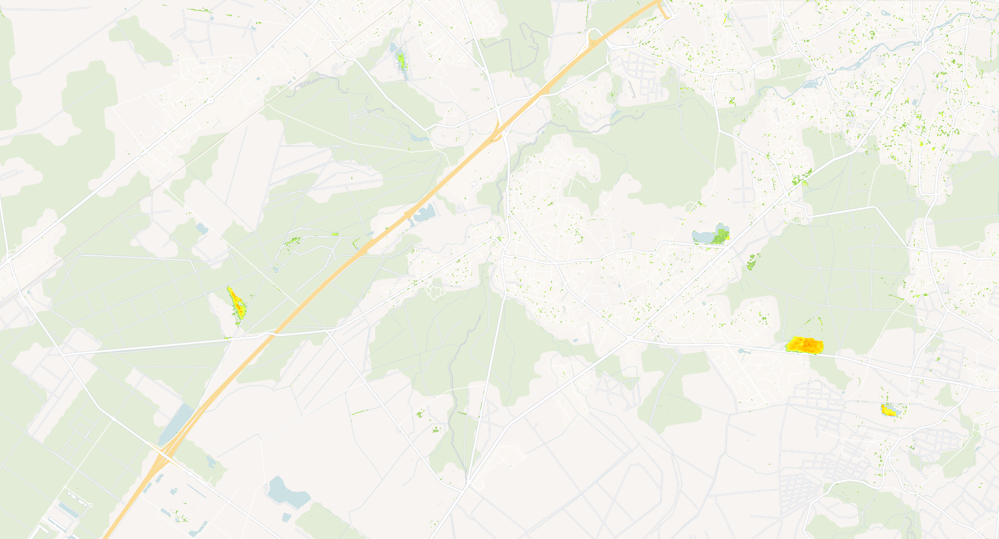

## Evaluate and visualize
 - [EO Browser](https://apps.sentinel-hub.com/eo-browser/?zoom=14&lat=44.74116&lng=-0.68441&themeId=PLANET_SANDBOX&visualizationUrl=U2FsdGVkX1%2BZHBeniJ8VPIPbczEw1Llrn%2FbIwnAqSoZVCan1gWblgYsntyVzySupIBgjWwxYrORp0ZVgjd91EYdX%2BzFVxS1EzW68yjVQEOWGtFo7OZ9dPTAVpe%2FGQkVK&evalscript=Ly9WRVJTSU9OPTMKLyogCiAqIEZvcmVzdCBWaXRhbGl0eSBDaGFuZ2UgSW5kZXggLSBMb3NzIFZpc3VhbGl6YXRpb24KICogVGhpcyBzY3JpcHQgdmlzdWFsaXplcyBvbmx5IG5lZ2F0aXZlIGNoYW5nZXMgKGxvc3NlcykgaW4gZm9yZXN0IHZpdGFsaXR5CiAqIGJldHdlZW4gdHdvIHRpbWVwb2ludHMgYmFzZWQgb24gdmVnZXRhdGlvbiBpbmRpY2VzLgogKiAKICogUGFyYW1ldGVyczoKICogLSBWSV9UWVBFOiBWZWdldGF0aW9uIGluZGV4IHR5cGUgKCJORFZJIiBvciAiU0FWSSIpCiAqIC0gQ0NfTUlOOiBNaW5pbXVtIGNhbm9weSBjb3ZlciBwZXJjZW50YWdlCiAqIC0gVklfTUlOLCBWSV9NQVg6IFJhbmdlIGZvciBjbGlwcGluZyB2ZWdldGF0aW9uIGluZGV4IHZhbHVlcwogKiAtIENIQU5HRV9USFJFU0hPTEQ6IE1pbmltdW0gJSBjaGFuZ2UgdG8gY2xhc3NpZnkgYXMgbG9zcwogKiAtIENMQVNTX0lOVEVSVkFMOiBJbnRlcnZhbCBmb3IgY2xhc3NpZnlpbmcgY2hhbmdlIG1hZ25pdHVkZQogKi8KCmZ1bmN0aW9uIHNldHVwKCkgewogIHJldHVybiB7CiAgICBpbnB1dDogWwogICAgICB7CiAgICAgICAgZGF0YXNvdXJjZTogImFycHMiLAogICAgICAgIGJhbmRzOiBbInJlZCIsICJuaXIiLCAiZGF0YU1hc2siLCAiY2xvdWRfbWFzayJdLAogICAgICB9LAogICAgICB7CiAgICAgICAgZGF0YXNvdXJjZTogImNhbm9weV9jb3ZlciIsCiAgICAgICAgYmFuZHM6IFsiQ0MiLCAiZGF0YU1hc2siXSwKICAgICAgfSwKICAgIF0sCiAgICBvdXRwdXQ6IFsKICAgICAgeyBiYW5kczogNCB9LCAvLyBSR0JBIGZvciBsb3NzCiAgICBdLAogICAgbW9zYWlja2luZzogIk9SQklUIiwKICB9Owp9CgovLyBDb25maWd1cmF0aW9uIHBhcmFtZXRlcnMKY29uc3QgVklfVFlQRSA9ICJORFZJIjsgLy8gQ2hvb3NlICJORFZJIiBvciAiU0FWSSIKY29uc3QgQ0NfTUlOID0gMjU7ICAgICAgLy8gTWluaW11bSBjYW5vcHkgY292ZXIgcGVyY2VudGFnZSB0byBjb25zaWRlciB2YWxpZCBmb3Jlc3QKY29uc3QgVklfTUlOID0gMC4xNTsgICAgLy8gTWluaW11bSB2ZWdldGF0aW9uIGluZGV4IHZhbHVlIGZvciBjbGlwcGluZwpjb25zdCBWSV9NQVggPSAwLjg1OyAgICAvLyBNYXhpbXVtIHZlZ2V0YXRpb24gaW5kZXggdmFsdWUgZm9yIGNsaXBwaW5nCmNvbnN0IENIQU5HRV9USFJFU0hPTEQgPSAyLjU7IC8vIE1pbmltdW0gJSBjaGFuZ2UgdG8gY2xhc3NpZnkgYXMgbG9zcwpjb25zdCBDTEFTU19JTlRFUlZBTCA9IDU7ICAgICAvLyBJbnRlcnZhbCBmb3IgY2xhc3NpZnlpbmcgY2hhbmdlIGludG8gcGFsZXR0ZXMKY29uc3QgSU5WQUxJRF9WSSA9IC05OTk5OyAgLy8gVmFsdWUgZm9yIGludmFsaWQgdmVnZXRhdGlvbiBpbmRleApjb25zdCBWSV9TQ0FMRSA9IDk5OyAgICAgIC8vIFNjYWxlIGZhY3RvciBmb3IgVkkgdmFsdWVzIChyZXN1bHRpbmcgaW4gcmFuZ2UgMS0xMDApCmNvbnN0IFNBVklfTCA9IDAuNTsgICAgICAgLy8gU29pbCBhZGp1c3RtZW50IGZhY3RvciBmb3IgU0FWSQoKLy8gQ29sb3IgcGFsZXR0ZSAtIGZvciB2aXRhbGl0eSBsb3NzZXMgKGZyb20gc21hbGwgdG8gc2V2ZXJlKQpjb25zdCBsb3NzUGFsZXR0ZSA9IFsKICBbMC42LCAwLjgsIDAuNF0sICAvLyAwIC0gc21hbGxlc3QgbG9zcwogIFswLjcsIDAuOSwgMC40XSwKICBbMC44LCAxLjAsIDAuNF0sCiAgWzAuOSwgMS4wLCAwLjNdLAogIFsxLjAsIDEuMCwgMC4yXSwKICBbMS4wLCAwLjksIDAuMV0sCiAgWzEuMCwgMC44LCAwLjBdLAogIFsxLjAsIDAuNiwgMC4wXSwKICBbMS4wLCAwLjQsIDAuMF0sCiAgWzEuMCwgMC4yLCAwLjBdLAogIFsxLjAsIDAuMCwgMC4wXSwKICBbMC44LCAwLjAsIDAuMF0sCiAgWzAuNiwgMC4wLCAwLjBdLAogIFswLjQsIDAuMCwgMC4wXSwKICBbMC4yLCAwLjAsIDAuMF0sCiAgWzAuMCwgMC4wLCAwLjRdLAogIFswLjAsIDAuMCwgMC42XSwKICBbMC4wLCAwLjAsIDAuOF0sCiAgWzAuMCwgMC4wLCAxLjBdLAogIFswLjIsIDAuMiwgMS4wXSwgIC8vIDE5IC0gc2V2ZXJlIGxvc3MKXTsKCi8vIENhbGN1bGF0ZSB2ZWdldGF0aW9uIGluZGV4IChWSSkgYmFzZWQgb24gdHlwZQpmdW5jdGlvbiBjYWxjdWxhdGVWSShuaXIsIHJlZCkgewogIGlmIChuaXIgPT09IHVuZGVmaW5lZCB8fCByZWQgPT09IHVuZGVmaW5lZCkgcmV0dXJuIElOVkFMSURfVkk7CiAgaWYgKG5pciArIHJlZCA9PT0gMCkgcmV0dXJuIElOVkFMSURfVkk7IC8vIEF2b2lkIGRpdmlzaW9uIGJ5IHplcm8KICAKICBpZiAoVklfVFlQRSA9PT0gIk5EVkkiKSB7CiAgICByZXR1cm4gKG5pciAtIHJlZCkgLyAobmlyICsgcmVkKTsKICB9IGVsc2UgaWYgKFZJX1RZUEUgPT09ICJTQVZJIikgewogICAgcmV0dXJuICgobmlyIC0gcmVkKSAvIChuaXIgKyByZWQgKyBTQVZJX0wpKSAqICgxICsgU0FWSV9MKTsKICB9IGVsc2UgewogICAgcmV0dXJuIElOVkFMSURfVkk7CiAgfQp9CgovLyBDbGlwIFZJIHRvIG1pbi9tYXggcmFuZ2UgYW5kIHNjYWxlIHRvIDEtMTAwIHJhbmdlCmZ1bmN0aW9uIGNsaXBBbmRTY2FsZVZJKHZpKSB7CiAgY29uc3QgY2xpcHBlZFZJID0gTWF0aC5tYXgoVklfTUlOLCBNYXRoLm1pbih2aSwgVklfTUFYKSk7CiAgcmV0dXJuIE1hdGgucm91bmQoKChjbGlwcGVkVkkgLSBWSV9NSU4pIC8gKFZJX01BWCAtIFZJX01JTikpICogVklfU0NBTEUpICsgMTsKfQoKLy8gRmlsdGVyIHNjZW5lcyB0byBvbmx5IGluY2x1ZGUgZmlyc3QgYW5kIGxhc3Qgb2Ygc3BlY2lmaWVkIHRpbWUgcmFuZ2UKZnVuY3Rpb24gcHJlUHJvY2Vzc1NjZW5lcyhjb2xsZWN0aW9ucykgewogIC8vIEdldCB0aGUgb3JiaXRzIGFycmF5CiAgdmFyIG9yYml0cyA9IGNvbGxlY3Rpb25zLmFycHMuc2NlbmVzLm9yYml0czsKICAKICAvLyBNYWtlIHN1cmUgd2UgaGF2ZSBhdCBsZWFzdCAyIG9yYml0cyB0byB3b3JrIHdpdGgKICBpZiAob3JiaXRzICYmIG9yYml0cy5sZW5ndGggPj0gMikgewogICAgLy8gS2VlcCBvbmx5IGZpcnN0IGFuZCBsYXN0IG9yYml0cwogICAgdmFyIGZpcnN0T3JiaXQgPSBvcmJpdHNbMF07CiAgICB2YXIgbGFzdE9yYml0ID0gb3JiaXRzW29yYml0cy5sZW5ndGggLSAxXTsKICAgIGNvbGxlY3Rpb25zLmFycHMuc2NlbmVzLm9yYml0cyA9IFtmaXJzdE9yYml0LCBsYXN0T3JiaXRdOwogIH0gZWxzZSB7CiAgICAvLyBMb2cgYW4gZXJyb3IgaWYgdGhlcmUgYXJlbid0IGVub3VnaCBvcmJpdHMKICAgIGNvbnNvbGUud2FybigiRlZDSSByZXF1aXJlcyBhdCBsZWFzdCAyIHNjZW5lcyBmb3IgY2hhbmdlIGRldGVjdGlvbiIpOwogIH0KICAKICByZXR1cm4gY29sbGVjdGlvbnM7Cn0KCi8vIE1haW4gZnVuY3Rpb24gdG8gZXZhbHVhdGUgZWFjaCBwaXhlbApmdW5jdGlvbiBldmFsdWF0ZVBpeGVsKHNhbXBsZXMpIHsKICAvLyBDaGVjayBmb3IgdW5kZWZpbmVkIGlucHV0cwogIGlmICghc2FtcGxlcy5hcnBzIHx8ICFzYW1wbGVzLmNhbm9weV9jb3ZlciB8fCAKICAgICAgc2FtcGxlcy5hcnBzLmxlbmd0aCA8IDIgfHwgc2FtcGxlcy5jYW5vcHlfY292ZXIubGVuZ3RoIDwgMikgewogICAgcmV0dXJuIFswLCAwLCAwLCAwXTsgLy8gVHJhbnNwYXJlbnQKICB9CgogIGNvbnN0IHBzX2FyZF9UMSA9IHNhbXBsZXMuYXJwc1sxXTsKICBjb25zdCBwc19hcmRfVDIgPSBzYW1wbGVzLmFycHNbMF07CiAgY29uc3QgY2Fub3B5X1QxID0gc2FtcGxlcy5jYW5vcHlfY292ZXJbMV07CiAgY29uc3QgY2Fub3B5X1QyID0gc2FtcGxlcy5jYW5vcHlfY292ZXJbMF07CgogIC8vIENoZWNrIGRhdGEgbWFza3MKICBpZiAocHNfYXJkX1QxLmRhdGFNYXNrID09PSAwIHx8IHBzX2FyZF9UMi5kYXRhTWFzayA9PT0gMCkgewogICAgcmV0dXJuIFswLCAwLCAwLCAwXTsKICB9CgogIC8vIENoZWNrIGNsb3VkIG1hc2tzCiAgaWYgKHBzX2FyZF9UMS5jbG91ZF9tYXNrICE9PSAxIHx8IHBzX2FyZF9UMi5jbG91ZF9tYXNrICE9PSAxKSB7CiAgICByZXR1cm4gWzAsIDAsIDAsIDBdOwogIH0KCiAgLy8gQ2hlY2sgY2Fub3B5IGNvdmVyIHRocmVzaG9sZHMKICBpZiAoY2Fub3B5X1QxLkNDIDw9IENDX01JTiB8fCBjYW5vcHlfVDIuQ0MgPD0gQ0NfTUlOKSB7CiAgICByZXR1cm4gWzAsIDAsIDAsIDBdOwogIH0KCiAgLy8gQ2FsY3VsYXRlIFZJIGZvciBUMSBhbmQgVDIKICBjb25zdCB2aV9UMSA9IGNhbGN1bGF0ZVZJKHBzX2FyZF9UMS5uaXIsIHBzX2FyZF9UMS5yZWQpOwogIGNvbnN0IHZpX1QyID0gY2FsY3VsYXRlVkkocHNfYXJkX1QyLm5pciwgcHNfYXJkX1QyLnJlZCk7CiAgCiAgLy8gQ2hlY2sgZm9yIGludmFsaWQgVkkgdmFsdWVzCiAgaWYgKHZpX1QxID09PSBJTlZBTElEX1ZJIHx8IHZpX1QyID09PSBJTlZBTElEX1ZJKSB7CiAgICByZXR1cm4gWzAsIDAsIDAsIDBdOwogIH0KCiAgLy8gQ2xpcCBhbmQgc2NhbGUgVkkgdmFsdWVzCiAgY29uc3QgdmkxMDBfVDEgPSBjbGlwQW5kU2NhbGVWSSh2aV9UMSk7CiAgY29uc3QgdmkxMDBfVDIgPSBjbGlwQW5kU2NhbGVWSSh2aV9UMik7CgogIC8vIENhbGN1bGF0ZSBwZXJjZW50YWdlIGNoYW5nZSBkaXJlY3RseQogIGNvbnN0IGNoYW5nZVBlcmNlbnQgPSB2aTEwMF9UMiAtIHZpMTAwX1QxOwoKICAvLyBDbGFzc2lmeSBjaGFuZ2UgaW50byBsb3NzCiAgaWYgKGNoYW5nZVBlcmNlbnQgPCAtQ0hBTkdFX1RIUkVTSE9MRCkgewogICAgY29uc3QgY2xhc3NJbmRleCA9IE1hdGgubWluKAogICAgICAxOSwKICAgICAgTWF0aC5mbG9vcigoLWNoYW5nZVBlcmNlbnQgLSBDSEFOR0VfVEhSRVNIT0xEKSAvIENMQVNTX0lOVEVSVkFMKQogICAgKTsKICAgIGNvbnN0IGNvbG9yID0gbG9zc1BhbGV0dGVbY2xhc3NJbmRleF07CiAgICByZXR1cm4gWy4uLmNvbG9yLCAxXTsgLy8gRnVsbHkgb3BhcXVlIGxvc3MKICB9IGVsc2UgewogICAgcmV0dXJuIFswLCAwLCAwLCAwXTsgLy8gRnVsbHkgdHJhbnNwYXJlbnQgaWYgbm8gc2lnbmlmaWNhbnQgY2hhbmdlCiAgfQp9Cg%3D%3D&datasetId=3f605f75-86c4-411a-b4ae-01c896f0e54e&fromTime=2023-03-20T00%3A00%3A00.000Z&toTime=2023-07-14T23%3A59%3A59.999Z&demSource3D=%22MAPZEN%22&dataFusion=%5B%7B%22id%22%3A%22CUSTOM%22%2C%22alias%22%3A%22arps%22%2C%22additionalParameters%22%3A%7B%22collectionId%22%3A%223f605f75-86c4-411a-b4ae-01c896f0e54e%22%2C%22subType%22%3Anull%2C%22locationId%22%3A%22aws-eu-central-1%22%7D%7D%2C%7B%22id%22%3A%22CUSTOM%22%2C%22alias%22%3A%22canopy_cover%22%2C%22additionalParameters%22%3A%7B%22collectionId%22%3A%22ca501757-cf8e-43a8-b1a4-1aa59ae22425%22%2C%22subType%22%3A%22BYOC%22%2C%22locationId%22%3A%22aws-eu-central-1%22%7D%2C%22timespan%22%3A%5B%222023-03-21T00%3A00%3A00.000Z%22%2C%222023-07-21T23%3A59%3A59.999Z%22%5D%7D%5D#custom-script){:target="_blank"}

 The example data is using Planet Sandox data. This data is restricted to Sentinel Hub users with active paid plans. If you are already a Planet Customer, see [here](https://community.planet.com/sentinel-hub-81/access-new-tools-for-analyzing-your-planet-data-on-sentinel-hub-732) on how to get access.

## General description

The FVCI-Loss script visualizes negative changes in forest vitality between two time periods. This specialized visualization focuses exclusively on areas showing decline in forest health, making it easier to identify disturbances, stress, or degradation. The script combines Analysis Ready PlanetScope imagery with Canopy Cover data from the Forest Carbon Monitoring dataset to ensure analysis is focused on forest areas only.

## Details of the script

The FVCI-Loss processing workflow includes:
1. Filter pixels based on canopy cover percentage (>25%) for both time periods
2. Calculate vegetation index (users can choose between NDVI or SAVI) for both time periods
3. Clip and scale both indices to a standardized range
4. Calculate the difference between the time periods
5. Identify pixels with negative change exceeding the threshold (>2.5%)
6. Classify negative changes into 20 intensity levels
7. Apply a color palette transitioning from light green through orange and red to blue to visualize different loss intensities

The script utilizes the first and last PlanetScope ARD acquisition in the specified time range.

## Description of representative images

The FVCI-Loss visualization uses a color palette specifically designed to highlight forest vitality decline:
- Light green: Minor decline in forest health
- Yellow to orange: Moderate decline
- Red to dark red: Significant decline
- Dark blue to light blue: Severe decline/potential deforestation

Areas with no significant decline or insufficient canopy cover remain transparent, allowing this output to be overlaid on other imagery.

A visualization of FVCI-Loss between March and July 2023 over Cestas, France:

