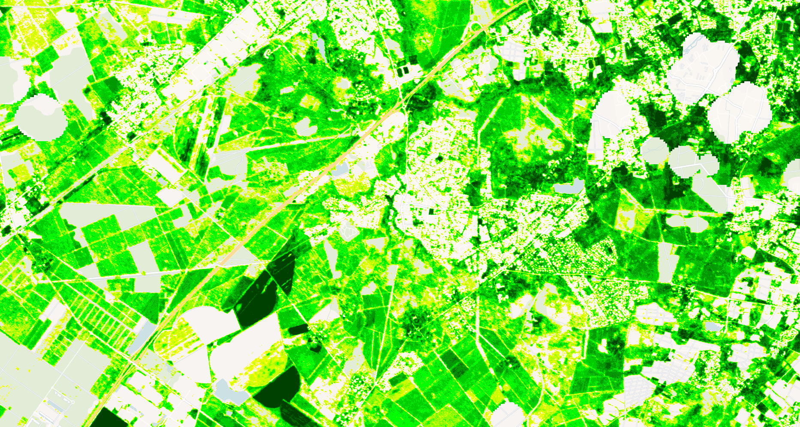

## Evaluate and visualize
 - [EO Browser](https://apps.sentinel-hub.com/eo-browser/?zoom=14&lat=44.74116&lng=-0.68435&themeId=PLANET_SANDBOX&visualizationUrl=U2FsdGVkX18OEMNjIWAv1%2F1WcOtr7OnBlmA10HUvNTr8n8WFDN5ihKBpFzUxpfO8WQzLLfDpVDZe3Bt%2BB0RqaxvyuKtCrJ2i5SUMl9a7M%2FTwTAJf3SCQoN8p9QIYPz%2F8&evalscript=Ly9WRVJTSU9OPTMKLyogCiAqIEZvcmVzdCBWaXRhbGl0eSBJbmRleCAoRlZJKSBFdmFsdWF0aW9uIFNjcmlwdAogKiBUaGlzIHNjcmlwdCBjYWxjdWxhdGVzIEZWSSBiYXNlZCBvbiB2ZWdldGF0aW9uIGluZGljZXMgKE5EVkkgb3IgU0FWSSkKICogYW5kIGNsYXNzaWZpZXMgcGl4ZWxzIGludG8gMTUgY2xhc3NlcyByZXByZXNlbnRpbmcgZGlmZmVyZW50IHZpdGFsaXR5IGxldmVscy4KICovCgpmdW5jdGlvbiBzZXR1cCgpIHsKICByZXR1cm4gewogICAgaW5wdXQ6IFsicmVkIiwgIm5pciIsICJkYXRhTWFzayIsICJjbG91ZF9tYXNrIl0sCiAgICBvdXRwdXQ6IHsgYmFuZHM6IDQgfSwgLy8gUkdCQQogIH07Cn0KCi8vIENvbmZpZ3VyYXRpb24gcGFyYW1ldGVycwpjb25zdCBWSV9UWVBFID0gIk5EVkkiOyAvLyBDaG9vc2UgIk5EVkkiIG9yICJTQVZJIgpjb25zdCBWSV9NSU4gPSAwLjE1OyAvLyBNaW5pbXVtIFZJIHZhbHVlIGZvciBjbGlwcGluZwpjb25zdCBWSV9NQVggPSAwLjg1OyAvLyBNYXhpbXVtIFZJIHZhbHVlIGZvciBjbGlwcGluZwpjb25zdCBWSV9USFJFU0hPTEQgPSAwLjU7IC8vIFRocmVzaG9sZCBmb3IgdmVnZXRhdGlvbiBtYXNraW5nCmNvbnN0IE5VTV9DTEFTU0VTID0gMTU7ICAgIC8vIE51bWJlciBvZiBGVkkgY2xhc3Nlcwpjb25zdCBJTlZBTElEX1ZJID0gLTk5OTk7ICAvLyBWYWx1ZSBmb3IgaW52YWxpZCB2ZWdldGF0aW9uIGluZGV4CmNvbnN0IFNBVklfTCA9IDAuNTsgICAgICAgLy8gU29pbCBhZGp1c3RtZW50IGZhY3RvciBmb3IgU0FWSQpjb25zdCBWSV9TQ0FMRSA9IDk5OyAgICAgIC8vIFNjYWxlIGZhY3RvciBmb3IgVkkgdmFsdWVzIChyZXN1bHRpbmcgaW4gcmFuZ2UgMS0xMDApCgovLyBDb2xvciBwYWxldHRlIC0gdml0YWxpdHkgY2xhc3NlcyBmcm9tIGxvd2VzdCAoMSkgdG8gaGlnaGVzdCAoMTUpCmNvbnN0IGZ2aVBhbGV0dGUgPSBbCiAgWzAuMCwgMC4wLCAwLjBdLCAgIC8vIDAg4oCTIGJsYWNrIChubyBkYXRhKQogIFswLjUzLCAxLjAsIDEuMF0sICAvLyAxIOKAkyBjeWFuIChleHRyZW1lbHkgbG93IHZpdGFsaXR5KQogIFswLjY4LCAxLjAsIDEuMF0sICAvLyAyIOKAkyBsaWdodCBjeWFuCiAgWzAuMCwgMC4zMywgMS4wXSwgIC8vIDMg4oCTIGJsdWUKICBbMC4zMywgMC4wLCAwLjBdLCAgLy8gNCDigJMgZGFyayByZWQKICBbMC42NywgMC4wLCAwLjBdLCAgLy8gNSDigJMgcmVkCiAgWzEuMCwgMC41LCAwLjBdLCAgIC8vIDYg4oCTIG9yYW5nZQogIFsxLjAsIDAuNzUsIDAuMF0sICAvLyA3IOKAkyBvcmFuZ2UteWVsbG93CiAgWzEuMCwgMS4wLCAwLjBdLCAgIC8vIDgg4oCTIHllbGxvdwogIFswLjgsIDEuMCwgMC4wXSwgICAvLyA5IOKAkyB5ZWxsb3ctZ3JlZW4KICBbMC41MywgMS4wLCAwLjBdLCAgLy8gMTAg4oCTIGxpbWUgZ3JlZW4KICBbMC4wLCAxLjAsIDAuMF0sICAgLy8gMTEg4oCTIGdyZWVuCiAgWzAuMCwgMC44LCAwLjBdLCAgIC8vIDEyIOKAkyBkYXJrIGdyZWVuCiAgWzAuMCwgMC42LCAwLjBdLCAgIC8vIDEzIOKAkyBkZWVwZXIgZ3JlZW4KICBbMC4wLCAwLjQsIDAuMF0sICAgLy8gMTQg4oCTIGZvcmVzdCBncmVlbgogIFswLjAsIDAuMjUsIDAuMF0sICAvLyAxNSDigJMgdmVyeSBkYXJrIGdyZWVuIChoaWdoZXN0IHZpdGFsaXR5KQpdOwoKLy8gQ2FsY3VsYXRlIHZlZ2V0YXRpb24gaW5kZXggKFZJKSBiYXNlZCBvbiB0eXBlCmZ1bmN0aW9uIGNhbGN1bGF0ZVZJKG5pciwgcmVkLCB0eXBlKSB7CiAgaWYgKG5pciA9PT0gdW5kZWZpbmVkIHx8IHJlZCA9PT0gdW5kZWZpbmVkKSByZXR1cm4gSU5WQUxJRF9WSTsKICBpZiAobmlyICsgcmVkID09PSAwKSByZXR1cm4gSU5WQUxJRF9WSTsgLy8gQXZvaWQgZGl2aXNpb24gYnkgemVybwoKICBpZiAodHlwZSA9PT0gIk5EVkkiKSB7CiAgICByZXR1cm4gKG5pciAtIHJlZCkgLyAobmlyICsgcmVkKTsKICB9IGVsc2UgaWYgKHR5cGUgPT09ICJTQVZJIikgewogICAgcmV0dXJuICgobmlyIC0gcmVkKSAvIChuaXIgKyByZWQgKyBTQVZJX0wpKSAqICgxICsgU0FWSV9MKTsKICB9IGVsc2UgewogICAgcmV0dXJuIElOVkFMSURfVkk7CiAgfQp9CgovLyBDbGlwIFZJIHRvIG1pbi9tYXggcmFuZ2UgYW5kIHNjYWxlIHRvIDEtMTAwIHJhbmdlCmZ1bmN0aW9uIGNsaXBBbmRTY2FsZVZJKHZpKSB7CiAgY29uc3QgY2xpcHBlZFZJID0gTWF0aC5tYXgoVklfTUlOLCBNYXRoLm1pbih2aSwgVklfTUFYKSk7CiAgcmV0dXJuIE1hdGgucm91bmQoKChjbGlwcGVkVkkgLSBWSV9NSU4pIC8gKFZJX01BWCAtIFZJX01JTikpICogVklfU0NBTEUpICsgMTsKfQoKLy8gTWFpbiBmdW5jdGlvbiB0byBldmFsdWF0ZSBlYWNoIHBpeGVsCmZ1bmN0aW9uIGV2YWx1YXRlUGl4ZWwoc2FtcGxlKSB7CiAgLy8gQ2hlY2sgZm9yIHVuZGVmaW5lZCBpbnB1dHMKICBpZiAoc2FtcGxlLnJlZCA9PT0gdW5kZWZpbmVkIHx8IHNhbXBsZS5uaXIgPT09IHVuZGVmaW5lZCkgewogICAgcmV0dXJuIFswLCAwLCAwLCAwXTsgLy8gVHJhbnNwYXJlbnQKICB9CgogIC8vIENoZWNrIGNsb3VkIG1hc2sgYW5kIGRhdGEgbWFzawogIGlmICgKICAgIHNhbXBsZS5kYXRhTWFzayA9PT0gMCB8fCAvLyBObyBkYXRhCiAgICBzYW1wbGUuY2xvdWRfbWFzayAhPT0gMSAvLyBDbG91ZHkgb3IgaW52YWxpZCBjb25kaXRpb24KICApIHsKICAgIHJldHVybiBbMCwgMCwgMCwgMF07IC8vIFRyYW5zcGFyZW50CiAgfQoKICAvLyBDYWxjdWxhdGUgdmVnZXRhdGlvbiBpbmRleAogIGNvbnN0IHZpID0gY2FsY3VsYXRlVkkoc2FtcGxlLm5pciwgc2FtcGxlLnJlZCwgVklfVFlQRSk7CgogIC8vIEhhbmRsZSBpbnZhbGlkIHZlZ2V0YXRpb24gaW5kZXgKICBpZiAodmkgPT09IElOVkFMSURfVkkpIHsKICAgIHJldHVybiBbMCwgMCwgMCwgMF07IC8vIFRyYW5zcGFyZW50CiAgfQoKICAvLyBDaGVjayBpZiBWSSBpcyBiZWxvdyB0aGUgdGhyZXNob2xkCiAgaWYgKHZpIDwgVklfVEhSRVNIT0xEKSB7CiAgICByZXR1cm4gWzAsIDAsIDAsIDBdOyAvLyBUcmFuc3BhcmVudAogIH0KCiAgLy8gQ2xpcCBhbmQgc2NhbGUgVkkKICBjb25zdCB2aTEwMCA9IGNsaXBBbmRTY2FsZVZJKHZpKTsKCiAgLy8gUmVjbGFzc2lmeSBWSTEwMCB0byBGVkkgY2xhc3NlcwogIGNvbnN0IGZ2aUNsYXNzID0gTWF0aC5taW4oCiAgICBOVU1fQ0xBU1NFUywKICAgIE1hdGguY2VpbCgodmkxMDAgLyAoVklfU0NBTEUgKyAxKSkgKiBOVU1fQ0xBU1NFUykKICApOwoKICBjb25zdCBjb2xvciA9IGZ2aVBhbGV0dGVbZnZpQ2xhc3NdOwogIHJldHVybiBbLi4uY29sb3IsIDFdOyAvLyBGdWxseSBvcGFxdWUKfQo%3D&datasetId=3f605f75-86c4-411a-b4ae-01c896f0e54e&fromTime=2023-04-18T00%3A00%3A00.000Z&toTime=2023-04-18T23%3A59%3A59.999Z&demSource3D=%22MAPZEN%22#custom-script){:target="_blank"}

 The example data is using Planet Sandox data. This data is restricted to Sentinel Hub users with active paid plans. If you are already a Planet Customer, see [here](https://community.planet.com/sentinel-hub-81/access-new-tools-for-analyzing-your-planet-data-on-sentinel-hub-732) on how to get access.

## General description

This script calculates the Forest Vitality Index (FVI) based on vegetation indices (NDVI or SAVI) and classifies forest areas into 15 distinct classes representing different vitality levels. The FVI provides a standardized measure of forest health that can be used for monitoring and management.

## Details of the script

The Forest Vitality Index is calculated as follows:
1. Calculate vegetation index (NDVI or SAVI) from red and NIR bands
2. Clip the vegetation index to a predefined range (0.15-0.85)
3. Scale the clipped VI to a 1-100 range
4. Classify the scaled values into 15 forest vitality classes
5. Apply a color palette to visualize the classes

The script includes cloud masking and data validation checks to ensure only valid forest pixels are processed. This version of the script only uses vegetation index thresholds to mask vegetated pixels. Please check the script [Forest Vitality Index with Canopy Cover Filter (FVI-CC)](../forest_vitality_index_canopy_cover/index.md) for a forest mask based on the Canopy Cover layer from the Forest Carbon Monitoring dataset.

## Description of representative images

The FVI visualizes forest vitality with a color palette ranging from red/orange (low vitality) to green (high vitality):
- Classes 1-3: Cyan to blue - Very low vitality
- Classes 4-7: Red to orange - Low vitality
- Classes 8-10: Yellow to lime - Medium vitality 
- Classes 11-15: Green to dark green - High vitality

A visualization of FVI over Cestas, France (April 2023):

