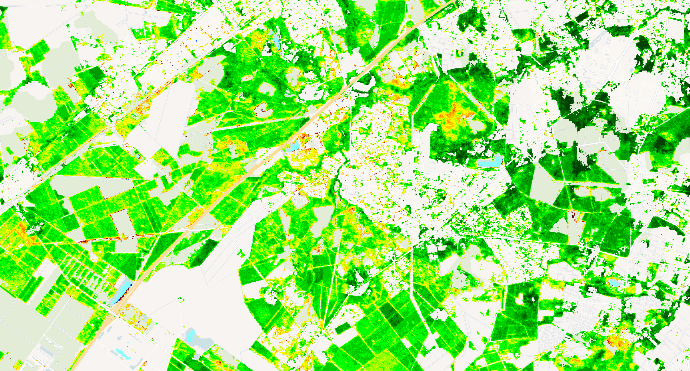

## Evaluate and visualize
 - [EO Browser](https://apps.sentinel-hub.com/eo-browser/?zoom=14&lat=44.74116&lng=-0.68435&themeId=PLANET_SANDBOX&visualizationUrl=U2FsdGVkX18sUeNI%2FMf6Q%2BSgM5Q0Do4f8fUeu3ckT3yN%2Bq8J1FinuNyQEXIiSXwBX%2Bpx7IGVGvppEfEcSHTxMX%2BxEyWmkNP8tnv9%2BukDaXNQFcTw%2BE7AiX1Z3jvEjoPQ&evalscript=Ly9WRVJTSU9OPTMKLyogCiAqIEZvcmVzdCBWaXRhbGl0eSBJbmRleCB3aXRoIENhbm9weSBDb3ZlciBGaWx0ZXIgKEZWSS1DQykgRXZhbHVhdGlvbiBTY3JpcHQKICogVGhpcyBzY3JpcHQgY2FsY3VsYXRlcyBGVkkgYmFzZWQgb24gdmVnZXRhdGlvbiBpbmRpY2VzIChORFZJIG9yIFNBVkkpCiAqIGFuZCBmaWx0ZXJzIHJlc3VsdHMgYmFzZWQgb24gYSBjYW5vcHkgY292ZXIgdGhyZXNob2xkLgogKiBJdCBjbGFzc2lmaWVzIHBpeGVscyBpbnRvIDE1IGNsYXNzZXMgcmVwcmVzZW50aW5nIGRpZmZlcmVudCB2aXRhbGl0eSBsZXZlbHMuCiAqIAogKiBQYXJhbWV0ZXJzOgogKiAtIFZJX1RZUEU6ICJORFZJIiBvciAiU0FWSSIgKE5vcm1hbGl6ZWQgRGlmZmVyZW5jZSBWZWdldGF0aW9uIEluZGV4IG9yIFNvaWwgQWRqdXN0ZWQgVkkpCiAqIC0gQ0NfTUlOOiBNaW5pbXVtIGNhbm9weSBjb3ZlciBwZXJjZW50YWdlIHRvIGNvbnNpZGVyIHZhbGlkIGZvcmVzdCBkYXRhCiAqIC0gVklfTUlOLCBWSV9NQVg6IFJhbmdlIGZvciBjbGlwcGluZyB2ZWdldGF0aW9uIGluZGV4IHZhbHVlcwogKi8KCmZ1bmN0aW9uIHNldHVwKCkgewogIHJldHVybiB7CiAgICBpbnB1dDogWwogICAgICB7CiAgICAgICAgZGF0YXNvdXJjZTogImFycHMiLAogICAgICAgIGJhbmRzOiBbInJlZCIsICJuaXIiLCAiZGF0YU1hc2siLCAiY2xvdWRfbWFzayJdLAogICAgICB9LAogICAgICB7CiAgICAgICAgZGF0YXNvdXJjZTogImNhbm9weV9jb3ZlciIsCiAgICAgICAgYmFuZHM6IFsiQ0MiLCAiZGF0YU1hc2siXSwKICAgICAgfSwKICAgIF0sCiAgICBvdXRwdXQ6IHsgYmFuZHM6IDQgfSwKICB9Owp9CgovLyBDb25maWd1cmF0aW9uIHBhcmFtZXRlcnMKY29uc3QgVklfVFlQRSA9ICJORFZJIjsgLy8gQ2hvb3NlICJORFZJIiBvciAiU0FWSSIKY29uc3QgQ0NfTUlOID0gMjU7IC8vIE1pbmltdW0gY2Fub3B5IGNvdmVyIGZvciB2YWxpZCBkYXRhCmNvbnN0IFZJX01JTiA9IDAuMTU7IC8vIE1pbmltdW0gVkkgdmFsdWUgZm9yIGNsaXBwaW5nCmNvbnN0IFZJX01BWCA9IDAuODU7IC8vIE1heGltdW0gVkkgdmFsdWUgZm9yIGNsaXBwaW5nCmNvbnN0IE5VTV9DTEFTU0VTID0gMTU7ICAgIC8vIE51bWJlciBvZiBGVkkgY2xhc3Nlcwpjb25zdCBTQVZJX0wgPSAwLjU7ICAgICAgIC8vIFNvaWwgYWRqdXN0bWVudCBmYWN0b3IgZm9yIFNBVkkKY29uc3QgSU5WQUxJRF9WSSA9IC05OTk5OyAgLy8gVmFsdWUgZm9yIGludmFsaWQgdmVnZXRhdGlvbiBpbmRleApjb25zdCBWSV9TQ0FMRSA9IDk5OyAgICAgIC8vIFNjYWxlIGZhY3RvciBmb3IgVkkgdmFsdWVzIChyZXN1bHRpbmcgaW4gcmFuZ2UgMS0xMDApCgovLyBDb2xvciBwYWxldHRlIC0gdml0YWxpdHkgY2xhc3NlcyBmcm9tIGxvd2VzdCAoMSkgdG8gaGlnaGVzdCAoMTUpCmNvbnN0IGZ2aVBhbGV0dGUgPSBbCiAgWzAuMCwgMC4wLCAwLjBdLCAgIC8vIDAg4oCTIGJsYWNrIChubyBkYXRhKQogIFswLjUzLCAxLjAsIDEuMF0sICAvLyAxIOKAkyBjeWFuIChleHRyZW1lbHkgbG93IHZpdGFsaXR5KQogIFswLjY4LCAxLjAsIDEuMF0sICAvLyAyIOKAkyBsaWdodCBjeWFuCiAgWzAuMCwgMC4zMywgMS4wXSwgIC8vIDMg4oCTIGJsdWUKICBbMC4zMywgMC4wLCAwLjBdLCAgLy8gNCDigJMgZGFyayByZWQKICBbMC42NywgMC4wLCAwLjBdLCAgLy8gNSDigJMgcmVkCiAgWzEuMCwgMC41LCAwLjBdLCAgIC8vIDYg4oCTIG9yYW5nZQogIFsxLjAsIDAuNzUsIDAuMF0sICAvLyA3IOKAkyBvcmFuZ2UteWVsbG93CiAgWzEuMCwgMS4wLCAwLjBdLCAgIC8vIDgg4oCTIHllbGxvdwogIFswLjgsIDEuMCwgMC4wXSwgICAvLyA5IOKAkyB5ZWxsb3ctZ3JlZW4KICBbMC41MywgMS4wLCAwLjBdLCAgLy8gMTAg4oCTIGxpbWUgZ3JlZW4KICBbMC4wLCAxLjAsIDAuMF0sICAgLy8gMTEg4oCTIGdyZWVuCiAgWzAuMCwgMC44LCAwLjBdLCAgIC8vIDEyIOKAkyBkYXJrIGdyZWVuCiAgWzAuMCwgMC42LCAwLjBdLCAgIC8vIDEzIOKAkyBkZWVwZXIgZ3JlZW4KICBbMC4wLCAwLjQsIDAuMF0sICAgLy8gMTQg4oCTIGZvcmVzdCBncmVlbgogIFswLjAsIDAuMjUsIDAuMF0sICAvLyAxNSDigJMgdmVyeSBkYXJrIGdyZWVuIChoaWdoZXN0IHZpdGFsaXR5KQpdOwoKLy8gQ2FsY3VsYXRlIHZlZ2V0YXRpb24gaW5kZXggKFZJKSBiYXNlZCBvbiB0eXBlCmZ1bmN0aW9uIGNhbGN1bGF0ZVZJKG5pciwgcmVkLCB0eXBlKSB7CiAgaWYgKG5pciA9PT0gdW5kZWZpbmVkIHx8IHJlZCA9PT0gdW5kZWZpbmVkKSByZXR1cm4gSU5WQUxJRF9WSTsKICBpZiAobmlyICsgcmVkID09PSAwKSByZXR1cm4gSU5WQUxJRF9WSTsgLy8gQXZvaWQgZGl2aXNpb24gYnkgemVybwoKICBpZiAodHlwZSA9PT0gIk5EVkkiKSB7CiAgICByZXR1cm4gKG5pciAtIHJlZCkgLyAobmlyICsgcmVkKTsKICB9IGVsc2UgaWYgKHR5cGUgPT09ICJTQVZJIikgewogICAgcmV0dXJuICgobmlyIC0gcmVkKSAvIChuaXIgKyByZWQgKyBTQVZJX0wpKSAqICgxICsgU0FWSV9MKTsKICB9IGVsc2UgewogICAgcmV0dXJuIElOVkFMSURfVkk7CiAgfQp9CgovLyBDbGlwIFZJIHRvIG1pbi9tYXggcmFuZ2UgYW5kIHNjYWxlIHRvIDEtMTAwIHJhbmdlCmZ1bmN0aW9uIGNsaXBBbmRTY2FsZVZJKHZpKSB7CiAgY29uc3QgY2xpcHBlZFZJID0gTWF0aC5tYXgoVklfTUlOLCBNYXRoLm1pbih2aSwgVklfTUFYKSk7CiAgcmV0dXJuIE1hdGgucm91bmQoKChjbGlwcGVkVkkgLSBWSV9NSU4pIC8gKFZJX01BWCAtIFZJX01JTikpICogVklfU0NBTEUpICsgMTsKfQoKLy8gTWFpbiBmdW5jdGlvbiB0byBldmFsdWF0ZSBlYWNoIHBpeGVsCmZ1bmN0aW9uIGV2YWx1YXRlUGl4ZWwoc2FtcGxlcykgewogIC8vIENoZWNrIGZvciB1bmRlZmluZWQgaW5wdXRzCiAgaWYgKCFzYW1wbGVzLmFycHMgfHwgIXNhbXBsZXMuY2Fub3B5X2NvdmVyKSB7CiAgICByZXR1cm4gWzAsIDAsIDAsIDBdOyAvLyBUcmFuc3BhcmVudAogIH0KICAKICBjb25zdCBwc19hcmQgPSBzYW1wbGVzLmFycHNbMF07CiAgY29uc3QgY2Fub3B5ID0gc2FtcGxlcy5jYW5vcHlfY292ZXJbMF07CgogIC8vIENoZWNrIGNhbm9weSBjb3ZlciBhbmQgZGF0YSBtYXNrcwogIGlmICgKICAgICFjYW5vcHkgfHwgCiAgICAhcHNfYXJkIHx8IAogICAgY2Fub3B5LkNDIDw9IENDX01JTiB8fCAKICAgIHBzX2FyZC5kYXRhTWFzayA9PT0gMCB8fCAKICAgIHBzX2FyZC5jbG91ZF9tYXNrICE9PSAxCiAgKSB7CiAgICByZXR1cm4gWzAsIDAsIDAsIDBdOyAvLyBUcmFuc3BhcmVudAogIH0KCiAgLy8gQ2FsY3VsYXRlIHZlZ2V0YXRpb24gaW5kZXgKICBjb25zdCB2aSA9IGNhbGN1bGF0ZVZJKHBzX2FyZC5uaXIsIHBzX2FyZC5yZWQsIFZJX1RZUEUpOwoKICAvLyBIYW5kbGUgaW52YWxpZCB2ZWdldGF0aW9uIGluZGV4CiAgaWYgKHZpID09PSBJTlZBTElEX1ZJKSB7CiAgICByZXR1cm4gWzAsIDAsIDAsIDBdOyAvLyBUcmFuc3BhcmVudAogIH0KCiAgLy8gQ2xpcCBhbmQgc2NhbGUgVkkKICBjb25zdCB2aTEwMCA9IGNsaXBBbmRTY2FsZVZJKHZpKTsKCiAgLy8gUmVjbGFzc2lmeSBWSTEwMCB0byBGVkkgY2xhc3NlcwogIGNvbnN0IGZ2aUNsYXNzID0gTWF0aC5taW4oCiAgICBOVU1fQ0xBU1NFUywKICAgIE1hdGguY2VpbCgodmkxMDAgLyAoVklfU0NBTEUgKyAxKSkgKiBOVU1fQ0xBU1NFUykKICApOwoKICBjb25zdCBjb2xvciA9IGZ2aVBhbGV0dGVbZnZpQ2xhc3NdOwogIHJldHVybiBbLi4uY29sb3IsIDFdOyAvLyBGdWxseSBvcGFxdWUKfQo%3D&datasetId=3f605f75-86c4-411a-b4ae-01c896f0e54e&fromTime=2023-04-18T00%3A00%3A00.000Z&toTime=2023-04-18T23%3A59%3A59.999Z&demSource3D=%22MAPZEN%22&dataFusion=%5B%7B%22id%22%3A%22CUSTOM%22%2C%22alias%22%3A%22arps%22%2C%22additionalParameters%22%3A%7B%22collectionId%22%3A%223f605f75-86c4-411a-b4ae-01c896f0e54e%22%2C%22subType%22%3Anull%2C%22locationId%22%3A%22aws-eu-central-1%22%7D%7D%2C%7B%22id%22%3A%22CUSTOM%22%2C%22alias%22%3A%22canopy_cover%22%2C%22additionalParameters%22%3A%7B%22collectionId%22%3A%22ca501757-cf8e-43a8-b1a4-1aa59ae22425%22%2C%22subType%22%3A%22BYOC%22%2C%22locationId%22%3A%22aws-eu-central-1%22%7D%2C%22timespan%22%3A%5B%222023-03-21T00%3A00%3A00.000Z%22%2C%222023-03-21T23%3A59%3A59.999Z%22%5D%7D%5D#custom-script){:target="_blank"}

 The example data is using Planet Sandox data. This data is restricted to Sentinel Hub users with active paid plans. If you are already a Planet Customer, see [here](https://community.planet.com/sentinel-hub-81/access-new-tools-for-analyzing-your-planet-data-on-sentinel-hub-732) on how to get access.

## General description

This script enhances the Forest Vitality Index (FVI) by incorporating a canopy cover filter. It combines Analysis Ready PlanetScope imagery with Canopy Cover data from the Forest Carbon Monitoring dataset to produce a more accurate forest vitality assessment that focuses exclusively on areas with significant tree coverage. By filtering with a minimum canopy cover threshold (default 25%), the script removes non-forest or sparse vegetation areas from the analysis.

## Details of the script

The FVI-CC processing workflow includes:
1. Filter pixels based on canopy cover percentage (>25%)
2. Calculate vegetation index (users can choose between NDVI or SAVI) from red and NIR bands for remaining pixels
3. Clip the vegetation index to a predefined range (0.15-0.85)
4. Scale the clipped VI to a 1-100 range
5. Classify the scaled values into 15 forest vitality classes
6. Apply a color palette to visualize the classes

The script includes cloud masking and data validation checks to ensure only valid forest pixels are processed.

## Description of representative images

The FVI-CC visualizes forest vitality with a color palette ranging from red/orange (low vitality) to green (high vitality), while masking non-forest areas:
- Classes 1-3: Cyan to blue - Very low vitality
- Classes 4-7: Red to orange - Low vitality
- Classes 8-10: Yellow to lime - Medium vitality 
- Classes 11-15: Green to dark green - High vitality

A visualization of FVI with Canopy Cover Filter (FVI-CC) over Cestas, France (April 2023):

