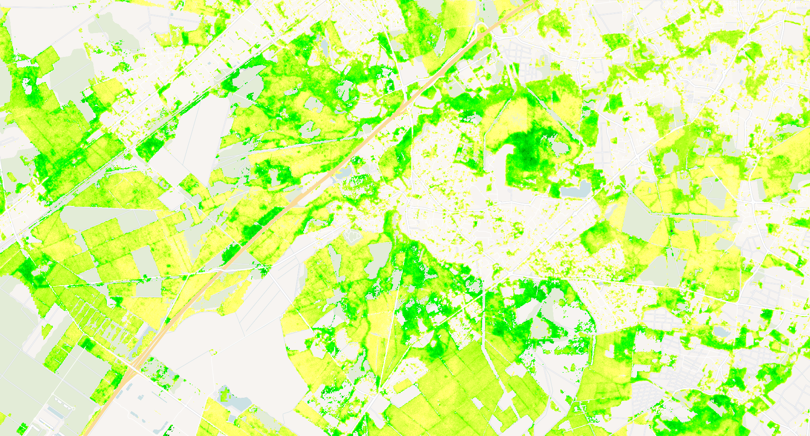

## Evaluate and visualize
 - [EO Browser](https://apps.sentinel-hub.com/eo-browser/?zoom=14&lat=44.74116&lng=-0.68435&themeId=PLANET_SANDBOX&visualizationUrl=U2FsdGVkX1%2BDVcWBLA1qHbbwokvfwDH%2BRfpQTxSOrUhpaoTYAzMKWAA3E%2FzMVxo2SmuWMDVfih7JE9f39%2BNQr0PRxDZufVahd6aQ73GgzgRwx1tFtK24yQLX7bIffvml&evalscript=Ly9WRVJTSU9OPTMKLyogCiAqIEZvcmVzdCBWaXRhbGl0eSBDaGFuZ2UgSW5kZXggLSBHYWluIFZpc3VhbGl6YXRpb24KICogVGhpcyBzY3JpcHQgdmlzdWFsaXplcyBvbmx5IHBvc2l0aXZlIGNoYW5nZXMgKGdhaW5zKSBpbiBmb3Jlc3Qgdml0YWxpdHkKICogYmV0d2VlbiB0d28gdGltZXBvaW50cyBiYXNlZCBvbiB2ZWdldGF0aW9uIGluZGljZXMuCiAqIAogKiBQYXJhbWV0ZXJzOgogKiAtIFZJX1RZUEU6IFZlZ2V0YXRpb24gaW5kZXggdHlwZSAoIk5EVkkiIG9yICJTQVZJIikKICogLSBDQ19NSU46IE1pbmltdW0gY2Fub3B5IGNvdmVyIHBlcmNlbnRhZ2UKICogLSBWSV9NSU4sIFZJX01BWDogUmFuZ2UgZm9yIGNsaXBwaW5nIHZlZ2V0YXRpb24gaW5kZXggdmFsdWVzCiAqIC0gQ0hBTkdFX1RIUkVTSE9MRDogTWluaW11bSAlIGNoYW5nZSB0byBjbGFzc2lmeSBhcyBnYWluCiAqIC0gQ0xBU1NfSU5URVJWQUw6IEludGVydmFsIGZvciBjbGFzc2lmeWluZyBjaGFuZ2UgbWFnbml0dWRlCiAqLwoKZnVuY3Rpb24gc2V0dXAoKSB7CiAgcmV0dXJuIHsKICAgIGlucHV0OiBbCiAgICAgIHsKICAgICAgICBkYXRhc291cmNlOiAiYXJwcyIsCiAgICAgICAgYmFuZHM6IFsicmVkIiwgIm5pciIsICJkYXRhTWFzayIsICJjbG91ZF9tYXNrIl0sCiAgICAgIH0sCiAgICAgIHsKICAgICAgICBkYXRhc291cmNlOiAiY2Fub3B5X2NvdmVyIiwKICAgICAgICBiYW5kczogWyJDQyIsICJkYXRhTWFzayJdLAogICAgICB9LAogICAgXSwKICAgIG91dHB1dDogWwogICAgICB7IGJhbmRzOiA0IH0sIC8vIFJHQkEgZm9yIGdhaW4KICAgIF0sCiAgICBtb3NhaWNraW5nOiAiT1JCSVQiLAogIH07Cn0KCi8vIENvbmZpZ3VyYXRpb24gcGFyYW1ldGVycwpjb25zdCBWSV9UWVBFID0gIk5EVkkiOyAvLyBDaG9vc2UgIk5EVkkiIG9yICJTQVZJIgpjb25zdCBDQ19NSU4gPSAyNTsgICAgICAvLyBNaW5pbXVtIGNhbm9weSBjb3ZlciBwZXJjZW50YWdlIHRvIGNvbnNpZGVyIHZhbGlkIGZvcmVzdApjb25zdCBWSV9NSU4gPSAwLjE1OyAgICAvLyBNaW5pbXVtIHZlZ2V0YXRpb24gaW5kZXggdmFsdWUgZm9yIGNsaXBwaW5nCmNvbnN0IFZJX01BWCA9IDAuODU7ICAgIC8vIE1heGltdW0gdmVnZXRhdGlvbiBpbmRleCB2YWx1ZSBmb3IgY2xpcHBpbmcKY29uc3QgQ0hBTkdFX1RIUkVTSE9MRCA9IDIuNTsgLy8gTWluaW11bSAlIGNoYW5nZSB0byBjbGFzc2lmeSBhcyBnYWluCmNvbnN0IENMQVNTX0lOVEVSVkFMID0gNTsgLy8gSW50ZXJ2YWwgZm9yIGNsYXNzaWZ5aW5nIGNoYW5nZSBpbnRvIHBhbGV0dGVzCmNvbnN0IElOVkFMSURfVkkgPSAtOTk5OTsgIC8vIFZhbHVlIGZvciBpbnZhbGlkIHZlZ2V0YXRpb24gaW5kZXgKY29uc3QgVklfU0NBTEUgPSA5OTsgICAgICAvLyBTY2FsZSBmYWN0b3IgZm9yIFZJIHZhbHVlcyAocmVzdWx0aW5nIGluIHJhbmdlIDEtMTAwKQpjb25zdCBTQVZJX0wgPSAwLjU7ICAgICAgIC8vIFNvaWwgYWRqdXN0bWVudCBmYWN0b3IgZm9yIFNBVkkKCi8vIENvbG9yIHBhbGV0dGUgLSBmb3Igdml0YWxpdHkgZ2FpbnMgKGZyb20gc21hbGwgdG8gc2lnbmlmaWNhbnQpCmNvbnN0IGdhaW5QYWxldHRlID0gWwogIFsxLjAsIDEuMCwgMC42XSwgIC8vIDAgLSBzbWFsbGVzdCBnYWluCiAgWzEuMCwgMS4wLCAwLjVdLAogIFsxLjAsIDEuMCwgMC40XSwKICBbMC45LCAxLjAsIDAuM10sCiAgWzAuOCwgMS4wLCAwLjJdLAogIFswLjcsIDEuMCwgMC4xXSwKICBbMC42LCAxLjAsIDAuMF0sCiAgWzAuNCwgMS4wLCAwLjBdLAogIFswLjIsIDEuMCwgMC4wXSwKICBbMC4wLCAxLjAsIDAuMF0sCiAgWzAuMCwgMC45LCAwLjBdLAogIFswLjAsIDAuOCwgMC4wXSwKICBbMC4wLCAwLjYsIDAuMF0sCiAgWzAuMCwgMC40LCAwLjBdLAogIFswLjAsIDAuMiwgMC4wXSwKICBbMC42LCAwLjAsIDAuNl0sCiAgWzAuNywgMC4wLCAwLjddLAogIFswLjgsIDAuMCwgMC44XSwKICBbMC45LCAwLjAsIDAuOV0sCiAgWzEuMCwgMC4wLCAxLjBdLCAgLy8gMTkgLSBzaWduaWZpY2FudCBnYWluCl07CgovLyBDYWxjdWxhdGUgdmVnZXRhdGlvbiBpbmRleCAoVkkpIGJhc2VkIG9uIHR5cGUKZnVuY3Rpb24gY2FsY3VsYXRlVkkobmlyLCByZWQpIHsKICBpZiAobmlyID09PSB1bmRlZmluZWQgfHwgcmVkID09PSB1bmRlZmluZWQpIHJldHVybiBJTlZBTElEX1ZJOwogIGlmIChuaXIgKyByZWQgPT09IDApIHJldHVybiBJTlZBTElEX1ZJOyAvLyBBdm9pZCBkaXZpc2lvbiBieSB6ZXJvCiAgCiAgaWYgKFZJX1RZUEUgPT09ICJORFZJIikgewogICAgcmV0dXJuIChuaXIgLSByZWQpIC8gKG5pciArIHJlZCk7CiAgfSBlbHNlIGlmIChWSV9UWVBFID09PSAiU0FWSSIpIHsKICAgIHJldHVybiAoKG5pciAtIHJlZCkgLyAobmlyICsgcmVkICsgU0FWSV9MKSkgKiAoMSArIFNBVklfTCk7CiAgfSBlbHNlIHsKICAgIHJldHVybiBJTlZBTElEX1ZJOwogIH0KfQoKLy8gQ2xpcCBWSSB0byBtaW4vbWF4IHJhbmdlIGFuZCBzY2FsZSB0byAxLTEwMCByYW5nZQpmdW5jdGlvbiBjbGlwQW5kU2NhbGVWSSh2aSkgewogIGNvbnN0IGNsaXBwZWRWSSA9IE1hdGgubWF4KFZJX01JTiwgTWF0aC5taW4odmksIFZJX01BWCkpOwogIHJldHVybiBNYXRoLnJvdW5kKCgoY2xpcHBlZFZJIC0gVklfTUlOKSAvIChWSV9NQVggLSBWSV9NSU4pKSAqIFZJX1NDQUxFKSArIDE7Cn0KCi8vIEZpbHRlciBzY2VuZXMgdG8gb25seSBpbmNsdWRlIGZpcnN0IGFuZCBsYXN0IG9mIHNwZWNpZmllZCB0aW1lIHJhbmdlCmZ1bmN0aW9uIHByZVByb2Nlc3NTY2VuZXMoY29sbGVjdGlvbnMpIHsKICAvLyBHZXQgdGhlIG9yYml0cyBhcnJheQogIHZhciBvcmJpdHMgPSBjb2xsZWN0aW9ucy5hcnBzLnNjZW5lcy5vcmJpdHM7CiAgCiAgLy8gTWFrZSBzdXJlIHdlIGhhdmUgYXQgbGVhc3QgMiBvcmJpdHMgdG8gd29yayB3aXRoCiAgaWYgKG9yYml0cyAmJiBvcmJpdHMubGVuZ3RoID49IDIpIHsKICAgIC8vIEtlZXAgb25seSBmaXJzdCBhbmQgbGFzdCBvcmJpdHMKICAgIHZhciBmaXJzdE9yYml0ID0gb3JiaXRzWzBdOwogICAgdmFyIGxhc3RPcmJpdCA9IG9yYml0c1tvcmJpdHMubGVuZ3RoIC0gMV07CiAgICBjb2xsZWN0aW9ucy5hcnBzLnNjZW5lcy5vcmJpdHMgPSBbZmlyc3RPcmJpdCwgbGFzdE9yYml0XTsKICB9IGVsc2UgewogICAgLy8gTG9nIGFuIGVycm9yIGlmIHRoZXJlIGFyZW4ndCBlbm91Z2ggb3JiaXRzCiAgICBjb25zb2xlLndhcm4oIkZWQ0kgcmVxdWlyZXMgYXQgbGVhc3QgMiBzY2VuZXMgZm9yIGNoYW5nZSBkZXRlY3Rpb24iKTsKICB9CiAgCiAgcmV0dXJuIGNvbGxlY3Rpb25zOwp9CgovLyBNYWluIGZ1bmN0aW9uIHRvIGV2YWx1YXRlIGVhY2ggcGl4ZWwKZnVuY3Rpb24gZXZhbHVhdGVQaXhlbChzYW1wbGVzKSB7CiAgLy8gQ2hlY2sgZm9yIHVuZGVmaW5lZCBpbnB1dHMKICBpZiAoIXNhbXBsZXMuYXJwcyB8fCAhc2FtcGxlcy5jYW5vcHlfY292ZXIgfHwgCiAgICAgIHNhbXBsZXMuYXJwcy5sZW5ndGggPCAyIHx8IHNhbXBsZXMuY2Fub3B5X2NvdmVyLmxlbmd0aCA8IDIpIHsKICAgIHJldHVybiBbMCwgMCwgMCwgMF07IC8vIFRyYW5zcGFyZW50CiAgfQoKICBjb25zdCBwc19hcmRfVDEgPSBzYW1wbGVzLmFycHNbMV07CiAgY29uc3QgcHNfYXJkX1QyID0gc2FtcGxlcy5hcnBzWzBdOwogIGNvbnN0IGNhbm9weV9UMSA9IHNhbXBsZXMuY2Fub3B5X2NvdmVyWzFdOwogIGNvbnN0IGNhbm9weV9UMiA9IHNhbXBsZXMuY2Fub3B5X2NvdmVyWzBdOwoKICAvLyBDaGVjayBkYXRhIG1hc2tzCiAgaWYgKHBzX2FyZF9UMS5kYXRhTWFzayA9PT0gMCB8fCBwc19hcmRfVDIuZGF0YU1hc2sgPT09IDApIHsKICAgIHJldHVybiBbMCwgMCwgMCwgMF07CiAgfQoKICAvLyBDaGVjayBjbG91ZCBtYXNrcwogIGlmIChwc19hcmRfVDEuY2xvdWRfbWFzayAhPT0gMSB8fCBwc19hcmRfVDIuY2xvdWRfbWFzayAhPT0gMSkgewogICAgcmV0dXJuIFswLCAwLCAwLCAwXTsKICB9CgogIC8vIENoZWNrIGNhbm9weSBjb3ZlciB0aHJlc2hvbGRzCiAgaWYgKGNhbm9weV9UMS5DQyA8PSBDQ19NSU4gfHwgY2Fub3B5X1QyLkNDIDw9IENDX01JTikgewogICAgcmV0dXJuIFswLCAwLCAwLCAwXTsKICB9CgogIC8vIENhbGN1bGF0ZSBWSSBmb3IgVDEgYW5kIFQyCiAgY29uc3QgdmlfVDEgPSBjYWxjdWxhdGVWSShwc19hcmRfVDEubmlyLCBwc19hcmRfVDEucmVkKTsKICBjb25zdCB2aV9UMiA9IGNhbGN1bGF0ZVZJKHBzX2FyZF9UMi5uaXIsIHBzX2FyZF9UMi5yZWQpOwogIAogIC8vIENoZWNrIGZvciBpbnZhbGlkIFZJIHZhbHVlcwogIGlmICh2aV9UMSA9PT0gSU5WQUxJRF9WSSB8fCB2aV9UMiA9PT0gSU5WQUxJRF9WSSkgewogICAgcmV0dXJuIFswLCAwLCAwLCAwXTsKICB9CgogIC8vIENsaXAgYW5kIHNjYWxlIFZJIHZhbHVlcwogIGNvbnN0IHZpMTAwX1QxID0gY2xpcEFuZFNjYWxlVkkodmlfVDEpOwogIGNvbnN0IHZpMTAwX1QyID0gY2xpcEFuZFNjYWxlVkkodmlfVDIpOwoKICAvLyBDYWxjdWxhdGUgcGVyY2VudGFnZSBjaGFuZ2UgZGlyZWN0bHkKICBjb25zdCBjaGFuZ2VQZXJjZW50ID0gdmkxMDBfVDIgLSB2aTEwMF9UMTsKCiAgLy8gQ2xhc3NpZnkgY2hhbmdlIGludG8gZ2FpbgogIGlmIChjaGFuZ2VQZXJjZW50ID4gQ0hBTkdFX1RIUkVTSE9MRCkgewogICAgY29uc3QgY2xhc3NJbmRleCA9IE1hdGgubWluKAogICAgICAxOSwKICAgICAgTWF0aC5mbG9vcigoY2hhbmdlUGVyY2VudCAtIENIQU5HRV9USFJFU0hPTEQpIC8gQ0xBU1NfSU5URVJWQUwpCiAgICApOwogICAgY29uc3QgY29sb3IgPSBnYWluUGFsZXR0ZVtjbGFzc0luZGV4XTsKICAgIHJldHVybiBbLi4uY29sb3IsIDFdOyAvLyBGdWxseSBvcGFxdWUgZ2FpbgogIH0gZWxzZSB7CiAgICByZXR1cm4gWzAsIDAsIDAsIDBdOyAvLyBGdWxseSB0cmFuc3BhcmVudCBpZiBubyBzaWduaWZpY2FudCBjaGFuZ2UKICB9Cn0K&datasetId=3f605f75-86c4-411a-b4ae-01c896f0e54e&fromTime=2023-03-20T00%3A00%3A00.000Z&toTime=2023-07-14T23%3A59%3A59.999Z&demSource3D=%22MAPZEN%22&dataFusion=%5B%7B%22id%22%3A%22CUSTOM%22%2C%22alias%22%3A%22arps%22%2C%22additionalParameters%22%3A%7B%22collectionId%22%3A%223f605f75-86c4-411a-b4ae-01c896f0e54e%22%2C%22subType%22%3Anull%2C%22locationId%22%3A%22aws-eu-central-1%22%7D%7D%2C%7B%22id%22%3A%22CUSTOM%22%2C%22alias%22%3A%22canopy_cover%22%2C%22additionalParameters%22%3A%7B%22collectionId%22%3A%22ca501757-cf8e-43a8-b1a4-1aa59ae22425%22%2C%22subType%22%3A%22BYOC%22%2C%22locationId%22%3A%22aws-eu-central-1%22%7D%2C%22timespan%22%3A%5B%222023-03-21T00%3A00%3A00.000Z%22%2C%222023-07-21T23%3A59%3A59.999Z%22%5D%7D%5D#custom-script){:target="_blank"}

 The example data is using Planet Sandox data. This data is restricted to Sentinel Hub users with active paid plans. If you are already a Planet Customer, see [here](https://community.planet.com/sentinel-hub-81/access-new-tools-for-analyzing-your-planet-data-on-sentinel-hub-732) on how to get access.

## General description

The FVCI-Gain script visualizes positive changes in forest vitality between two time periods. This specialized visualization focuses exclusively on areas showing improvement in forest health, making it easier to identify regeneration, growth, or recovery patterns. The script combines Analysis Ready PlanetScope imagery with Canopy Cover data from the Forest Carbon Monitoring dataset to ensure analysis is focused on forest areas only.

## Details of the script

The FVCI-Gain processing workflow includes:
1. Filter pixels based on canopy cover percentage (>25%) for both time periods
2. Calculate vegetation index (users can choose between NDVI or SAVI) for both time periods
3. Clip and scale both indices to a standardized range
4. Calculate the difference between the time periods
5. Identify pixels with positive change exceeding the threshold (>2.5%)
6. Classify positive changes into 20 intensity levels
7. Apply a color palette transitioning from yellow through green to purple to visualize different gain intensities

The script utilizes the first and last PlanetScope ARD acquisition in the specified time range.

## Description of representative images

The FVCI-Gain visualization uses a color palette specifically designed to highlight forest vitality improvements:
- Light yellow to yellow: Minor improvements in forest health
- Yellow-green to green: Moderate improvements
- Dark green: Significant improvements
- Purple to magenta: Major improvements/regeneration

Areas with no significant improvement or insufficient canopy cover remain transparent.

A visualization of FVCI-Gain between March and July 2023 over Cestas, France:

