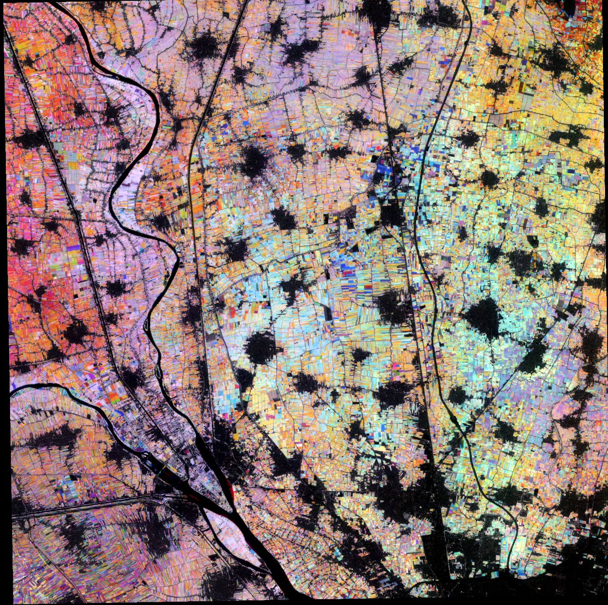

## Author of the script
[@HarelDan](https://github.com/hareldunn/GIS_Repo/blob/master/Multi-Temporal%20NDVI%20for%20Sentinel%20Hub%20Custom%20Scripts){:target="_blank"} 

Adapted to [PlanetScope](https://docs.planet.com/data/imagery/planetscope/) and [Analysis-Ready PlanetScope](https://docs.planet.com/data/imagery/arps/) by András Zlinszky and Github Copilot.

## General description of the script
Agricultural growth stage is a script visualizing the multi-temporal NDVI trends in Sentinel-2 imagery. It takes the current image as baseline and calculates the average NDVI for the previous 2 months.
The script requires multi-temporal processing, so the parameter TEMPORAL=true should be added to the request.
A simple stretching is applied to NDVI between 0.1 and 0.7 by default, then the mean NDVI from the first, second and third month is assigned to the Red, Green and Blue channels of the image respectively, creating a composite image. What you see on the composite is 
- how dense and/or vigorous the vegetation is, represented by the brightness of the color from black (no vegetation at all) to white (dense green vegetation all year), with various shades of color in between
- when the vegetation peak happens and how distinct it is. Vegetation with a single very distict peak will be one of the primary colors (Red, Green, Blue) while vegetation with a longer, more even growth season will be yellow (between Red and Green) or cyan (between Green and Blue). Purple color may indicate two vegetation peaks, one in the first month and another in the last, with a dry period or grassland mowing in between.

## How to use

- In Planet Insights Platform Browser, open the calendar panel dropdown (with the dropdown button on the right)
- Select the time interval view (the calendar icon with arrows on the top right). You will now see two dates, labeled "from" and "until".
- Select these dates to cover an interval of three months for the regular script.
- Select your evalscript of choice from this script website and copy it from the code window above
- In Planet Insights Browser, click the `Custom Script` in the list of layers and the `Custom Script` tab to open the evalscript code window
- Select the full text inside the window (eg. with the Ctrl+A hotkey) and paste the evalscript code from the clipboard
- Wait until the data loads - this may take some time for large areas.

## Description of representative images

The Agricultural growth stage script applied to the agricultural fields of the Nile Delta, just north of Cairo, Egypt. 

## References
Based on: 
[source 1](https://twitter.com/sentinel_hub/status/922813457145221121){:target="_blank"}, 
[source 2](https://twitter.com/sentinel_hub/status/1020755996359225344){:target="_blank"}

