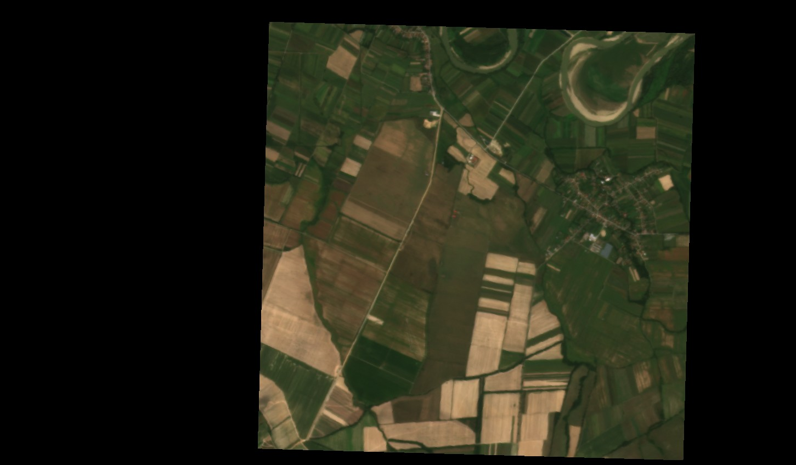

A place close to Cărășeu, Romania - an example of Planet Sandbox data

---

## Description of the Script

kNDVI (Kernel NDVI) is a recently proposed vegetation index (Camps-Valls 2021) based on a nonlinear generalization of the popular Normalized Differential Vegetation Index (NDVI). kNDVI works by re-scaling the relation between the difference in Red and Near Infrared (NIR) from a simple linear difference to a more complex relationship. Here we coded the simplest definition of kNDVI with a Radial Basis Function kernel as proposed in Camps-Valls (2021).
It seems based on the cited literature that kNDVI provides better correlation with field biomass or crop yield and provides higher accuracy for classification than NDVI. Note that for some machine learning applications, since this is "just" a rescaling of the spectral index, kNDVI might not perform differently than NDVI.
However, due to the second-order relationship with the difference of Red and NIR, kNDVI can produce high values when the difference is negative. Such cases include non-vegetated surfaces, but also clouds which may thus be incorrectly displayed. Therefore, kNDVI is highly suitable for following vegetation patterns and processes, but not at all suitable on its own for separating vegetated surfaces from water, ice or clouds.
This was slightly improved by adding the "clear" band from PlanetScope data to at least filter away clouds. If the pixel is not clear, nothing is returned

The script has 4 different outputs:
- Default has 4 bands (Red, Green, Blue and Transparency, for visualization in Planet Insights Browser)
- Index is the value of kndvi for the purpose of generating histograms in the Browser, unless the image is cloudy - then it is null.
- eobrowserStats is the value of kndvi for the purpose of generating Statistics API outputs such as time series, unless the image is cloudy - then it is null. 
- dataMask is a simple mask for valid/invalid pixels - note that cloudy pixels will also have valid values!

## Description of representative images

kNDVI is highly sensitive to the typical range of vegetation greenness, and is less sensitive to saturation at high biomass levels. Therefore it is useful for visualizing fine-scale patterns in crops or vegetation.

Grasslands and crop fields near  Lipău, Romania, **PlanetScope**, 2023-09-06, [**kNDVI**]. The image highlights the fine patterns in vegetation greenness and biomass governed by microtopography near the river. Subtle patterns in the small agricultural fields are easy to recognise. In densely vegetated areas such as the wetland just north of the river bend in the top center, the index does not saturate but highlights small patterns 

For comparison, here is a visualization of the same image with the default NDVI script available in Copernicus Browser. **PlanetScope**, 2023-09-06, [**NDVI**]. This visualization is darker and saturated for the most densely vegetated parts of the image, not showing the patterns of the grassland. Note that the palette (mapping of values from 0-1 to various green colours) is exactly the same for both images

Finally, for orientation, here is a true colour image. **PlanetScope**, 2023-09-06, [**True Color**]. Here you can see the various land cover categories and the wide variety of dry and green vegetation biomass. 

## References

- Camps-Valls, Gustau, et al. "A unified vegetation index for quantifying the terrestrial biosphere." Science Advances 7.9 (2021): eabc7447. [link](https://www.science.org/doi/10.1126/sciadv.abc7447)