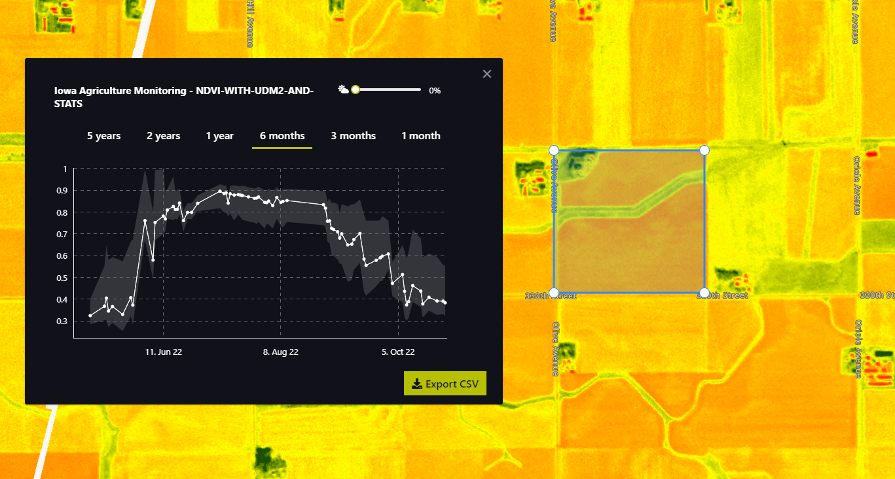

The example data is using Planet Sandox data. This data is restricted to Sentinel Hub users with active paid plans. If you are already a Planet Customer, see [here](https://community.planet.com/sentinel-hub-81/access-new-tools-for-analyzing-your-planet-data-on-sentinel-hub-732) on how to get access.

## General description

The well known and widely used NDVI is a simple, but effective index for quantifying green vegetation. It normalizes green leaf scattering in Near Infra-red wavelengths with chlorophyll absorption in red wavelengths.

The value range of the NDVI is -1 to 1. Negative values of NDVI (values approaching -1) correspond to water. Values close to zero (-0.1 to 0.1) generally correspond to barren areas of rock, sand, or snow. Low, positive values represent shrub and grassland (approximately 0.2 to 0.4), while high values indicate temperate and tropical rainforests (values approaching 1). It is a good proxy for live green vegetation; see [1] for details.

The normalized difference vegetation index, abbreviated NDVI, is defined as   

$$NDVI := \mathtt{Index}(nir,red) = \frac{nir-red}{nir+red}.$$  

This is an example script which can be used with EO Browser and is configured to return statistics in a format which can be used with the statistical info chart.  For more information, see <a href = "https://www.sentinel-hub.com/faq/how-configure-your-layers-statistical-info-eo-browser/"> How Can I Configure My Layers For Statistical Information In EO Browser?</a>

## Representative images

NDVI of agriculture fields in Iowa. 

## References
 [1] Wikipedia, [Normalized Difference Vegetation Index](https://en.wikipedia.org/wiki/Normalized_Difference_Vegetation_Index). Accessed on October 4th 2017.
