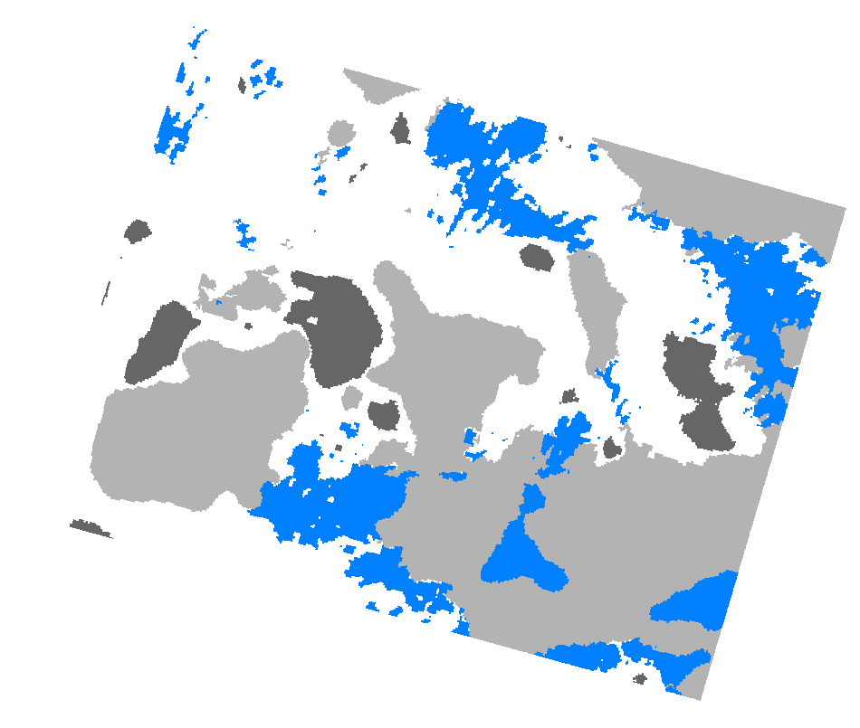

# Cloud/Snow Mask Classification, PlanetScope

<a href="#" id='togglescript'>Show</a> script or [download](script.js){:target="_blank"} it.


      


## Evaluate and visualize

As PlanetScope is commercial data, brought into Sentinel Hub as Bring Your Own Data, direct EO Browser and Sentinel Playgorund links are not possible due to the personalized data credentials.   

## General description

PlanetScope has several usable data mask (UDM2) bands. The `UDM2_Clear` band gives information on whether the pixel is clear, meaning that the surface is clearly visible. If it's not clear, that means it's classified as either shadow, snow, light haze, heavy haze or cloud. Each of these is a separate UDM2 mask band: 

- UDM2_Snow
- UDM2_Shadow
- UDM2_LightHaze
- UDM2_HeavyHaze
- UDM2_Cloud

When the mask band == 1, the pixel belongs to the mask (for example, when UDM2_Snow == 1, the pixel was recognized as snow). The bands are mutually exclusive - if a pixel belongs to one mask class, it cannot belong to any other.

In the script, each of the UDM2 mask bands is classified with a unique color, and the pixels that do not belong to any class, are returned transparent. 

**Color legend**
<table>
  <tr>
    <th>Mask</th>
    <th>HTLM color code</th>
    <th>Color</th>
  </tr>
  <tr>
    <td>Snow</td>
    <td>#0080FF</td>
    <td style="background-color: #0080FF;"></td>
  </tr>
  <tr>
    <td>Shadow</td>
    <td>#666666</td>
    <td style="background-color: #666666;"></td>
  </tr>
  <tr>
    <td>Light haze</td>
    <td>#00E6FF</td>
    <td style="background-color: #00E6FF;"></td>
  </tr>
  <tr>
    <td>Heavy haze</td>
    <td>#FFB3FF</td>
    <td style="background-color: #FFB3FF;"></td>
  </tr>
  <tr>
    <td>Cloud</td>
    <td>#B3B3B3</td>
    <td style="background-color: #B3B3B3;"></td>
  </tr>
</table>

## Description of representative images

Several mask classes over Austria, acquired on 2021-03-23.

## References
 - Learn more about the bands in [PlanetScope documentation](https://assets.planet.com/docs/Planet_Combined_Imagery_Product_Specs_letter_screen.pdf#page=96) 
