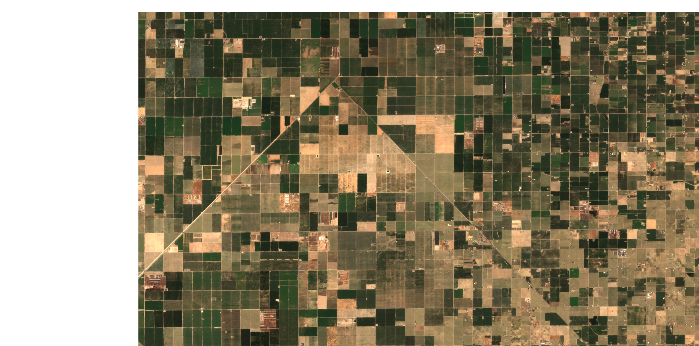

## General description

The cloudless mosaic script composites together observations across a time range, which is set as 7 days in this script.  Pixels which are not clear in the Useable Data Mask (UDM) are removed.  There are two options for functions to select which scene to get the pixel from, `getLastObservation` and `getMedian`.  `getLastObservation` will put the most recent non cloudy pixel on top.  `getMedian` will remove outliers due to shadows or cloud haze that may have been missed by the UDM algorithm.  

Below is an example of several PlanetScope scenes being composited across an area that spans several strips and contains gaps when viewed per day.  The script returns a continuous image without gaps.  

