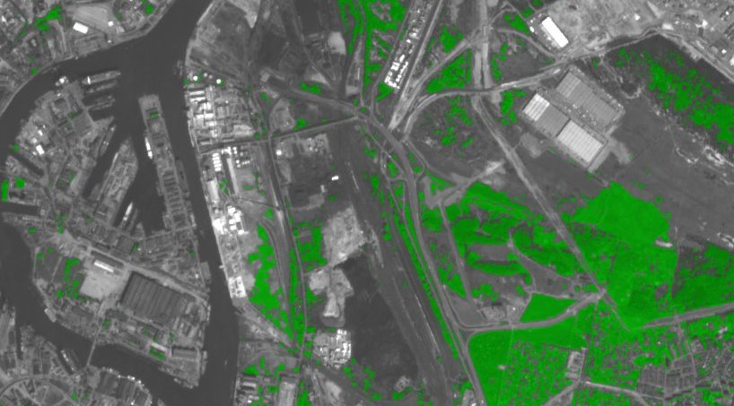

The example data is using Planet Sandox data. This data is restricted to Sentinel Hub users with active paid plans. If you are already a Planet Customer, see [here](https://community.planet.com/sentinel-hub-81/access-new-tools-for-analyzing-your-planet-data-on-sentinel-hub-732) on how to get access.

## General description of the script

Uses NDVI [1] to color PlanetScope images and create awareness of green areas in cities around the World. The script was modified to fit PlanetScope spectral bands. 
See also <a href="https://custom-scripts.sentinel-hub.com/sentinel-2/green_city/#">Green City for PlanetScope.</a> 

## Author of the script

Carlos Bentes

## Description of representative images

Visualization of the port of Hamburg with the Green City script. Acquisition date 2019-04-30, processed by Sentinel Hub. 

## References

[1] Normalized difference vegetation index: 
https://en.wikipedia.org/wiki/Normalized_difference_vegetation_index

## Credits

Y. Zha, J. Gao & S. Ni (2003) Use of normalized difference built-up index in automatically mapping urban areas from TM imagery, International Journal of Remote Sensing, 24:3, 583-594, DOI: 10.1080/01431160304987
