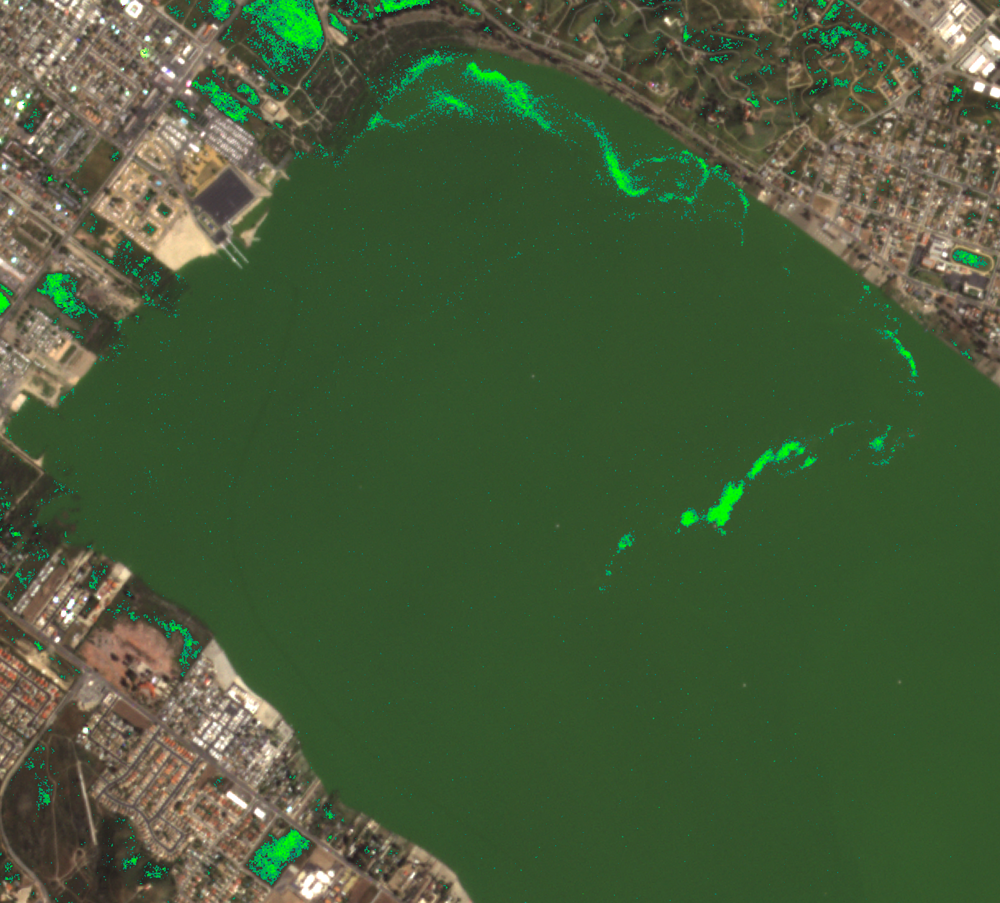

## General description

The normalized difference chlorophyll index, abbreviated NDCI, is defined as   

$$NDCI := \mathtt{Index}(rededge,red) = \frac{rededge-red}{rededge+red}$$  

This is an example script which can be used with EO Browser and is configured to return statistics in a format which can be used with the statistical info chart.  For more information, see <a href = "https://www.sentinel-hub.com/faq/how-configure-your-layers-statistical-info-eo-browser/"> How Can I Configure My Layers For Statistical Information In EO Browser?</a>

## Representative image

NDCI over Lake Elsinore in California.

## References
Sachidananda Mishra, Deepak R. Mishra (2012) Normalized difference chlorophyll index: A novel model for remote estimation of chlorophyll-a concentration in turbid productive waters, Remote Sensing of Environment, 117:394-406, DOI: [10.1016/j.rse.2011.10.016](https://doi.org/10.1016/j.rse.2011.10.016)