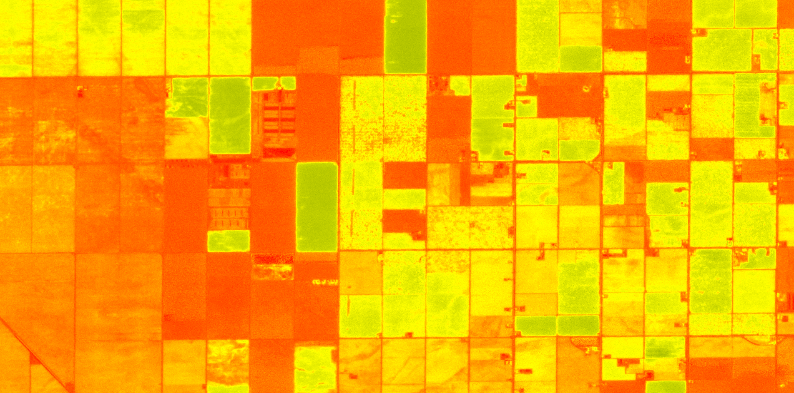

## General description

The normalized difference red edge index, abbreviated NDRE, is defined as   

$$NDRE := \mathtt{Index}(nir,rededge) = \frac{nir-rededge}{nir+rededge}$$  

This is an example script which can be used with EO Browser and is configured to return statistics in a format which can be used with the statistical info chart.  For more information, see <a href = "https://www.sentinel-hub.com/faq/how-configure-your-layers-statistical-info-eo-browser/"> How Can I Configure My Layers For Statistical Information In EO Browser?</a>

## Description of representative images

NDRE of agriculture fields in California. 

## References
 [1] Wikipedia, [Normalized Difference Vegetation Index](https://en.wikipedia.org/wiki/Normalized_Difference_Red_Edge_Index).
