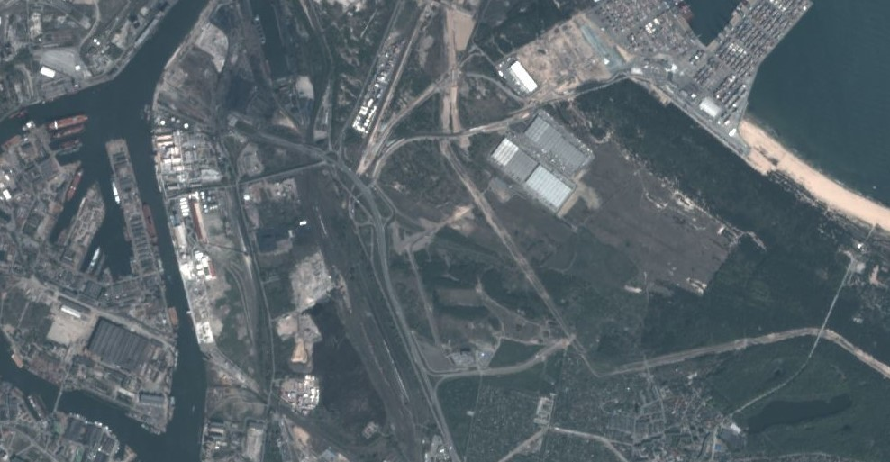

# True color product, PlanetScope

<a href="#" id='togglescript'>Show</a> script or [download](script.js){:target="_blank"} it.


      


## Evaluate and visualize

As PlanetScope is commercial data, brought into Sentinel Hub as Bring Your Own Data, direct EO Browser and Sentinel Playgorund links are not possible due to the personalized data credentials.   

## General description

The true color product maps PlanetScope band values B3, B2, and B1 which roughly correspond to red, green, and blue part of the spectrum, respectively, to R, G, and B components.

## Description of representative images

True color visualization of Rome.

## References
 - Wikipedia, [False color](https://en.wikipedia.org/wiki/False_color#True_color). Accessed October 10th 2017.
