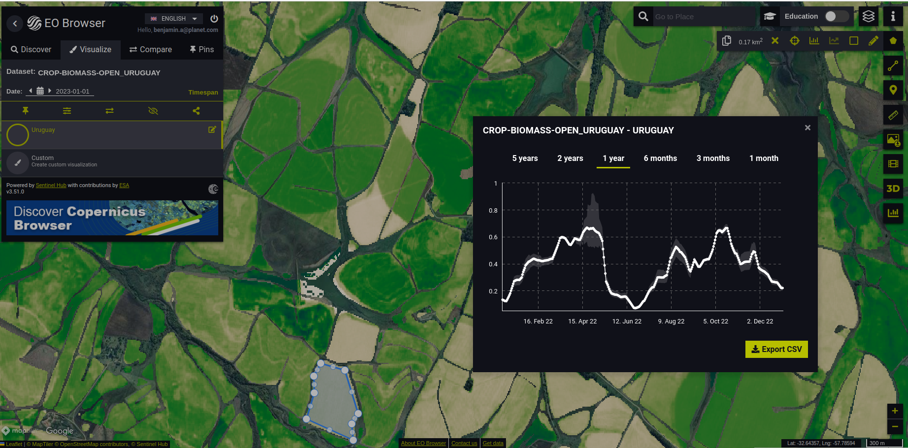

## Evaluate and visualize

As Crop Biomass is commercial data, brought into Sentinel Hub as Bring Your Own Data, direct EO Browser and Sentinel Playground links are not possible due to the personalized data credentials.

## General description

Biomass Proxy is a fusion of microwave and optical satellite imagery, using the advantages of each to accurately estimate relative above-ground crop biomass regardless of cloud cover and at a high spatial resolution (10 m x 10 m).

It integrates microwave data from the European Space Agency (ESA) Sentinel-1 satellites and optical images from its Sentinel-2 satellites.

Planetary Variables then fuses the output from these combined data sources in an algorithm designed to provide a reliable measurement of crop biomass over agricultural areas under all circumstances.

This is a relative measure of biomass, so each pixel value has a value of 0 (low biomass) to 1 (high biomass).

It should be computed over agricultural fields.

## Description of representative images

Crop Biomass of agriculture fields in Uruguay.

