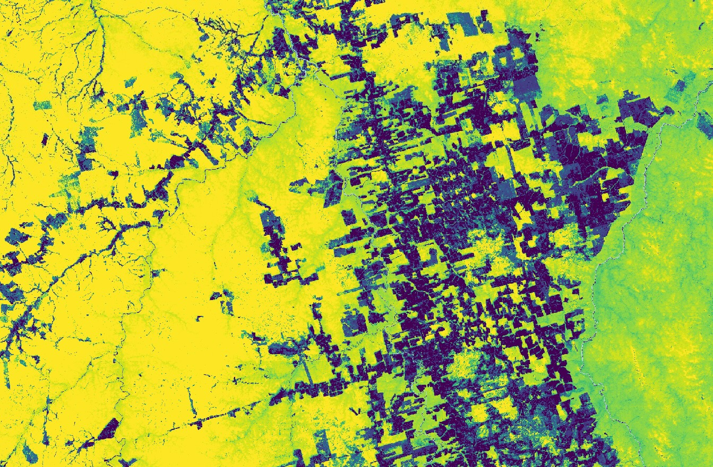

## Evaluate and visualize

As Forest Carbon Monitoring is commercial data, brought into Sentinel Hub as Bring Your Own Data, direct EO Browser links are not possible due to the personalized data credentials.

## General description

Aboveground carbon density quantifies the expected density of carbon stored in woody biomass across the
landscape, measured in mass per area (megagrams of carbon per hectare). It is not a direct estimate of the total
carbon in that pixel, as the spatial resolution of each pixel is less than one hectare. To estimate total carbon in a
pixel, users should normalize these values to account for the size of each pixel, or average the density values to 1
hectare in an equal area projection.

The data layer has four bands:

- **Aboveground Carbon Density** quantifies the density of carbon stored in woody vegetation,
  primarily trees and shrubs. Grassland, herbaceous, and soil carbon stocks are not quantified.
- **Lower prediction bound (5th percentile)** of the 90% prediction interval for model predictions at each pixel.
- **Upper prediction bound (95th percentile)** of the 90% prediction interval for model predictions at each pixel.

## Description of representative images

Aboveground Carbon Density in 2024-09-21 near Novo Progresso, Brazil..

