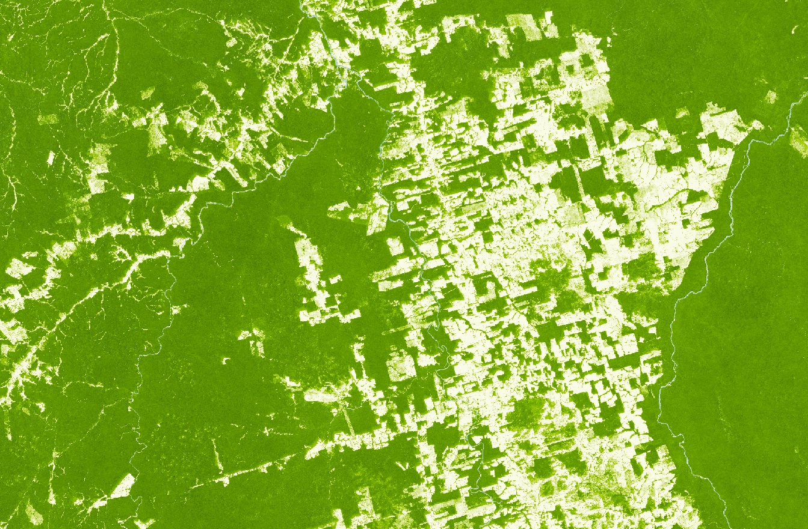

## Evaluate and visualize

As Forest Carbon Monitoring is commercial data, brought into Sentinel Hub as Bring Your Own Data, direct EO Browser links are not possible due to the personalized data credentials.

## General description

Canopy height quantifies the average stand height of trees within each pixel. Because this is a spatial average
over a moderate resolution, the modeled height values are shorter than the tallest individual tree within a pixel.

The data layer has four bands:

- **Canopy Height** quantifies the average height of all vegetation in that pixel.
- **Lower prediction bound (5th percentile)** of the 90% prediction interval for model predictions at each pixel.
- **Upper prediction bound (95th percentile)** of the 90% prediction interval for model predictions at each pixel.

## Description of representative images

Canopy Height in 2022 near Apui, Brazil.

