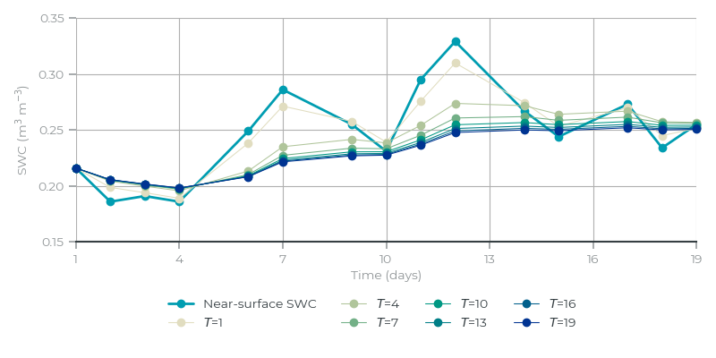

## General description
Here, we show how to compute and visualize derived root-zone soil water content (DRZSWC) using the Sentinel Hub EO Browser. DRZSWC is an estimate of the amount of water in the soil in the root zone: the depth range over which plant roots take up most of their water. The root zone depends on the type of vegetation, but typically covers the upper 100 cm of the soil [Stocker et al., 2023]. With satellites, we can observed soil water content (SWC) in the upper layer of the soil, typically covering the first 5 to 10 cm. To estimate SWC in the root zone from the upper-layed SWC observed by satellites, we can use an exponential filter.

## Description of representative images

| Near-surface soil water content (May 26, 2022) | Derived root-zone soil water content (May 26, 2022) | Sentinel-2 image (June 20, 2022) |
|:----:|:----:|:----:| 
|   |  |  |

In the figure above, we show near-surface and root-zone soil water content in Iowa (USA), on a rainy day after a dry period. The surface has become wet (blue), while the deeper root zone is still dry (yellow) due to the long dry spell. 

## Algorithm
The main drivers of SWC changes (precipitation and evaporation) happen at the surface. As a result, near-surface soil water content tends to react more and faster on precipitation and evaporation than soil water content in the deeper root zone. Omitting lateral transport and drainage to deeper layers, we can describe the changes over time $$t$$ of DRZSWC $$R$$ as a simple diffusion process that is a function of near-surface soil water content $$S$$ [Wagner et al., 1998]:

$$
\frac{\partial R(t)}{\partial t} = \frac{1}{T} \left[S(t) - R(t)\right].
$$

Here, $$T$$ is a time constant that sets the typical time scale that determines how quickly DRZSWC reacts to changes in near-surface SWC. 

Because we do not have continuous measurements of near-surface soil water content, we need to discretize this differential equation. Albergel et al. [2008] and Paulik et al. [2014] have proposed a recursive equation to solve this system, that computes DRZSWC for each time step $$n$$ for which we have an observation of $$S$$:

$$
R_n = R_{n-1} + K_n \cdot \left[S_n - R_{n-1} \right] 
$$

The gain $$K$$ is defined as:

$$
K_n = \frac{K_{n-1}}{K_{n-1} + e^{-{\Delta t / T}}}
$$

$$\Delta t$$ is the time between the two consecutive observations. For the first time step, we set $$R_1 = S_1$$ and $$K_n = 1$$. 

The time constant $$T$$ sets the response time of DRZSWC to near-surface SWC changes, and depends to the soil type and the depth of the root zone. Here, $$T$$ has been set to 10 days, which follows Albergel et al. [2008] for a root-zone soil layer of about 1 meter.  

The effect of setting $$T$$ can be seen in the figure below, which shows a typical near-surface SWC time series from the Netherlands, measured by SMAP:

The longer the time constant $$T$$, the more the high-frequency variations in SWC are damped. Also note here that the procedure needs some spin-up days. 

## References
- Albergel, C., Rüdiger, C., Pellarin, T., Calvet, J.-C., Fritz, N., Froissard, F., Suquia, D., Petitpa, A., Piguet, B., & Martin, E. (2008). From near-surface to root-zone soil moisture using an exponential filter: An assessment of the method based on in-situ observations and model simulations. Hydrology and Earth System Sciences, 12(6), 1323–1337. [https://doi.org/10.5194/hess-12-1323-2008](https://doi.org/10.5194/hess-12-1323-2008)

- Paulik, C., Dorigo, W., Wagner, W., & Kidd, R. (2014). Validation of the ASCAT Soil Water Index using in situ data from the International Soil Moisture Network. International Journal of Applied Earth Observation and Geoinformation, 30, 1–8. [https://doi.org/10.1016/j.jag.2014.01.007](https://doi.org/10.1016/j.jag.2014.01.007)

- Stocker, B. D., Tumber-Dávila, S. J., Konings, A. G., Anderson, M. C., Hain, C., & Jackson, R. B. (2023). Global patterns of water storage in the rooting zones of vegetation. Nature Geoscience. [https://doi.org/10.1038/s41561-023-01125-2](https://doi.org/10.1038/s41561-023-01125-2)

- Wagner, W., Lemoine, G., & Rott, H. (1999). A Method for Estimating Soil Moisture from ERS Scatterometer and Soil Data. Remote Sensing of Environment, 70(2), 191–207. [https://doi.org/10.1016/S0034-4257(99)00036-X](https://doi.org/10.1016/S0034-4257(99)00036-X)

## Useful links
-   [SWC Technical specifications](https://developers.planet.com/docs/planetary-variables/soil-water-content-technical-specification/)
-   [SWC Data sheet](https://planet.widen.net/s/cv7bfjhhd5)
-   [Sentinel Hub documentation about Soil Water Content](https://docs.sentinel-hub.com/api/latest/data/planetary-variables/soil-water-content/)