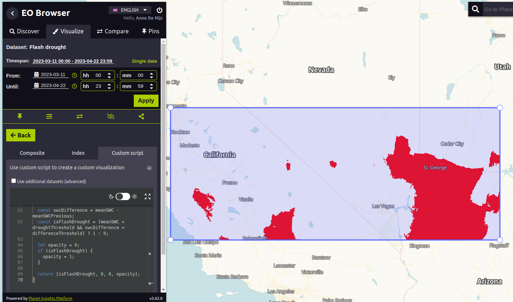

## General description
Droughts that are formed in just a few weeks are called flash droughts. We have published a [series of blog posts](https://www.planet.com/pulse/drying-up-in-a-flash-what-satellite-data-can-tell-us-about-flash-drought-risks-and-the-regions-we-should-be-watching/) about this fast-emerging and increasingly impactful climate phenomenon. This custom script uses the same principles as described in the blogs and can be used to highlight areas with potential flash droughts.

## Method
Based on the work of Eswar et al. (2018), we developed a methodology that highlights areas that reach a certain threshold for dryness and changes in SWC over a 28-day period. Specific thresholds for dryness and changes in SWC are set; by default, areas are highlighted where the 14-days backward average SWC was under 0.15 m3/m3 and the average decrease in the 14-days backward average SWC was above 0.12 m3/m3 compared to 28 days ago. Visualizing the areas that meet those criteria over time show these rapidly drying regions in red, and as conditions continue to change, they fade away.

## Description of representative images
[One of the blog posts](https://www.planet.com/pulse/flash-drought-hotspots-southwestern-united-states/) describes the flash drought in Southwestern United States in 2023. The example below shows the flash drought in a part of the Southwest on 22 April 2023.

## Usage of the script
The amount of days to calculate the backward average is 14, but can be changed by setting *nDaysBackwardAverage*. By default, the backward average SWC value is compared to the backward average SWC value of 28 days ago, which can be changed by setting *nDaysPrevious*. If you have a collection with SWC data, the first day on which this flash drought script can be applied is day 42 (*nDaysBackwardAverage + nDaysPrevious*). Be also aware that you set the timespan correctly in the EO Browser or Requests Builder (the difference between the start and end date must be at least *nDaysBackwardAverage + nDaysPrevious*), otherwise *no data* will be returned. 

## Useful links
-   [SWC Technical specifications](https://developers.planet.com/docs/planetary-variables/soil-water-content-technical-specification/)
-   [SWC Data sheet](https://planet.widen.net/s/cv7bfjhhd5)
-   [Sentinel Hub documentation about Soil Water Content](https://docs.sentinel-hub.com/api/latest/data/planetary-variables/soil-water-content/)

## References
Eswar R., Das N.N., Poulsen C., Behrangi A., Swigart J., Svoboda M., Entekhabi D., Yueh S., Doorn B., Entin J. (2018). SMAP Soil Moisture Change as an Indicator of Drought Conditions. Remote Sensing, 10(5), 788. [https://doi.org/10.3390/rs10050788](https://doi.org/10.3390/rs10050788)