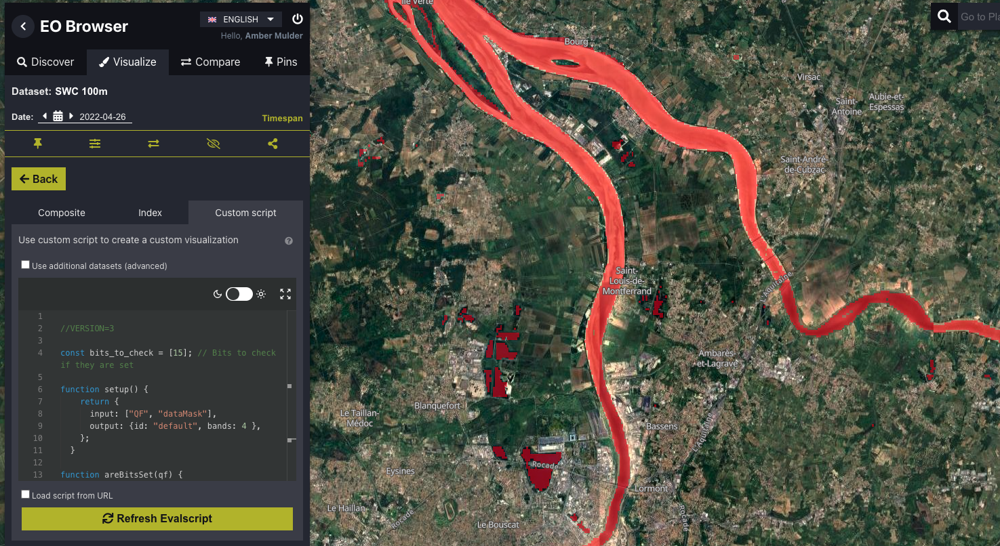
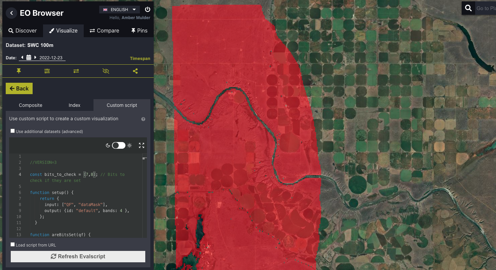

## General description
Soil Water Content (SWC) products include [quality flag assets](https://developers.planet.com/docs/planetary-variables/soil-water-content-technical-specification/#quality-flags) that provide quality metadata for each pixel using a bitwise flag system. These flags help identify the reliability of the SWC values for each pixel. Here we show how these quality flags can be easily displayed using custom scripts. For a complete list of all possible quality flags and their corresponding bits, please refer to [these tables](https://developers.planet.com/docs/planetary-variables/soil-water-content-technical-specification/#quality-flags).

## Notes on usage
Users can customize the script by adding the bit numbers corresponding to the quality flag(s) of interest to the `bits_to_check` list within the script. By default, the provided scripts are set to check all critical flags (indicating unreliable data, with corresponding SWC pixels set to the no data value), but this can be updated to include or exclude specific flags as needed.

The provided Visualization script highlights pixels for which specific quality flags of interest are set. This allows users to visually inspect areas of concern or interest.

The Raw Values script retrieves a binary raster where:

- `1` indicates pixels for which the quality flag(s) of interest are set  
- `0` indicates pixels where the quality flag(s) of interest are not set

## Description of representative images
The 'Open water' (bit 15\) quality flag in Bordeaux, France, on 2022-04-26.

The 'Possible frozen soil' (bit 7) and 'Frozen soil' (bit 8) quality flags in Alberta, Canada, on 2022-12-23.

## Useful links
-   [SWC Technical specifications](https://developers.planet.com/docs/planetary-variables/soil-water-content-technical-specification/)
-   [SWC Data sheet](https://planet.widen.net/s/cv7bfjhhd5)
-   [Sentinel Hub documentation about Soil Water Content](https://docs.sentinel-hub.com/api/latest/data/planetary-variables/soil-water-content/)