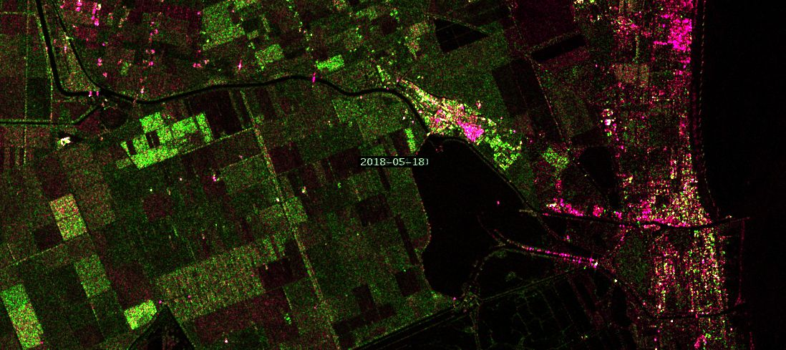
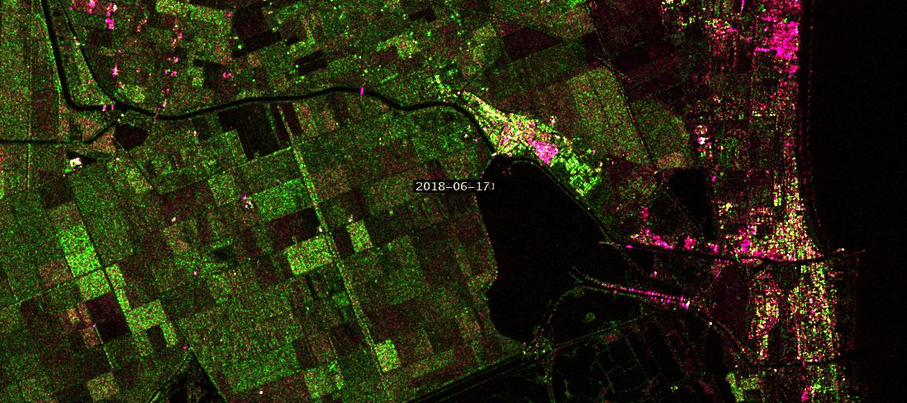
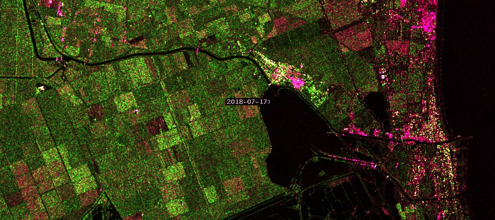

# Agricultural Crop Monitoring from Space Script

<a href="#" id='togglescript'>Show</a> script or [download](script.js){:target="_blank"} it.


      


## Evaluate and visualize   
 - [Sentinel Playground](https://apps.sentinel-hub.com/sentinel-playground-temporal/?source=S1-AWS-IW-VVVH&lat=44.683972246144066&lng=12.169933319091797&zoom=13&preset=CUSTOM&layers=VV,VV,VV&maxcc=100&gain=1.0&gamma=1.0&time=2017-01-01%7C2018-08-28&atmFilter=&showDates=true&evalscript=Ly9WRVJTSU9OPTMgKGF1dG8tY29udmVydGVkIGZyb20gMSkKdmFyIG1hc3Rlcl9kYXRlID0gIjIwMTgtMDQtMjAiOyB2YXIgc2xhdmVfZGF0ZSA9ICIyMDE4LTA4LTIyIjsgLy8gQ29tYWNjaGlvLCBGZXJyYXJhLCBJdGFseSAgIAoKLy8gU2VsZWN0aW9uIG9mIHBvbGFyaXphdGlvbnMgCmZ1bmN0aW9uIHNldHVwKCkgewogIHJldHVybiB7CiAgICBpbnB1dDogW3sKICAgICAgYmFuZHM6IFsKICAgICAgICAgICJWViIsCiAgICAgICAgICAiVkgiCiAgICAgIF0KICAgIH1dLAogICAgb3V0cHV0OiB7IGJhbmRzOiAzIH0sCiAgICBtb3NhaWNraW5nOiAiT1JCSVQiCiAgfQp9CgoKZnVuY3Rpb24gZmlsdGVyU2NlbmVzIChzY2VuZXMpIHsgIApyZXR1cm4gc2NlbmVzLmZpbHRlcihmdW5jdGlvbiAoc2NlbmUpIHsKLy8gc2V0IGRhdGVzIGZvciBtYXN0ZXIgYW5kIHNsYXZlIGltYWdlcwp2YXIgYWxsb3dlZERhdGVzID0gW21hc3Rlcl9kYXRlLHNsYXZlX2RhdGVdOyAKdmFyIHNjZW5lRGF0ZVN0ciA9IGRhdGVmb3JtYXQoc2NlbmUuZGF0ZSk7CmlmIChhbGxvd2VkRGF0ZXMuaW5kZXhPZihzY2VuZURhdGVTdHIpIT0gLTEpIHJldHVybiB0cnVlOwplbHNlIHJldHVybiBmYWxzZTsKICB9KTsKfQoKLy8gQ3JvcCBNb25pdG9yaW5nCmZ1bmN0aW9uIGNhbGNCKHNhbXBsZSkgewogIHZhciBvdXRCID0gKC41KihzYW1wbGUuVlYpKTsKICByZXR1cm4gW291dEJdOwp9CmZ1bmN0aW9uIGNhbGNHKHNhbXBsZSkgewogIHZhciBvdXRHID0gKDgqKHNhbXBsZS5WSCkpOwogIHJldHVybiBbb3V0R107Cn0KZnVuY3Rpb24gY2FsY1Ioc2FtcGxlKSB7CiAgdmFyIG91dFIgPSAoMS41KihzYW1wbGUuVlYpKTsKICByZXR1cm4gW291dFJdOwp9CgpmdW5jdGlvbiBkYXRlZm9ybWF0KGQpeyAgCiAgdmFyIGRkID0gZC5nZXREYXRlKCk7CiAgdmFyIG1tID0gZC5nZXRNb250aCgpKzE7CiAgdmFyIHl5eXkgPSBkLmdldEZ1bGxZZWFyKCk7CiAgaWYoZGQ8MTApe2RkPScwJytkZH0KICBpZihtbTwxMCl7bW09JzAnK21tfQogIHZhciBpc29kYXRlID0geXl5eSsnLScrbW0rJy0nK2RkOwogIHJldHVybiBpc29kYXRlOwp9CmZ1bmN0aW9uIGV2YWx1YXRlUGl4ZWwoc2FtcGxlcyxzY2VuZXMpIHsgIAogIHZhciBSbWFzdGVyID0gMDt2YXIgUnNsYXZlID0gMDsKICB2YXIgR21hc3RlciA9IDA7dmFyIEdzbGF2ZSA9IDA7CiAgdmFyIEJtYXN0ZXIgPSAwO3ZhciBCc2xhdmUgPSAwOwogIFJtYXN0ZXIgPSBjYWxjUihzYW1wbGVzWzFdKTsKICBSc2xhdmUgPSBjYWxjUihzYW1wbGVzWzBdKTsgIAogIEdtYXN0ZXIgPSBjYWxjRyhzYW1wbGVzWzFdKTsKICBHc2xhdmUgPSBjYWxjRyhzYW1wbGVzWzBdKTsgIAogIEJtYXN0ZXIgPSBjYWxjQihzYW1wbGVzWzFdKTsKICBCc2xhdmUgPSBjYWxjQihzYW1wbGVzWzBdKTsKICBSZGlmPVJzbGF2ZS1SbWFzdGVyOwogIEdkaWY9R3NsYXZlLUdtYXN0ZXI7CiAgQmRpZj1Cc2xhdmUtQm1hc3RlcjsKICByZXR1cm4gW1JzbGF2ZSxHZGlmLEJzbGF2ZV0KfQ%3D%3D&temporal=true){:target="_blank"} 
 
 The script is based on the time series of Sentinel-1 radar data. The example timelapse of  Comacchio, Ferrara, Italy, is based on the master date 2018-04-20 and the followig slave dates: 
 
[2018-04-24](https://apps.sentinel-hub.com/sentinel-playground-temporal/?source=S1-AWS-IW-VVVH&lat=44.683972246144066&lng=12.169933319091797&zoom=13&preset=CUSTOM&layers=VV,VV,VV&maxcc=100&gain=1.0&gamma=1.0&time=2017-01-01%7C2018-04-26&atmFilter=&showDates=true&evalscript=Ly9WRVJTSU9OPTMgKGF1dG8tY29udmVydGVkIGZyb20gMSkKdmFyIG1hc3Rlcl9kYXRlID0gIjIwMTgtMDQtMjAiOyB2YXIgc2xhdmVfZGF0ZSA9ICIyMDE4LTA0LTI0IjsgLy8gQ29tYWNjaGlvLCBGZXJyYXJhLCBJdGFseSAgIAoKLy8gU2VsZWN0aW9uIG9mIHBvbGFyaXphdGlvbnMgCmZ1bmN0aW9uIHNldHVwKCkgewogIHJldHVybiB7CiAgICBpbnB1dDogW3sKICAgICAgYmFuZHM6IFsKICAgICAgICAgICAgICAgICAgIlZWIiwKICAgICAgICAgICJWSCIKICAgICAgXQogICAgfV0sCiAgICBvdXRwdXQ6IHsgYmFuZHM6IDMgfSwKICAgIG1vc2FpY2tpbmc6ICJPUkJJVCIKICB9Cn0KCgpmdW5jdGlvbiBmaWx0ZXJTY2VuZXMgKHNjZW5lcykgeyAgCnJldHVybiBzY2VuZXMuZmlsdGVyKGZ1bmN0aW9uIChzY2VuZSkgewovLyBzZXQgZGF0ZXMgZm9yIG1hc3RlciBhbmQgc2xhdmUgaW1hZ2VzCnZhciBhbGxvd2VkRGF0ZXMgPSBbbWFzdGVyX2RhdGUsc2xhdmVfZGF0ZV07IAp2YXIgc2NlbmVEYXRlU3RyID0gZGF0ZWZvcm1hdChzY2VuZS5kYXRlKTsKaWYgKGFsbG93ZWREYXRlcy5pbmRleE9mKHNjZW5lRGF0ZVN0cikhPSAtMSkgcmV0dXJuIHRydWU7CmVsc2UgcmV0dXJuIGZhbHNlOwogIH0pOwp9CgovLyBDcm9wIE1vbml0b3JpbmcKZnVuY3Rpb24gY2FsY0Ioc2FtcGxlKSB7CiAgdmFyIG91dEIgPSAoLjUqKHNhbXBsZS5WVikpOwogIHJldHVybiBbb3V0Ql07Cn0KZnVuY3Rpb24gY2FsY0coc2FtcGxlKSB7CiAgdmFyIG91dEcgPSAoOCooc2FtcGxlLlZIKSk7CiAgcmV0dXJuIFtvdXRHXTsKfQpmdW5jdGlvbiBjYWxjUihzYW1wbGUpIHsKICB2YXIgb3V0UiA9ICgxLjUqKHNhbXBsZS5WVikpOwogIHJldHVybiBbb3V0Ul07Cn0KCmZ1bmN0aW9uIGRhdGVmb3JtYXQoZCl7ICAKICB2YXIgZGQgPSBkLmdldERhdGUoKTsKICB2YXIgbW0gPSBkLmdldE1vbnRoKCkrMTsKICB2YXIgeXl5eSA9IGQuZ2V0RnVsbFllYXIoKTsKICBpZihkZDwxMCl7ZGQ9JzAnK2RkfQogIGlmKG1tPDEwKXttbT0nMCcrbW19CiAgdmFyIGlzb2RhdGUgPSB5eXl5KyctJyttbSsnLScrZGQ7CiAgcmV0dXJuIGlzb2RhdGU7Cn0KZnVuY3Rpb24gZXZhbHVhdGVQaXhlbChzYW1wbGVzLHNjZW5lcykgeyAgCiAgdmFyIFJtYXN0ZXIgPSAwO3ZhciBSc2xhdmUgPSAwOwogIHZhciBHbWFzdGVyID0gMDt2YXIgR3NsYXZlID0gMDsKICB2YXIgQm1hc3RlciA9IDA7dmFyIEJzbGF2ZSA9IDA7CiAgUm1hc3RlciA9IGNhbGNSKHNhbXBsZXNbMV0pOwogIFJzbGF2ZSA9IGNhbGNSKHNhbXBsZXNbMF0pOyAgCiAgR21hc3RlciA9IGNhbGNHKHNhbXBsZXNbMV0pOwogIEdzbGF2ZSA9IGNhbGNHKHNhbXBsZXNbMF0pOyAgCiAgQm1hc3RlciA9IGNhbGNCKHNhbXBsZXNbMV0pOwogIEJzbGF2ZSA9IGNhbGNCKHNhbXBsZXNbMF0pOwogIFJkaWY9UnNsYXZlLVJtYXN0ZXI7CiAgR2RpZj1Hc2xhdmUtR21hc3RlcjsKICBCZGlmPUJzbGF2ZS1CbWFzdGVyOwogIHJldHVybiBbUnNsYXZlLEdkaWYsQnNsYXZlXQp9&temporal=true){:target="_blank"} 

[2018-05-06](https://apps.sentinel-hub.com/sentinel-playground-temporal/?source=S1-AWS-IW-VVVH&lat=44.683972246144066&lng=12.169933319091797&zoom=13&preset=CUSTOM&layers=VV,VV,VV&maxcc=100&gain=1.0&gamma=1.0&time=2017-01-01%7C2018-05-18&atmFilter=&showDates=true&evalscript=Ly9WRVJTSU9OPTMgKGF1dG8tY29udmVydGVkIGZyb20gMSkKdmFyIG1hc3Rlcl9kYXRlID0gIjIwMTgtMDQtMjAiOyB2YXIgc2xhdmVfZGF0ZSA9ICIyMDE4LTA1LTA2IjsgLy8gQ29tYWNjaGlvLCBGZXJyYXJhLCBJdGFseSAgIAoKLy8gU2VsZWN0aW9uIG9mIHBvbGFyaXphdGlvbnMgCmZ1bmN0aW9uIHNldHVwKCkgewogIHJldHVybiB7CiAgICBpbnB1dDogW3sKICAgICAgYmFuZHM6IFsKICAgICAgICAgICAgICAgICAgIlZWIiwKICAgICAgICAgICJWSCIKICAgICAgXQogICAgfV0sCiAgICBvdXRwdXQ6IHsgYmFuZHM6IDMgfSwKICAgIG1vc2FpY2tpbmc6ICJPUkJJVCIKICB9Cn0KCgpmdW5jdGlvbiBmaWx0ZXJTY2VuZXMgKHNjZW5lcykgeyAgCnJldHVybiBzY2VuZXMuZmlsdGVyKGZ1bmN0aW9uIChzY2VuZSkgewovLyBzZXQgZGF0ZXMgZm9yIG1hc3RlciBhbmQgc2xhdmUgaW1hZ2VzCnZhciBhbGxvd2VkRGF0ZXMgPSBbbWFzdGVyX2RhdGUsc2xhdmVfZGF0ZV07IAp2YXIgc2NlbmVEYXRlU3RyID0gZGF0ZWZvcm1hdChzY2VuZS5kYXRlKTsKaWYgKGFsbG93ZWREYXRlcy5pbmRleE9mKHNjZW5lRGF0ZVN0cikhPSAtMSkgcmV0dXJuIHRydWU7CmVsc2UgcmV0dXJuIGZhbHNlOwogIH0pOwp9CgovLyBDcm9wIE1vbml0b3JpbmcKZnVuY3Rpb24gY2FsY0Ioc2FtcGxlKSB7CiAgdmFyIG91dEIgPSAoLjUqKHNhbXBsZS5WVikpOwogIHJldHVybiBbb3V0Ql07Cn0KZnVuY3Rpb24gY2FsY0coc2FtcGxlKSB7CiAgdmFyIG91dEcgPSAoOCooc2FtcGxlLlZIKSk7CiAgcmV0dXJuIFtvdXRHXTsKfQpmdW5jdGlvbiBjYWxjUihzYW1wbGUpIHsKICB2YXIgb3V0UiA9ICgxLjUqKHNhbXBsZS5WVikpOwogIHJldHVybiBbb3V0Ul07Cn0KCmZ1bmN0aW9uIGRhdGVmb3JtYXQoZCl7ICAKICB2YXIgZGQgPSBkLmdldERhdGUoKTsKICB2YXIgbW0gPSBkLmdldE1vbnRoKCkrMTsKICB2YXIgeXl5eSA9IGQuZ2V0RnVsbFllYXIoKTsKICBpZihkZDwxMCl7ZGQ9JzAnK2RkfQogIGlmKG1tPDEwKXttbT0nMCcrbW19CiAgdmFyIGlzb2RhdGUgPSB5eXl5KyctJyttbSsnLScrZGQ7CiAgcmV0dXJuIGlzb2RhdGU7Cn0KZnVuY3Rpb24gZXZhbHVhdGVQaXhlbChzYW1wbGVzLHNjZW5lcykgeyAgCiAgdmFyIFJtYXN0ZXIgPSAwO3ZhciBSc2xhdmUgPSAwOwogIHZhciBHbWFzdGVyID0gMDt2YXIgR3NsYXZlID0gMDsKICB2YXIgQm1hc3RlciA9IDA7dmFyIEJzbGF2ZSA9IDA7CiAgUm1hc3RlciA9IGNhbGNSKHNhbXBsZXNbMV0pOwogIFJzbGF2ZSA9IGNhbGNSKHNhbXBsZXNbMF0pOyAgCiAgR21hc3RlciA9IGNhbGNHKHNhbXBsZXNbMV0pOwogIEdzbGF2ZSA9IGNhbGNHKHNhbXBsZXNbMF0pOyAgCiAgQm1hc3RlciA9IGNhbGNCKHNhbXBsZXNbMV0pOwogIEJzbGF2ZSA9IGNhbGNCKHNhbXBsZXNbMF0pOwogIFJkaWY9UnNsYXZlLVJtYXN0ZXI7CiAgR2RpZj1Hc2xhdmUtR21hc3RlcjsKICBCZGlmPUJzbGF2ZS1CbWFzdGVyOwogIHJldHVybiBbUnNsYXZlLEdkaWYsQnNsYXZlXQp9&temporal=true){:target="_blank"} 

[2018-05-18](https://apps.sentinel-hub.com/sentinel-playground-temporal/?source=S1-AWS-IW-VVVH&lat=44.683972246144066&lng=12.169933319091797&zoom=13&preset=CUSTOM&layers=VV,VV,VV&maxcc=100&gain=1.0&gamma=1.0&time=2017-01-01%7C2018-05-24&atmFilter=&showDates=true&evalscript=Ly9WRVJTSU9OPTMgKGF1dG8tY29udmVydGVkIGZyb20gMSkKdmFyIG1hc3Rlcl9kYXRlID0gIjIwMTgtMDQtMjAiOyB2YXIgc2xhdmVfZGF0ZSA9ICIyMDE4LTA1LTE4IjsgLy8gQ29tYWNjaGlvLCBGZXJyYXJhLCBJdGFseSAgIAoKLy8gU2VsZWN0aW9uIG9mIHBvbGFyaXphdGlvbnMgCmZ1bmN0aW9uIHNldHVwKCkgewogIHJldHVybiB7CiAgICBpbnB1dDogW3sKICAgICAgYmFuZHM6IFsKICAgICAgICAgICAgICAgICAgIlZWIiwKICAgICAgICAgICJWSCIKICAgICAgXQogICAgfV0sCiAgICBvdXRwdXQ6IHsgYmFuZHM6IDMgfSwKICAgIG1vc2FpY2tpbmc6ICJPUkJJVCIKICB9Cn0KCgpmdW5jdGlvbiBmaWx0ZXJTY2VuZXMgKHNjZW5lcykgeyAgCnJldHVybiBzY2VuZXMuZmlsdGVyKGZ1bmN0aW9uIChzY2VuZSkgewovLyBzZXQgZGF0ZXMgZm9yIG1hc3RlciBhbmQgc2xhdmUgaW1hZ2VzCnZhciBhbGxvd2VkRGF0ZXMgPSBbbWFzdGVyX2RhdGUsc2xhdmVfZGF0ZV07IAp2YXIgc2NlbmVEYXRlU3RyID0gZGF0ZWZvcm1hdChzY2VuZS5kYXRlKTsKaWYgKGFsbG93ZWREYXRlcy5pbmRleE9mKHNjZW5lRGF0ZVN0cikhPSAtMSkgcmV0dXJuIHRydWU7CmVsc2UgcmV0dXJuIGZhbHNlOwogIH0pOwp9CgovLyBDcm9wIE1vbml0b3JpbmcKZnVuY3Rpb24gY2FsY0Ioc2FtcGxlKSB7CiAgdmFyIG91dEIgPSAoLjUqKHNhbXBsZS5WVikpOwogIHJldHVybiBbb3V0Ql07Cn0KZnVuY3Rpb24gY2FsY0coc2FtcGxlKSB7CiAgdmFyIG91dEcgPSAoOCooc2FtcGxlLlZIKSk7CiAgcmV0dXJuIFtvdXRHXTsKfQpmdW5jdGlvbiBjYWxjUihzYW1wbGUpIHsKICB2YXIgb3V0UiA9ICgxLjUqKHNhbXBsZS5WVikpOwogIHJldHVybiBbb3V0Ul07Cn0KCmZ1bmN0aW9uIGRhdGVmb3JtYXQoZCl7ICAKICB2YXIgZGQgPSBkLmdldERhdGUoKTsKICB2YXIgbW0gPSBkLmdldE1vbnRoKCkrMTsKICB2YXIgeXl5eSA9IGQuZ2V0RnVsbFllYXIoKTsKICBpZihkZDwxMCl7ZGQ9JzAnK2RkfQogIGlmKG1tPDEwKXttbT0nMCcrbW19CiAgdmFyIGlzb2RhdGUgPSB5eXl5KyctJyttbSsnLScrZGQ7CiAgcmV0dXJuIGlzb2RhdGU7Cn0KZnVuY3Rpb24gZXZhbHVhdGVQaXhlbChzYW1wbGVzLHNjZW5lcykgeyAgCiAgdmFyIFJtYXN0ZXIgPSAwO3ZhciBSc2xhdmUgPSAwOwogIHZhciBHbWFzdGVyID0gMDt2YXIgR3NsYXZlID0gMDsKICB2YXIgQm1hc3RlciA9IDA7dmFyIEJzbGF2ZSA9IDA7CiAgUm1hc3RlciA9IGNhbGNSKHNhbXBsZXNbMV0pOwogIFJzbGF2ZSA9IGNhbGNSKHNhbXBsZXNbMF0pOyAgCiAgR21hc3RlciA9IGNhbGNHKHNhbXBsZXNbMV0pOwogIEdzbGF2ZSA9IGNhbGNHKHNhbXBsZXNbMF0pOyAgCiAgQm1hc3RlciA9IGNhbGNCKHNhbXBsZXNbMV0pOwogIEJzbGF2ZSA9IGNhbGNCKHNhbXBsZXNbMF0pOwogIFJkaWY9UnNsYXZlLVJtYXN0ZXI7CiAgR2RpZj1Hc2xhdmUtR21hc3RlcjsKICBCZGlmPUJzbGF2ZS1CbWFzdGVyOwogIHJldHVybiBbUnNsYXZlLEdkaWYsQnNsYXZlXQp9&temporal=true){:target="_blank"} 

[2018-05-30](https://apps.sentinel-hub.com/sentinel-playground-temporal/?source=S1-AWS-IW-VVVH&lat=44.683972246144066&lng=12.169933319091797&zoom=13&preset=CUSTOM&layers=VV,VV,VV&maxcc=100&gain=1.0&gamma=1.0&time=2017-01-01%7C2018-06-05&atmFilter=&showDates=true&evalscript=Ly9WRVJTSU9OPTMgKGF1dG8tY29udmVydGVkIGZyb20gMSkKdmFyIG1hc3Rlcl9kYXRlID0gIjIwMTgtMDQtMjAiOyB2YXIgc2xhdmVfZGF0ZSA9ICIyMDE4LTA1LTMwIjsgLy8gQ29tYWNjaGlvLCBGZXJyYXJhLCBJdGFseSAgIAoKLy8gU2VsZWN0aW9uIG9mIHBvbGFyaXphdGlvbnMgCmZ1bmN0aW9uIHNldHVwKCkgewogIHJldHVybiB7CiAgICBpbnB1dDogW3sKICAgICAgYmFuZHM6IFsKICAgICAgICAgICAgICAgICAgIlZWIiwKICAgICAgICAgICJWSCIKICAgICAgXQogICAgfV0sCiAgICBvdXRwdXQ6IHsgYmFuZHM6IDMgfSwKICAgIG1vc2FpY2tpbmc6ICJPUkJJVCIKICB9Cn0KCgpmdW5jdGlvbiBmaWx0ZXJTY2VuZXMgKHNjZW5lcykgeyAgCnJldHVybiBzY2VuZXMuZmlsdGVyKGZ1bmN0aW9uIChzY2VuZSkgewovLyBzZXQgZGF0ZXMgZm9yIG1hc3RlciBhbmQgc2xhdmUgaW1hZ2VzCnZhciBhbGxvd2VkRGF0ZXMgPSBbbWFzdGVyX2RhdGUsc2xhdmVfZGF0ZV07IAp2YXIgc2NlbmVEYXRlU3RyID0gZGF0ZWZvcm1hdChzY2VuZS5kYXRlKTsKaWYgKGFsbG93ZWREYXRlcy5pbmRleE9mKHNjZW5lRGF0ZVN0cikhPSAtMSkgcmV0dXJuIHRydWU7CmVsc2UgcmV0dXJuIGZhbHNlOwogIH0pOwp9CgovLyBDcm9wIE1vbml0b3JpbmcKZnVuY3Rpb24gY2FsY0Ioc2FtcGxlKSB7CiAgdmFyIG91dEIgPSAoLjUqKHNhbXBsZS5WVikpOwogIHJldHVybiBbb3V0Ql07Cn0KZnVuY3Rpb24gY2FsY0coc2FtcGxlKSB7CiAgdmFyIG91dEcgPSAoOCooc2FtcGxlLlZIKSk7CiAgcmV0dXJuIFtvdXRHXTsKfQpmdW5jdGlvbiBjYWxjUihzYW1wbGUpIHsKICB2YXIgb3V0UiA9ICgxLjUqKHNhbXBsZS5WVikpOwogIHJldHVybiBbb3V0Ul07Cn0KCmZ1bmN0aW9uIGRhdGVmb3JtYXQoZCl7ICAKICB2YXIgZGQgPSBkLmdldERhdGUoKTsKICB2YXIgbW0gPSBkLmdldE1vbnRoKCkrMTsKICB2YXIgeXl5eSA9IGQuZ2V0RnVsbFllYXIoKTsKICBpZihkZDwxMCl7ZGQ9JzAnK2RkfQogIGlmKG1tPDEwKXttbT0nMCcrbW19CiAgdmFyIGlzb2RhdGUgPSB5eXl5KyctJyttbSsnLScrZGQ7CiAgcmV0dXJuIGlzb2RhdGU7Cn0KZnVuY3Rpb24gZXZhbHVhdGVQaXhlbChzYW1wbGVzLHNjZW5lcykgeyAgCiAgdmFyIFJtYXN0ZXIgPSAwO3ZhciBSc2xhdmUgPSAwOwogIHZhciBHbWFzdGVyID0gMDt2YXIgR3NsYXZlID0gMDsKICB2YXIgQm1hc3RlciA9IDA7dmFyIEJzbGF2ZSA9IDA7CiAgUm1hc3RlciA9IGNhbGNSKHNhbXBsZXNbMV0pOwogIFJzbGF2ZSA9IGNhbGNSKHNhbXBsZXNbMF0pOyAgCiAgR21hc3RlciA9IGNhbGNHKHNhbXBsZXNbMV0pOwogIEdzbGF2ZSA9IGNhbGNHKHNhbXBsZXNbMF0pOyAgCiAgQm1hc3RlciA9IGNhbGNCKHNhbXBsZXNbMV0pOwogIEJzbGF2ZSA9IGNhbGNCKHNhbXBsZXNbMF0pOwogIFJkaWY9UnNsYXZlLVJtYXN0ZXI7CiAgR2RpZj1Hc2xhdmUtR21hc3RlcjsKICBCZGlmPUJzbGF2ZS1CbWFzdGVyOwogIHJldHVybiBbUnNsYXZlLEdkaWYsQnNsYXZlXQp9Cg%3D%3D&temporal=true){:target="_blank"} 

[2018-06-17](https://apps.sentinel-hub.com/sentinel-playground-temporal/?source=S1-AWS-IW-VVVH&lat=44.683972246144066&lng=12.169933319091797&zoom=13&preset=CUSTOM&layers=VV,VV,VV&maxcc=100&gain=1.0&gamma=1.0&time=2017-01-01%7C2018-06-23&atmFilter=&showDates=true&evalscript=Ly9WRVJTSU9OPTMgKGF1dG8tY29udmVydGVkIGZyb20gMSkKdmFyIG1hc3Rlcl9kYXRlID0gIjIwMTgtMDQtMjAiOyB2YXIgc2xhdmVfZGF0ZSA9ICIyMDE4LTA2LTE3IjsgLy8gQ29tYWNjaGlvLCBGZXJyYXJhLCBJdGFseSAgIAoKLy8gU2VsZWN0aW9uIG9mIHBvbGFyaXphdGlvbnMgCmZ1bmN0aW9uIHNldHVwKCkgewogIHJldHVybiB7CiAgICBpbnB1dDogW3sKICAgICAgYmFuZHM6IFsKICAgICAgICAgICAgICAgICAgIlZWIiwKICAgICAgICAgICJWSCIKICAgICAgXQogICAgfV0sCiAgICBvdXRwdXQ6IHsgYmFuZHM6IDMgfSwKICAgIG1vc2FpY2tpbmc6ICJPUkJJVCIKICB9Cn0KCgpmdW5jdGlvbiBmaWx0ZXJTY2VuZXMgKHNjZW5lcykgeyAgCnJldHVybiBzY2VuZXMuZmlsdGVyKGZ1bmN0aW9uIChzY2VuZSkgewovLyBzZXQgZGF0ZXMgZm9yIG1hc3RlciBhbmQgc2xhdmUgaW1hZ2VzCnZhciBhbGxvd2VkRGF0ZXMgPSBbbWFzdGVyX2RhdGUsc2xhdmVfZGF0ZV07IAp2YXIgc2NlbmVEYXRlU3RyID0gZGF0ZWZvcm1hdChzY2VuZS5kYXRlKTsKaWYgKGFsbG93ZWREYXRlcy5pbmRleE9mKHNjZW5lRGF0ZVN0cikhPSAtMSkgcmV0dXJuIHRydWU7CmVsc2UgcmV0dXJuIGZhbHNlOwogIH0pOwp9CgovLyBDcm9wIE1vbml0b3JpbmcKZnVuY3Rpb24gY2FsY0Ioc2FtcGxlKSB7CiAgdmFyIG91dEIgPSAoLjUqKHNhbXBsZS5WVikpOwogIHJldHVybiBbb3V0Ql07Cn0KZnVuY3Rpb24gY2FsY0coc2FtcGxlKSB7CiAgdmFyIG91dEcgPSAoOCooc2FtcGxlLlZIKSk7CiAgcmV0dXJuIFtvdXRHXTsKfQpmdW5jdGlvbiBjYWxjUihzYW1wbGUpIHsKICB2YXIgb3V0UiA9ICgxLjUqKHNhbXBsZS5WVikpOwogIHJldHVybiBbb3V0Ul07Cn0KCmZ1bmN0aW9uIGRhdGVmb3JtYXQoZCl7ICAKICB2YXIgZGQgPSBkLmdldERhdGUoKTsKICB2YXIgbW0gPSBkLmdldE1vbnRoKCkrMTsKICB2YXIgeXl5eSA9IGQuZ2V0RnVsbFllYXIoKTsKICBpZihkZDwxMCl7ZGQ9JzAnK2RkfQogIGlmKG1tPDEwKXttbT0nMCcrbW19CiAgdmFyIGlzb2RhdGUgPSB5eXl5KyctJyttbSsnLScrZGQ7CiAgcmV0dXJuIGlzb2RhdGU7Cn0KZnVuY3Rpb24gZXZhbHVhdGVQaXhlbChzYW1wbGVzLHNjZW5lcykgeyAgCiAgdmFyIFJtYXN0ZXIgPSAwO3ZhciBSc2xhdmUgPSAwOwogIHZhciBHbWFzdGVyID0gMDt2YXIgR3NsYXZlID0gMDsKICB2YXIgQm1hc3RlciA9IDA7dmFyIEJzbGF2ZSA9IDA7CiAgUm1hc3RlciA9IGNhbGNSKHNhbXBsZXNbMV0pOwogIFJzbGF2ZSA9IGNhbGNSKHNhbXBsZXNbMF0pOyAgCiAgR21hc3RlciA9IGNhbGNHKHNhbXBsZXNbMV0pOwogIEdzbGF2ZSA9IGNhbGNHKHNhbXBsZXNbMF0pOyAgCiAgQm1hc3RlciA9IGNhbGNCKHNhbXBsZXNbMV0pOwogIEJzbGF2ZSA9IGNhbGNCKHNhbXBsZXNbMF0pOwogIFJkaWY9UnNsYXZlLVJtYXN0ZXI7CiAgR2RpZj1Hc2xhdmUtR21hc3RlcjsKICBCZGlmPUJzbGF2ZS1CbWFzdGVyOwogIHJldHVybiBbUnNsYXZlLEdkaWYsQnNsYXZlXQp9&temporal=true){:target="_blank"} 

[2018-07-17](https://apps.sentinel-hub.com/sentinel-playground-temporal/?source=S1-AWS-IW-VVVH&lat=44.683972246144066&lng=12.169933319091797&zoom=13&preset=CUSTOM&layers=VV,VV,VV&maxcc=100&gain=1.0&gamma=1.0&time=2017-01-01%7C2018-07-23&atmFilter=&showDates=true&evalscript=Ly9WRVJTSU9OPTMgKGF1dG8tY29udmVydGVkIGZyb20gMSkKdmFyIG1hc3Rlcl9kYXRlID0gIjIwMTgtMDQtMjAiOyB2YXIgc2xhdmVfZGF0ZSA9ICIyMDE4LTA3LTE3IjsgLy8gQ29tYWNjaGlvLCBGZXJyYXJhLCBJdGFseSAgIAoKLy8gU2VsZWN0aW9uIG9mIHBvbGFyaXphdGlvbnMgCmZ1bmN0aW9uIHNldHVwKCkgewogIHJldHVybiB7CiAgICBpbnB1dDogW3sKICAgICAgYmFuZHM6IFsKICAgICAgICAgICAgICAgICAgIlZWIiwKICAgICAgICAgICJWSCIKICAgICAgXQogICAgfV0sCiAgICBvdXRwdXQ6IHsgYmFuZHM6IDMgfSwKICAgIG1vc2FpY2tpbmc6ICJPUkJJVCIKICB9Cn0KCgpmdW5jdGlvbiBmaWx0ZXJTY2VuZXMgKHNjZW5lcykgeyAgCnJldHVybiBzY2VuZXMuZmlsdGVyKGZ1bmN0aW9uIChzY2VuZSkgewovLyBzZXQgZGF0ZXMgZm9yIG1hc3RlciBhbmQgc2xhdmUgaW1hZ2VzCnZhciBhbGxvd2VkRGF0ZXMgPSBbbWFzdGVyX2RhdGUsc2xhdmVfZGF0ZV07IAp2YXIgc2NlbmVEYXRlU3RyID0gZGF0ZWZvcm1hdChzY2VuZS5kYXRlKTsKaWYgKGFsbG93ZWREYXRlcy5pbmRleE9mKHNjZW5lRGF0ZVN0cikhPSAtMSkgcmV0dXJuIHRydWU7CmVsc2UgcmV0dXJuIGZhbHNlOwogIH0pOwp9CgovLyBDcm9wIE1vbml0b3JpbmcKZnVuY3Rpb24gY2FsY0Ioc2FtcGxlKSB7CiAgdmFyIG91dEIgPSAoLjUqKHNhbXBsZS5WVikpOwogIHJldHVybiBbb3V0Ql07Cn0KZnVuY3Rpb24gY2FsY0coc2FtcGxlKSB7CiAgdmFyIG91dEcgPSAoOCooc2FtcGxlLlZIKSk7CiAgcmV0dXJuIFtvdXRHXTsKfQpmdW5jdGlvbiBjYWxjUihzYW1wbGUpIHsKICB2YXIgb3V0UiA9ICgxLjUqKHNhbXBsZS5WVikpOwogIHJldHVybiBbb3V0Ul07Cn0KCmZ1bmN0aW9uIGRhdGVmb3JtYXQoZCl7ICAKICB2YXIgZGQgPSBkLmdldERhdGUoKTsKICB2YXIgbW0gPSBkLmdldE1vbnRoKCkrMTsKICB2YXIgeXl5eSA9IGQuZ2V0RnVsbFllYXIoKTsKICBpZihkZDwxMCl7ZGQ9JzAnK2RkfQogIGlmKG1tPDEwKXttbT0nMCcrbW19CiAgdmFyIGlzb2RhdGUgPSB5eXl5KyctJyttbSsnLScrZGQ7CiAgcmV0dXJuIGlzb2RhdGU7Cn0KZnVuY3Rpb24gZXZhbHVhdGVQaXhlbChzYW1wbGVzLHNjZW5lcykgeyAgCiAgdmFyIFJtYXN0ZXIgPSAwO3ZhciBSc2xhdmUgPSAwOwogIHZhciBHbWFzdGVyID0gMDt2YXIgR3NsYXZlID0gMDsKICB2YXIgQm1hc3RlciA9IDA7dmFyIEJzbGF2ZSA9IDA7CiAgUm1hc3RlciA9IGNhbGNSKHNhbXBsZXNbMV0pOwogIFJzbGF2ZSA9IGNhbGNSKHNhbXBsZXNbMF0pOyAgCiAgR21hc3RlciA9IGNhbGNHKHNhbXBsZXNbMV0pOwogIEdzbGF2ZSA9IGNhbGNHKHNhbXBsZXNbMF0pOyAgCiAgQm1hc3RlciA9IGNhbGNCKHNhbXBsZXNbMV0pOwogIEJzbGF2ZSA9IGNhbGNCKHNhbXBsZXNbMF0pOwogIFJkaWY9UnNsYXZlLVJtYXN0ZXI7CiAgR2RpZj1Hc2xhdmUtR21hc3RlcjsKICBCZGlmPUJzbGF2ZS1CbWFzdGVyOwogIHJldHVybiBbUnNsYXZlLEdkaWYsQnNsYXZlXQp9&temporal=true){:target="_blank"}

[2018-08-04](https://apps.sentinel-hub.com/sentinel-playground-temporal/?source=S1-AWS-IW-VVVH&lat=44.683972246144066&lng=12.169933319091797&zoom=13&preset=CUSTOM&layers=VV,VV,VV&maxcc=100&gain=1.0&gamma=1.0&time=2017-01-01%7C2018-08-18&atmFilter=&showDates=true&evalscript=Ly9WRVJTSU9OPTMgKGF1dG8tY29udmVydGVkIGZyb20gMSkKdmFyIG1hc3Rlcl9kYXRlID0gIjIwMTgtMDQtMjAiOyB2YXIgc2xhdmVfZGF0ZSA9ICIyMDE4LTA4LTA0IjsgLy8gQ29tYWNjaGlvLCBGZXJyYXJhLCBJdGFseSAgIAoKLy8gU2VsZWN0aW9uIG9mIHBvbGFyaXphdGlvbnMgCmZ1bmN0aW9uIHNldHVwKCkgewogIHJldHVybiB7CiAgICBpbnB1dDogW3sKICAgICAgYmFuZHM6IFsKICAgICAgICAgICAgICAgICAgIlZWIiwKICAgICAgICAgICJWSCIKICAgICAgXQogICAgfV0sCiAgICBvdXRwdXQ6IHsgYmFuZHM6IDMgfSwKICAgIG1vc2FpY2tpbmc6ICJPUkJJVCIKICB9Cn0KCgpmdW5jdGlvbiBmaWx0ZXJTY2VuZXMgKHNjZW5lcykgeyAgCnJldHVybiBzY2VuZXMuZmlsdGVyKGZ1bmN0aW9uIChzY2VuZSkgewovLyBzZXQgZGF0ZXMgZm9yIG1hc3RlciBhbmQgc2xhdmUgaW1hZ2VzCnZhciBhbGxvd2VkRGF0ZXMgPSBbbWFzdGVyX2RhdGUsc2xhdmVfZGF0ZV07IAp2YXIgc2NlbmVEYXRlU3RyID0gZGF0ZWZvcm1hdChzY2VuZS5kYXRlKTsKaWYgKGFsbG93ZWREYXRlcy5pbmRleE9mKHNjZW5lRGF0ZVN0cikhPSAtMSkgcmV0dXJuIHRydWU7CmVsc2UgcmV0dXJuIGZhbHNlOwogIH0pOwp9CgovLyBDcm9wIE1vbml0b3JpbmcKZnVuY3Rpb24gY2FsY0Ioc2FtcGxlKSB7CiAgdmFyIG91dEIgPSAoLjUqKHNhbXBsZS5WVikpOwogIHJldHVybiBbb3V0Ql07Cn0KZnVuY3Rpb24gY2FsY0coc2FtcGxlKSB7CiAgdmFyIG91dEcgPSAoOCooc2FtcGxlLlZIKSk7CiAgcmV0dXJuIFtvdXRHXTsKfQpmdW5jdGlvbiBjYWxjUihzYW1wbGUpIHsKICB2YXIgb3V0UiA9ICgxLjUqKHNhbXBsZS5WVikpOwogIHJldHVybiBbb3V0Ul07Cn0KCmZ1bmN0aW9uIGRhdGVmb3JtYXQoZCl7ICAKICB2YXIgZGQgPSBkLmdldERhdGUoKTsKICB2YXIgbW0gPSBkLmdldE1vbnRoKCkrMTsKICB2YXIgeXl5eSA9IGQuZ2V0RnVsbFllYXIoKTsKICBpZihkZDwxMCl7ZGQ9JzAnK2RkfQogIGlmKG1tPDEwKXttbT0nMCcrbW19CiAgdmFyIGlzb2RhdGUgPSB5eXl5KyctJyttbSsnLScrZGQ7CiAgcmV0dXJuIGlzb2RhdGU7Cn0KZnVuY3Rpb24gZXZhbHVhdGVQaXhlbChzYW1wbGVzLHNjZW5lcykgeyAgCiAgdmFyIFJtYXN0ZXIgPSAwO3ZhciBSc2xhdmUgPSAwOwogIHZhciBHbWFzdGVyID0gMDt2YXIgR3NsYXZlID0gMDsKICB2YXIgQm1hc3RlciA9IDA7dmFyIEJzbGF2ZSA9IDA7CiAgUm1hc3RlciA9IGNhbGNSKHNhbXBsZXNbMV0pOwogIFJzbGF2ZSA9IGNhbGNSKHNhbXBsZXNbMF0pOyAgCiAgR21hc3RlciA9IGNhbGNHKHNhbXBsZXNbMV0pOwogIEdzbGF2ZSA9IGNhbGNHKHNhbXBsZXNbMF0pOyAgCiAgQm1hc3RlciA9IGNhbGNCKHNhbXBsZXNbMV0pOwogIEJzbGF2ZSA9IGNhbGNCKHNhbXBsZXNbMF0pOwogIFJkaWY9UnNsYXZlLVJtYXN0ZXI7CiAgR2RpZj1Hc2xhdmUtR21hc3RlcjsKICBCZGlmPUJzbGF2ZS1CbWFzdGVyOwogIHJldHVybiBbUnNsYXZlLEdkaWYsQnNsYXZlXQp9&temporal=true){:target="_blank"}

[2018-08-22](https://apps.sentinel-hub.com/sentinel-playground-temporal/?source=S1-AWS-IW-VVVH&lat=44.683972246144066&lng=12.169933319091797&zoom=13&preset=CUSTOM&layers=VV,VV,VV&maxcc=100&gain=1.0&gamma=1.0&time=2017-01-01%7C2018-08-28&atmFilter=&showDates=true&evalscript=Ly9WRVJTSU9OPTMgKGF1dG8tY29udmVydGVkIGZyb20gMSkKdmFyIG1hc3Rlcl9kYXRlID0gIjIwMTgtMDQtMjAiOyB2YXIgc2xhdmVfZGF0ZSA9ICIyMDE4LTA4LTIyIjsgLy8gQ29tYWNjaGlvLCBGZXJyYXJhLCBJdGFseSAgIAoKLy8gU2VsZWN0aW9uIG9mIHBvbGFyaXphdGlvbnMgCmZ1bmN0aW9uIHNldHVwKCkgewogIHJldHVybiB7CiAgICBpbnB1dDogW3sKICAgICAgYmFuZHM6IFsKICAgICAgICAgICAgICAgICAgIlZWIiwKICAgICAgICAgICJWSCIKICAgICAgXQogICAgfV0sCiAgICBvdXRwdXQ6IHsgYmFuZHM6IDMgfSwKICAgIG1vc2FpY2tpbmc6ICJPUkJJVCIKICB9Cn0KCgpmdW5jdGlvbiBmaWx0ZXJTY2VuZXMgKHNjZW5lcykgeyAgCnJldHVybiBzY2VuZXMuZmlsdGVyKGZ1bmN0aW9uIChzY2VuZSkgewovLyBzZXQgZGF0ZXMgZm9yIG1hc3RlciBhbmQgc2xhdmUgaW1hZ2VzCnZhciBhbGxvd2VkRGF0ZXMgPSBbbWFzdGVyX2RhdGUsc2xhdmVfZGF0ZV07IAp2YXIgc2NlbmVEYXRlU3RyID0gZGF0ZWZvcm1hdChzY2VuZS5kYXRlKTsKaWYgKGFsbG93ZWREYXRlcy5pbmRleE9mKHNjZW5lRGF0ZVN0cikhPSAtMSkgcmV0dXJuIHRydWU7CmVsc2UgcmV0dXJuIGZhbHNlOwogIH0pOwp9CgovLyBDcm9wIE1vbml0b3JpbmcKZnVuY3Rpb24gY2FsY0Ioc2FtcGxlKSB7CiAgdmFyIG91dEIgPSAoLjUqKHNhbXBsZS5WVikpOwogIHJldHVybiBbb3V0Ql07Cn0KZnVuY3Rpb24gY2FsY0coc2FtcGxlKSB7CiAgdmFyIG91dEcgPSAoOCooc2FtcGxlLlZIKSk7CiAgcmV0dXJuIFtvdXRHXTsKfQpmdW5jdGlvbiBjYWxjUihzYW1wbGUpIHsKICB2YXIgb3V0UiA9ICgxLjUqKHNhbXBsZS5WVikpOwogIHJldHVybiBbb3V0Ul07Cn0KCmZ1bmN0aW9uIGRhdGVmb3JtYXQoZCl7ICAKICB2YXIgZGQgPSBkLmdldERhdGUoKTsKICB2YXIgbW0gPSBkLmdldE1vbnRoKCkrMTsKICB2YXIgeXl5eSA9IGQuZ2V0RnVsbFllYXIoKTsKICBpZihkZDwxMCl7ZGQ9JzAnK2RkfQogIGlmKG1tPDEwKXttbT0nMCcrbW19CiAgdmFyIGlzb2RhdGUgPSB5eXl5KyctJyttbSsnLScrZGQ7CiAgcmV0dXJuIGlzb2RhdGU7Cn0KZnVuY3Rpb24gZXZhbHVhdGVQaXhlbChzYW1wbGVzLHNjZW5lcykgeyAgCiAgdmFyIFJtYXN0ZXIgPSAwO3ZhciBSc2xhdmUgPSAwOwogIHZhciBHbWFzdGVyID0gMDt2YXIgR3NsYXZlID0gMDsKICB2YXIgQm1hc3RlciA9IDA7dmFyIEJzbGF2ZSA9IDA7CiAgUm1hc3RlciA9IGNhbGNSKHNhbXBsZXNbMV0pOwogIFJzbGF2ZSA9IGNhbGNSKHNhbXBsZXNbMF0pOyAgCiAgR21hc3RlciA9IGNhbGNHKHNhbXBsZXNbMV0pOwogIEdzbGF2ZSA9IGNhbGNHKHNhbXBsZXNbMF0pOyAgCiAgQm1hc3RlciA9IGNhbGNCKHNhbXBsZXNbMV0pOwogIEJzbGF2ZSA9IGNhbGNCKHNhbXBsZXNbMF0pOwogIFJkaWY9UnNsYXZlLVJtYXN0ZXI7CiAgR2RpZj1Hc2xhdmUtR21hc3RlcjsKICBCZGlmPUJzbGF2ZS1CbWFzdGVyOwogIHJldHVybiBbUnNsYXZlLEdkaWYsQnNsYXZlXQp9&temporal=true){:target="_blank"}

## General description of the script

In agriculture, remote sensing images provide information of damaged crop, crop extent, crop productivity. These images can be also used to distinguish crops from other land classes, evaluate the effects of rainfall, irrigation systems, droughts, floods, fertilizer, pesticide, and Ö . The provided information would be useful to farmers, governments, and agricultural insurance companies.

In order to provide the state of agricultural fields, we need to multi-temporal remote sensing images. The script is based on the time series of Sentinel-1 radar data. Using multi-temporal information from radar images makes it possible to improve the outputs of optical images. In the script, a time series of nine Sentinel-1 IW GRD images with VV and VH polarizations in a selected timeline is used as an input. 

## Details of the script

The images were acquired during the period from 2018/04/20 to 2018/08/22, in the region of Ferrara, Italy. The image of 2018/04/20 was used as the master image.

The output of the script gives a good view of where crops are growing well, or where crops are not growing, and identifies the surrounding water bodies and urban areas. The different colours in the crop fields display the growth stage variations between the crops. The results of the script are consistent with the Normalized Difference Vegetation Index (NDVI).

See more details about the script in [the supplementary material](supplementary_material.pdf){:target="_blank"} .

## Author of the script

Maryam Salehi

## Description of representative images

The acquired images during the period from 2018/04/20 to 2018/08/22, in the region of Ferrara, Italy. The image of 2018/04/20 was used as the master image.

            R=?1.5◊VV?_slave, G=?8◊(VH?_slave-?VH?_master), B=?0.5◊VV?_slave.

1) Ferrara, Italy on April 24th, 2018

2) Ferrara, Italy on May 5th, 2018

3) Ferrara, Italy on June 17th, 2018

4) Ferrara, Italy on July 7th, 2018

5) Ferrara, Italy on August 22nd, 2018

