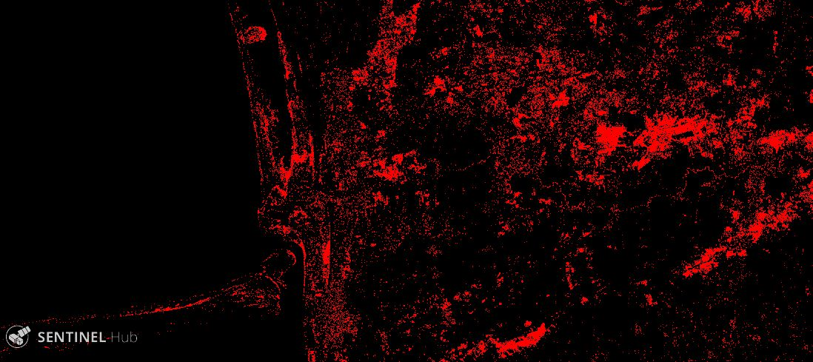

# Flood Mapping With Sentinel-1 Script

<a href="#" id='togglescript'>Show</a> script or [download](script.js){:target="_blank"} it.


      


## Evaluate and visualize   

### Example 1
 - [Sentinel Playground Temporal](https://apps.sentinel-hub.com/sentinel-playground-temporal/?source=S1-AWS-IW-VVVH&lat=37.009357015982836&lng=54.18366523459554&zoom=11&preset=CUSTOM&layers=VV,VV,VV&maxcc=100&gain=1.0&gamma=1.0&time=2017-01-01%7C2019-03-30&atmFilter=&showDates=false&evalscript=Ly9WRVJTSU9OPTMgKGF1dG8tY29udmVydGVkIGZyb20gMSkKLy8gRGF0ZSBEZWZpbml0aW9uIAp2YXIgYmVmb3JlZmxvb2RfZGF0ZSA9ICIyMDE5LTAzLTExIjsgdmFyIGR1cmluZ2Zsb29kX2RhdGUgPSAiMjAxOS0wMy0yMyI7IC8vIEZsb29kIGluIEFnaGdoYWxhLCBJcmFuICAgICAKLy92YXIgYmVmb3JlZmxvb2RfZGF0ZSA9ICIyMDE5LTAxLTA2IjsgdmFyIGR1cmluZ2Zsb29kX2RhdGUgPSAiMjAxOS0wMS0xNCI7IC8vIEZsb29kIGluIFVydWd1YWlhbmEsIFJpbyBHcmFuZGUgZG8gU3VsLCBCcmF6aWwgICAgICAgCi8vdmFyIGJlZm9yZWZsb29kX2RhdGUgPSAiMjAyMC0wMS0wNCI7IHZhciBkdXJpbmdmbG9vZF9kYXRlID0gIjIwMjAtMDEtMTMiOyAvLyBGbG9vZCBpbiBzb3V0aGVybiBJcmFuCiAKLy8gU2VsZWN0aW9uIG9mIHBvbGFyaXphdGlvbiAKZnVuY3Rpb24gc2V0dXAoKSB7CiAgcmV0dXJuIHsKICAgIGlucHV0OiBbewogICAgICBiYW5kczogWwogICAgICAgICJWViIKICAgICAgXQogICAgfV0sCiAgICBvdXRwdXQ6IHsgYmFuZHM6IDMgfSwKICAgIG1vc2FpY2tpbmc6ICJPUkJJVCIKICB9Cn0KCgpmdW5jdGlvbiBmaWx0ZXJTY2VuZXMgKHNjZW5lcykgeyAgCnJldHVybiBzY2VuZXMuZmlsdGVyKGZ1bmN0aW9uIChzY2VuZSkgewovLyBzZXQgZGF0ZXMgZm9yIGJlZm9yZS1hbmQtZHVyaW5nIGZsb29kIGFuYWx5c2lzCnZhciBhbGxvd2VkRGF0ZXMgPSBbYmVmb3JlZmxvb2RfZGF0ZSxkdXJpbmdmbG9vZF9kYXRlXTsgCnZhciBzY2VuZURhdGVTdHIgPSBkYXRlZm9ybWF0KHNjZW5lLmRhdGUpOwppZiAoYWxsb3dlZERhdGVzLmluZGV4T2Yoc2NlbmVEYXRlU3RyKSE9IC0xKSByZXR1cm4gdHJ1ZTsKZWxzZSByZXR1cm4gZmFsc2U7CiAgfSk7Cn0KCi8vIEZsb29kIG1hcHBpbmcKZnVuY3Rpb24gY2FsY0ZNKHNhbXBsZSkgewogIHZhciBvdXR2diA9IHNhbXBsZS5WVjsKICByZXR1cm4gWzEuNSpvdXR2dl07Cn0KCmZ1bmN0aW9uIGRhdGVmb3JtYXQoZCl7ICAKICB2YXIgZGQgPSBkLmdldERhdGUoKTsKICB2YXIgbW0gPSBkLmdldE1vbnRoKCkrMTsKICB2YXIgeXl5eSA9IGQuZ2V0RnVsbFllYXIoKTsKICBpZihkZDwxMCl7ZGQ9JzAnK2RkfQogIGlmKG1tPDEwKXttbT0nMCcrbW19CiAgdmFyIGlzb2RhdGUgPSB5eXl5KyctJyttbSsnLScrZGQ7CiAgcmV0dXJuIGlzb2RhdGU7Cn0KCmZ1bmN0aW9uIGV2YWx1YXRlUGl4ZWwoc2FtcGxlcyxzY2VuZXMpIHsgIAogIHZhciBvdXRiZSA9IDA7CiAgdmFyIG91dGR1ID0gMDsgIAogIC8vIGJlZm9yZS1mbG9vZCBpbWFnZQogIG91dGJlID0gY2FsY0ZNKHNhbXBsZXNbMV0pOwogIC8vIGR1cmluZy1mbG9vZCBpbWFnZQogIG91dGR1ID0gY2FsY0ZNKHNhbXBsZXNbMF0pOyAgCiAgcmV0dXJuIFtvdXRiZSxvdXRkdSxvdXRkdV0KIC8vICoqKioqKioqKioqKioqKioqKioqKioqKioqKioqKioqKioqKgogLy8gbWFzayBjcmVhdGlvbgogLy8gdmFyIGRvdXQgPSBvdXRiZSAtIG91dGR1OyAgICAKIC8vIHJldHVybiBbZG91dCA%2BIDAuMDUgPyAgMSA6IDBdCiAvLyAqKioqKioqKioqKioqKioqKioqKioqKioqKioqKioqKioqKioKfQo%3D&temporal=true){:target="_blank"} 
 
 ### Example 2
 
 - [Sentinel Playground Temporal](https://apps.sentinel-hub.com/sentinel-playground-temporal/?source=S1-AWS-IW-VVVH&lat=25.23665005236088&lng=61.36307455133647&zoom=11&preset=CUSTOM&layers=VV,VV,VV&maxcc=100&gain=1.0&gamma=1.0&time=2017-01-01%7C2020-01-25&atmFilter=&showDates=false&evalscript=Ly9WRVJTSU9OPTMgKGF1dG8tY29udmVydGVkIGZyb20gMSkKLy8gRGF0ZSBEZWZpbml0aW9uIAovL3ZhciBiZWZvcmVmbG9vZF9kYXRlID0gIjIwMTktMDMtMTEiOyB2YXIgZHVyaW5nZmxvb2RfZGF0ZSA9ICIyMDE5LTAzLTIzIjsgLy8gRmxvb2QgaW4gQWdoZ2hhbGEsIElyYW4gICAgIAovL3ZhciBiZWZvcmVmbG9vZF9kYXRlID0gIjIwMTktMDEtMDYiOyB2YXIgZHVyaW5nZmxvb2RfZGF0ZSA9ICIyMDE5LTAxLTE0IjsgLy8gRmxvb2QgaW4gVXJ1Z3VhaWFuYSwgUmlvIEdyYW5kZSBkbyBTdWwsIEJyYXppbCAgICAgICAKdmFyIGJlZm9yZWZsb29kX2RhdGUgPSAiMjAyMC0wMS0wNCI7IHZhciBkdXJpbmdmbG9vZF9kYXRlID0gIjIwMjAtMDEtMTMiOyAvLyBGbG9vZCBpbiBzb3V0aGVybiBJcmFuCiAKLy8gU2VsZWN0aW9uIG9mIHBvbGFyaXphdGlvbiAKZnVuY3Rpb24gc2V0dXAoKSB7CiAgcmV0dXJuIHsKICAgIGlucHV0OiBbewogICAgICBiYW5kczogWwogICAgICAgICAgICAgICAgICAiVlYiCiAgICAgIF0KICAgIH1dLAogICAgb3V0cHV0OiB7IGJhbmRzOiAzIH0sCiAgICBtb3NhaWNraW5nOiAiT1JCSVQiCiAgfQp9CgoKZnVuY3Rpb24gZmlsdGVyU2NlbmVzIChzY2VuZXMpIHsgIApyZXR1cm4gc2NlbmVzLmZpbHRlcihmdW5jdGlvbiAoc2NlbmUpIHsKLy8gc2V0IGRhdGVzIGZvciBiZWZvcmUtYW5kLWR1cmluZyBmbG9vZCBhbmFseXNpcwp2YXIgYWxsb3dlZERhdGVzID0gW2JlZm9yZWZsb29kX2RhdGUsZHVyaW5nZmxvb2RfZGF0ZV07IAp2YXIgc2NlbmVEYXRlU3RyID0gZGF0ZWZvcm1hdChzY2VuZS5kYXRlKTsKaWYgKGFsbG93ZWREYXRlcy5pbmRleE9mKHNjZW5lRGF0ZVN0cikhPSAtMSkgcmV0dXJuIHRydWU7CmVsc2UgcmV0dXJuIGZhbHNlOwogIH0pOwp9CgovLyBGbG9vZCBtYXBwaW5nCmZ1bmN0aW9uIGNhbGNGTShzYW1wbGUpIHsKICB2YXIgb3V0dnYgPSBzYW1wbGUuVlY7CiAgcmV0dXJuIFsxLjUqb3V0dnZdOwp9CgpmdW5jdGlvbiBkYXRlZm9ybWF0KGQpeyAgCiAgdmFyIGRkID0gZC5nZXREYXRlKCk7CiAgdmFyIG1tID0gZC5nZXRNb250aCgpKzE7CiAgdmFyIHl5eXkgPSBkLmdldEZ1bGxZZWFyKCk7CiAgaWYoZGQ8MTApe2RkPScwJytkZH0KICBpZihtbTwxMCl7bW09JzAnK21tfQogIHZhciBpc29kYXRlID0geXl5eSsnLScrbW0rJy0nK2RkOwogIHJldHVybiBpc29kYXRlOwp9CgpmdW5jdGlvbiBldmFsdWF0ZVBpeGVsKHNhbXBsZXMsc2NlbmVzKSB7ICAKICB2YXIgb3V0YmUgPSAwOwogIHZhciBvdXRkdSA9IDA7ICAKICAvLyBiZWZvcmUtZmxvb2QgaW1hZ2UKICBvdXRiZSA9IGNhbGNGTShzYW1wbGVzWzFdKTsKICAvLyBkdXJpbmctZmxvb2QgaW1hZ2UKICBvdXRkdSA9IGNhbGNGTShzYW1wbGVzWzBdKTsgIAogIHJldHVybiBbb3V0YmUsb3V0ZHUsb3V0ZHVdCiAvLyAqKioqKioqKioqKioqKioqKioqKioqKioqKioqKioqKioqKioKIC8vIG1hc2sgY3JlYXRpb24KIC8vIHZhciBkb3V0ID0gb3V0YmUgLSBvdXRkdTsgICAgCiAvLyByZXR1cm4gW2RvdXQgPiAwLjA1ID8gIDEgOiAwXQogLy8gKioqKioqKioqKioqKioqKioqKioqKioqKioqKioqKioqKioqCn0K&temporal=true){:target="_blank"} 
 
 ### Example 3

- [Sentinel Playground Temporal](https://apps.sentinel-hub.com/sentinel-playground-temporal/?source=S1-AWS-IW-VVVH&lat=-29.789205584310288&lng=-57.195479662623256&zoom=12&preset=CUSTOM&layers=VV,VV,VV&maxcc=100&gain=1.0&gamma=1.0&time=2017-01-01%7C2019-01-23&atmFilter=&showDates=false&evalscript=Ly9WRVJTSU9OPTMgKGF1dG8tY29udmVydGVkIGZyb20gMSkKLy8gRGF0ZSBEZWZpbml0aW9uIAovL3ZhciBiZWZvcmVmbG9vZF9kYXRlID0gIjIwMTktMDMtMTEiOyB2YXIgZHVyaW5nZmxvb2RfZGF0ZSA9ICIyMDE5LTAzLTIzIjsgLy8gRmxvb2QgaW4gQWdoZ2hhbGEsIElyYW4gICAgIAp2YXIgYmVmb3JlZmxvb2RfZGF0ZSA9ICIyMDE5LTAxLTA2IjsgdmFyIGR1cmluZ2Zsb29kX2RhdGUgPSAiMjAxOS0wMS0xNCI7IC8vIEZsb29kIGluIFVydWd1YWlhbmEsIFJpbyBHcmFuZGUgZG8gU3VsLCBCcmF6aWwgICAgICAgCi8vdmFyIGJlZm9yZWZsb29kX2RhdGUgPSAiMjAyMC0wMS0wNCI7IHZhciBkdXJpbmdmbG9vZF9kYXRlID0gIjIwMjAtMDEtMTMiOyAvLyBGbG9vZCBpbiBzb3V0aGVybiBJcmFuCiAKLy8gU2VsZWN0aW9uIG9mIHBvbGFyaXphdGlvbiAKZnVuY3Rpb24gc2V0dXAoKSB7CiAgcmV0dXJuIHsKICAgIGlucHV0OiBbewogICAgICBiYW5kczogWwogICAgICAgICAgICAgICAgICAiVlYiCiAgICAgIF0KICAgIH1dLAogICAgb3V0cHV0OiB7IGJhbmRzOiAzIH0sCiAgICBtb3NhaWNraW5nOiAiT1JCSVQiCiAgfQp9CgoKZnVuY3Rpb24gZmlsdGVyU2NlbmVzIChzY2VuZXMpIHsgIApyZXR1cm4gc2NlbmVzLmZpbHRlcihmdW5jdGlvbiAoc2NlbmUpIHsKLy8gc2V0IGRhdGVzIGZvciBiZWZvcmUtYW5kLWR1cmluZyBmbG9vZCBhbmFseXNpcwp2YXIgYWxsb3dlZERhdGVzID0gW2JlZm9yZWZsb29kX2RhdGUsZHVyaW5nZmxvb2RfZGF0ZV07IAp2YXIgc2NlbmVEYXRlU3RyID0gZGF0ZWZvcm1hdChzY2VuZS5kYXRlKTsKaWYgKGFsbG93ZWREYXRlcy5pbmRleE9mKHNjZW5lRGF0ZVN0cikhPSAtMSkgcmV0dXJuIHRydWU7CmVsc2UgcmV0dXJuIGZhbHNlOwogIH0pOwp9CgovLyBGbG9vZCBtYXBwaW5nCmZ1bmN0aW9uIGNhbGNGTShzYW1wbGUpIHsKICB2YXIgb3V0dnYgPSBzYW1wbGUuVlY7CiAgcmV0dXJuIFsxLjUqb3V0dnZdOwp9CgpmdW5jdGlvbiBkYXRlZm9ybWF0KGQpeyAgCiAgdmFyIGRkID0gZC5nZXREYXRlKCk7CiAgdmFyIG1tID0gZC5nZXRNb250aCgpKzE7CiAgdmFyIHl5eXkgPSBkLmdldEZ1bGxZZWFyKCk7CiAgaWYoZGQ8MTApe2RkPScwJytkZH0KICBpZihtbTwxMCl7bW09JzAnK21tfQogIHZhciBpc29kYXRlID0geXl5eSsnLScrbW0rJy0nK2RkOwogIHJldHVybiBpc29kYXRlOwp9CgpmdW5jdGlvbiBldmFsdWF0ZVBpeGVsKHNhbXBsZXMsc2NlbmVzKSB7ICAKICB2YXIgb3V0YmUgPSAwOwogIHZhciBvdXRkdSA9IDA7ICAKICAvLyBiZWZvcmUtZmxvb2QgaW1hZ2UKICBvdXRiZSA9IGNhbGNGTShzYW1wbGVzWzFdKTsKICAvLyBkdXJpbmctZmxvb2QgaW1hZ2UKICBvdXRkdSA9IGNhbGNGTShzYW1wbGVzWzBdKTsgIAogIHJldHVybiBbb3V0YmUsb3V0ZHUsb3V0ZHVdCiAvLyAqKioqKioqKioqKioqKioqKioqKioqKioqKioqKioqKioqKioKIC8vIG1hc2sgY3JlYXRpb24KIC8vIHZhciBkb3V0ID0gb3V0YmUgLSBvdXRkdTsgICAgCiAvLyByZXR1cm4gW2RvdXQgPiAwLjA1ID8gIDEgOiAwXQogLy8gKioqKioqKioqKioqKioqKioqKioqKioqKioqKioqKioqKioqCn0K&temporal=true){:target="_blank"} 

 ### Example 4

- [Sentinel Playground Temporal](
https://apps.sentinel-hub.com/sentinel-playground-temporal/?source=S1-AWS-IW-VVVH&lat=37.00118174037924&lng=54.134819651953876&zoom=11&preset=CUSTOM&layers=VV,VV,VV&maxcc=100&gain=1.0&gamma=1.0&time=2017-01-01%7C2019-03-30&atmFilter=&showDates=false&evalscript=Ly9WRVJTSU9OPTMgKGF1dG8tY29udmVydGVkIGZyb20gMSkKLy8gRGF0ZSBEZWZpbml0aW9uIAp2YXIgYmVmb3JlZmxvb2RfZGF0ZSA9ICIyMDE5LTAzLTExIjsgdmFyIGR1cmluZ2Zsb29kX2RhdGUgPSAiMjAxOS0wMy0yMyI7IC8vIEZsb29kIGluIEFnaGdoYWxhLCBJcmFuICAgICAKLy92YXIgYmVmb3JlZmxvb2RfZGF0ZSA9ICIyMDE5LTAxLTA2IjsgdmFyIGR1cmluZ2Zsb29kX2RhdGUgPSAiMjAxOS0wMS0xNCI7IC8vIEZsb29kIGluIFVydWd1YWlhbmEsIFJpbyBHcmFuZGUgZG8gU3VsLCBCcmF6aWwgICAgICAgCi8vdmFyIGJlZm9yZWZsb29kX2RhdGUgPSAiMjAyMC0wMS0wNCI7IHZhciBkdXJpbmdmbG9vZF9kYXRlID0gIjIwMjAtMDEtMTMiOyAvLyBGbG9vZCBpbiBzb3V0aGVybiBJcmFuCiAKLy8gU2VsZWN0aW9uIG9mIHBvbGFyaXphdGlvbiAKZnVuY3Rpb24gc2V0dXAoKSB7CiAgcmV0dXJuIHsKICAgIGlucHV0OiBbewogICAgICBiYW5kczogWwogICAgICAgICAgICAgICAgICAiVlYiCiAgICAgIF0KICAgIH1dLAogICAgb3V0cHV0OiB7IGJhbmRzOiAzIH0sCiAgICBtb3NhaWNraW5nOiAiT1JCSVQiCiAgfQp9CgoKZnVuY3Rpb24gZmlsdGVyU2NlbmVzIChzY2VuZXMpIHsgIApyZXR1cm4gc2NlbmVzLmZpbHRlcihmdW5jdGlvbiAoc2NlbmUpIHsKLy8gc2V0IGRhdGVzIGZvciBiZWZvcmUtYW5kLWR1cmluZyBmbG9vZCBhbmFseXNpcwp2YXIgYWxsb3dlZERhdGVzID0gW2JlZm9yZWZsb29kX2RhdGUsZHVyaW5nZmxvb2RfZGF0ZV07IAp2YXIgc2NlbmVEYXRlU3RyID0gZGF0ZWZvcm1hdChzY2VuZS5kYXRlKTsKaWYgKGFsbG93ZWREYXRlcy5pbmRleE9mKHNjZW5lRGF0ZVN0cikhPSAtMSkgcmV0dXJuIHRydWU7CmVsc2UgcmV0dXJuIGZhbHNlOwogIH0pOwp9CgovLyBGbG9vZCBtYXBwaW5nCmZ1bmN0aW9uIGNhbGNGTShzYW1wbGUpIHsKICB2YXIgb3V0dnYgPSBzYW1wbGUuVlY7CiAgcmV0dXJuIFsxLjUqb3V0dnZdOwp9CgpmdW5jdGlvbiBkYXRlZm9ybWF0KGQpeyAgCiAgdmFyIGRkID0gZC5nZXREYXRlKCk7CiAgdmFyIG1tID0gZC5nZXRNb250aCgpKzE7CiAgdmFyIHl5eXkgPSBkLmdldEZ1bGxZZWFyKCk7CiAgaWYoZGQ8MTApe2RkPScwJytkZH0KICBpZihtbTwxMCl7bW09JzAnK21tfQogIHZhciBpc29kYXRlID0geXl5eSsnLScrbW0rJy0nK2RkOwogIHJldHVybiBpc29kYXRlOwp9CgpmdW5jdGlvbiBldmFsdWF0ZVBpeGVsKHNhbXBsZXMsc2NlbmVzKSB7ICAKICB2YXIgb3V0YmUgPSAwOwogIHZhciBvdXRkdSA9IDA7ICAKICAvLyBiZWZvcmUtZmxvb2QgaW1hZ2UKICBvdXRiZSA9IGNhbGNGTShzYW1wbGVzWzFdKTsKICAvLyBkdXJpbmctZmxvb2QgaW1hZ2UKICBvdXRkdSA9IGNhbGNGTShzYW1wbGVzWzBdKTsgIAogIC8vcmV0dXJuIFtvdXRiZSxvdXRkdSxvdXRkdV0KIC8vICoqKioqKioqKioqKioqKioqKioqKioqKioqKioqKioqKioqKgogLy8gbWFzayBjcmVhdGlvbgogIHZhciBkb3V0ID0gb3V0YmUgLSBvdXRkdTsgICAgCiAgcmV0dXJuIFtkb3V0ID4gMC4wOCA%2FICAxIDogMF0KIC8vICoqKioqKioqKioqKioqKioqKioqKioqKioqKioqKioqKioqKgp9Cg%3D%3D&temporal=true){:target="_blank"} 

 ### Example 5
 
 - [Sentinel Playground Temporal](
https://apps.sentinel-hub.com/sentinel-playground-temporal/?source=S1-AWS-IW-VVVH&lat=37.00118174037924&lng=54.134819651953876&zoom=11&preset=CUSTOM&layers=VV,VV,VV&maxcc=100&gain=1.0&gamma=1.0&time=2017-01-01%7C2019-03-30&atmFilter=&showDates=false&evalscript=Ly9WRVJTSU9OPTMgKGF1dG8tY29udmVydGVkIGZyb20gMSkKLy8gRGF0ZSBEZWZpbml0aW9uIAp2YXIgYmVmb3JlZmxvb2RfZGF0ZSA9ICIyMDE5LTAzLTExIjsgdmFyIGR1cmluZ2Zsb29kX2RhdGUgPSAiMjAxOS0wMy0yMyI7IC8vIEZsb29kIGluIEFnaGdoYWxhLCBJcmFuICAgICAKLy92YXIgYmVmb3JlZmxvb2RfZGF0ZSA9ICIyMDE5LTAxLTA2IjsgdmFyIGR1cmluZ2Zsb29kX2RhdGUgPSAiMjAxOS0wMS0xNCI7IC8vIEZsb29kIGluIFVydWd1YWlhbmEsIFJpbyBHcmFuZGUgZG8gU3VsLCBCcmF6aWwgICAgICAgCi8vdmFyIGJlZm9yZWZsb29kX2RhdGUgPSAiMjAyMC0wMS0wNCI7IHZhciBkdXJpbmdmbG9vZF9kYXRlID0gIjIwMjAtMDEtMTMiOyAvLyBGbG9vZCBpbiBzb3V0aGVybiBJcmFuCiAKLy8gU2VsZWN0aW9uIG9mIHBvbGFyaXphdGlvbiAKZnVuY3Rpb24gc2V0dXAoKSB7CiAgcmV0dXJuIHsKICAgIGlucHV0OiBbewogICAgICBiYW5kczogWwogICAgICAgICAgICAgICAgICAiVlYiCiAgICAgIF0KICAgIH1dLAogICAgb3V0cHV0OiB7IGJhbmRzOiAzIH0sCiAgICBtb3NhaWNraW5nOiAiT1JCSVQiCiAgfQp9CgoKZnVuY3Rpb24gZmlsdGVyU2NlbmVzIChzY2VuZXMpIHsgIApyZXR1cm4gc2NlbmVzLmZpbHRlcihmdW5jdGlvbiAoc2NlbmUpIHsKLy8gc2V0IGRhdGVzIGZvciBiZWZvcmUtYW5kLWR1cmluZyBmbG9vZCBhbmFseXNpcwp2YXIgYWxsb3dlZERhdGVzID0gW2JlZm9yZWZsb29kX2RhdGUsZHVyaW5nZmxvb2RfZGF0ZV07IAp2YXIgc2NlbmVEYXRlU3RyID0gZGF0ZWZvcm1hdChzY2VuZS5kYXRlKTsKaWYgKGFsbG93ZWREYXRlcy5pbmRleE9mKHNjZW5lRGF0ZVN0cikhPSAtMSkgcmV0dXJuIHRydWU7CmVsc2UgcmV0dXJuIGZhbHNlOwogIH0pOwp9CgovLyBGbG9vZCBtYXBwaW5nCmZ1bmN0aW9uIGNhbGNGTShzYW1wbGUpIHsKICB2YXIgb3V0dnYgPSBzYW1wbGUuVlY7CiAgcmV0dXJuIFsxLjUqb3V0dnZdOwp9CgpmdW5jdGlvbiBkYXRlZm9ybWF0KGQpeyAgCiAgdmFyIGRkID0gZC5nZXREYXRlKCk7CiAgdmFyIG1tID0gZC5nZXRNb250aCgpKzE7CiAgdmFyIHl5eXkgPSBkLmdldEZ1bGxZZWFyKCk7CiAgaWYoZGQ8MTApe2RkPScwJytkZH0KICBpZihtbTwxMCl7bW09JzAnK21tfQogIHZhciBpc29kYXRlID0geXl5eSsnLScrbW0rJy0nK2RkOwogIHJldHVybiBpc29kYXRlOwp9CgpmdW5jdGlvbiBldmFsdWF0ZVBpeGVsKHNhbXBsZXMsc2NlbmVzKSB7ICAKICB2YXIgb3V0YmUgPSAwOwogIHZhciBvdXRkdSA9IDA7ICAKICAvLyBiZWZvcmUtZmxvb2QgaW1hZ2UKICBvdXRiZSA9IGNhbGNGTShzYW1wbGVzWzFdKTsKICAvLyBkdXJpbmctZmxvb2QgaW1hZ2UKICBvdXRkdSA9IGNhbGNGTShzYW1wbGVzWzBdKTsgIAogIC8vcmV0dXJuIFtvdXRiZSxvdXRkdSxvdXRkdV0KIC8vICoqKioqKioqKioqKioqKioqKioqKioqKioqKioqKioqKioqKgogLy8gbWFzayBjcmVhdGlvbgogIHZhciBkb3V0ID0gb3V0YmUgLSBvdXRkdTsgICAgCiAgcmV0dXJuIFtkb3V0ID4gMC4wNSA%2FICAxIDogMF0KIC8vICoqKioqKioqKioqKioqKioqKioqKioqKioqKioqKioqKioqKgp9Cg%3D%3D&temporal=true){:target="_blank"} 

## General description of the script

Floods are one of the most destructive natural hazard worldwide that causes severe economic, environmental, and human losses. I have developed a script to describe the capabilities of the Sentinel-1 radar images for flood mapping in three case study areas (Aghghala, Iran; Kalani, Iran; Uruguaiana, Rio Grande do Sul, Brazil). The script is adapted to Sentinel-1 IW GRD images with VV polarization and helps in visualization of flooded areas. The visualization allows to quickly determine the extent of the damaged areas regardless of weather conditions. Also it can be helpful to recognize the flood patterns. The algorithm works great for separating flooded areas from permanent water bodies and land areas. It must be used only in multi-temporal processing with two images before and during the flood.

## Details of the script

For Providing the outputs, the [?1.5◊VV?_(before_flood), ?1.5◊VV?_(during_flood), ?1.5◊VV?_(during_flood)] combination is used for [R, G, B]. This combination allows to discriminate between flooded areas and permanent water bodies, land, Ö (unflooded areas). The permanent water bodies are shown as black due to the specular reflection and so darkness of all three channels. The flooded areas are often displayed in red, due to the darkness of green and blue channels and the brightness of red channel.  However, the flooded urban areas do not appear dark. This is because, in these regions, there are multiple scatterers, such as buildings, that send parts of the signal back towards the radar. Also, the presence of water at the base of the vegetation, buildings, and Ö results in a double-bounce scattering. These can be identified through their high response at VV and different colours (e.g. cyan) in the RGB image. To separate flooded from unflooded a threshold is selected on the difference values between the before and during flood backscatters. In outputs, low values correspond to the less affected areas (black colour), and high values correspond to the more affected areas (red colour).

## Author of the script

Maryam Salehi

## Description of representative images

1) First case study: Flood mapping in Aghghala, Iran using an image during the flood on 2019/03/23 and a reference image before the flood from 2019/03/11. R=2019/03/11,B,G=2019/03/23.

2) Second case study: Flood mapping in Kalani, Iran using an image during the flood on 2020/01/13 and a reference image before the flood from 2020/01/04. R=2020/01/04,B,G=2020/01/13.

3) Third case study: Flood mapping in Uruguaiana, Rio Grande do Sul, Brazil using an image during the flood on 2019/01/14 and a reference image before the flood from 2019/01/06. R=2019/01/06,B,G=2019/01/14.

4) The outputs of applying thresholds of 0.05 for the first case study.

5) The outputs of applying thresholds of 0.08 for the first case study.

