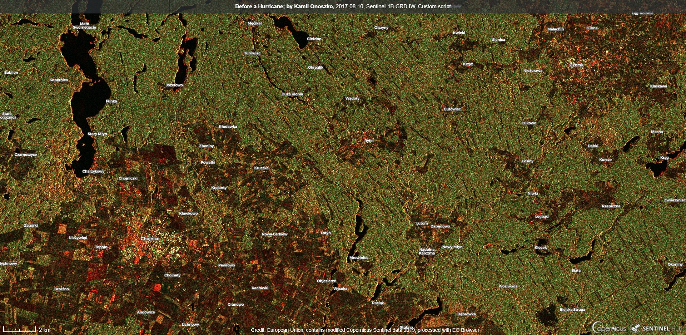
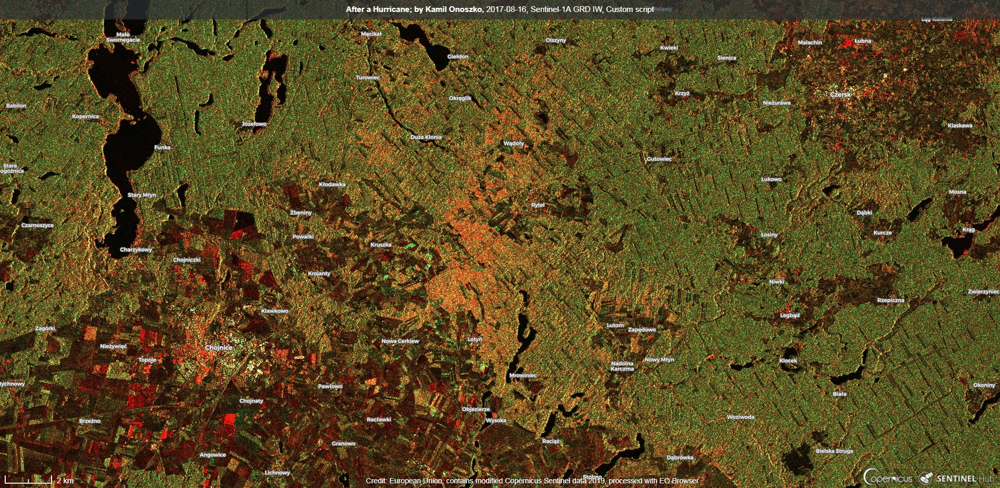

## General description of the script

The script helps in visualization of forest damage after a hurricane.

The script is based on Sentinel-1 radar data. With the help of the script, you can specify the area of damage a few days after the disaster (regardless of weather conditions, cloudiness).

Visualization allows you to quickly determine the extent of damage and can be useful for emergency services to plan the right amount of equipment and people to help.

## Author of the script

Kamil Onoszko

## Description of representative images

Visualization before the Hurricane in Chojnice, Poland in August 2017:

Visualization after the Hurricane:

