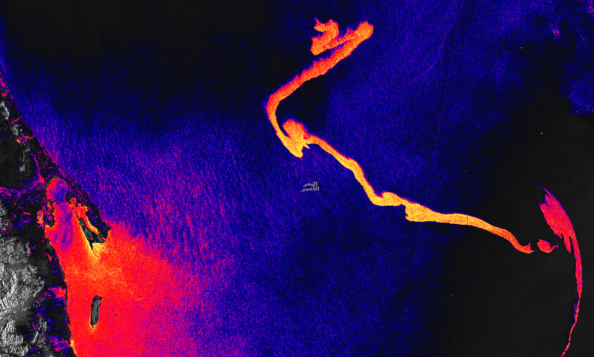
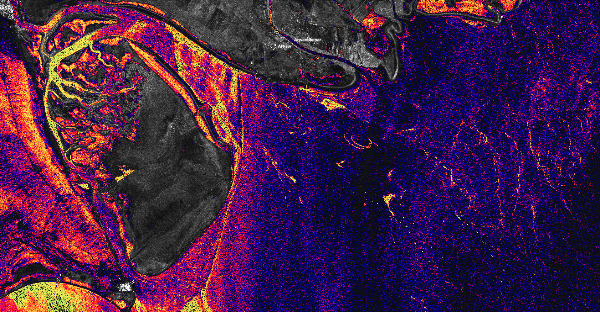
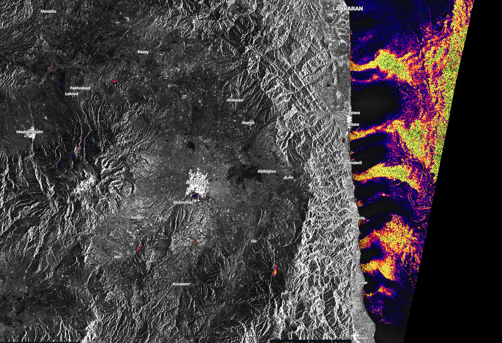

# Oil Slicks and Red Tide Monitoring

<a href="#" id='togglescript'>Show</a> script or [download](script.js){:target="_blank"} it.


      


## Author of the script
By TIZNEGAR Startup Co, 
[www.tiznegar.com](http://www.tiznegar.com/){:target="_blank"}

## Evaluate and Visualize

- [EO Browser](https://sentinelshare.page.link/5vH6){:target="_blank"}

## General description
This script is capable of detecting oil slicks and [red tides (harmful algal blooms)](https://oceanservice.noaa.gov/facts/redtide.html) at sea. In this script we use the ORM (Oil slicks and Red tide monitoring) index, calculated as: 

**ORM = Math.log(0.01/(0.01+VV*2))**

The pixels where both ORM index values are lower than zero, and VV and VH values are low, are visualized with a continuous color visualization. Other areas are returned as grayscale VV visualization. 
Differences in color of ORM values below 0 correspond to changes in water roughness, making it posible to detect oil pollution (which is characterized by a very shiny surface), and red tides (characterized by rough surface changes). Aside from oil spills and red ocean tides, the script can also be used to monitor water quality of wetlands and rivers connected to the sea, by detecting pollution caused by industrial pollutants, municipal sewage, algae density and mud. Increased water pollution is indicated by bright yellow, orange and red colors in the script. 

Dense clouds and severe storms negatively affect the accuracy of this indicator.

## Description of representative images

**Example 1**

Oil slick caused by the collision of a Sabiti tanker 108 km from the Saudi port of Jeddah in the Red Sea. 

[Show in EO Browser.](https://sentinelshare.page.link/5vH6){:target="_blank"}

**Example 2**

Changes in quality of incoming waters due to algae density change in the Persian Gulf. 

[Show in EO Browser.](https://sentinelshare.page.link/d2c1){:target="_blank"}

**Example 3**

River waters enter into the Caspian Sea, bringing a higher concentration of algae, industrial pollutants and mud. 

[Show in EO Browser.](https://sentinelshare.page.link/vpVp){:target="_blank"}

