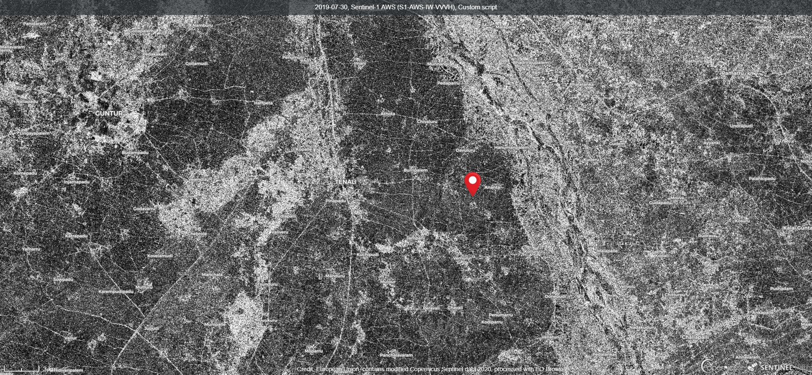
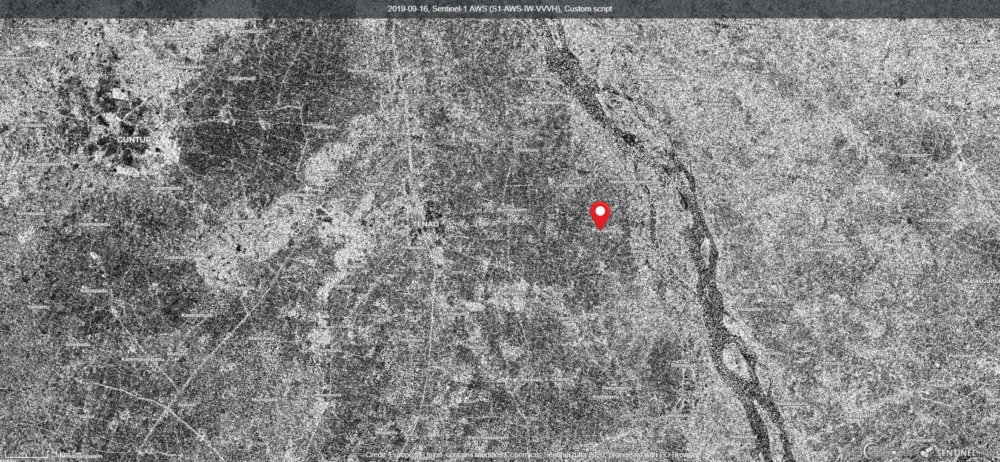
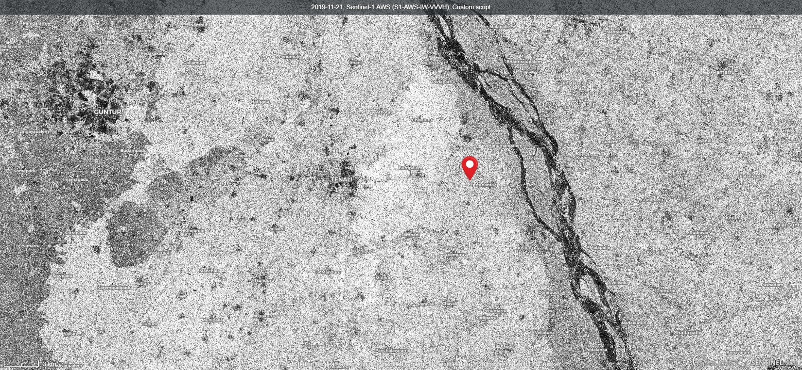
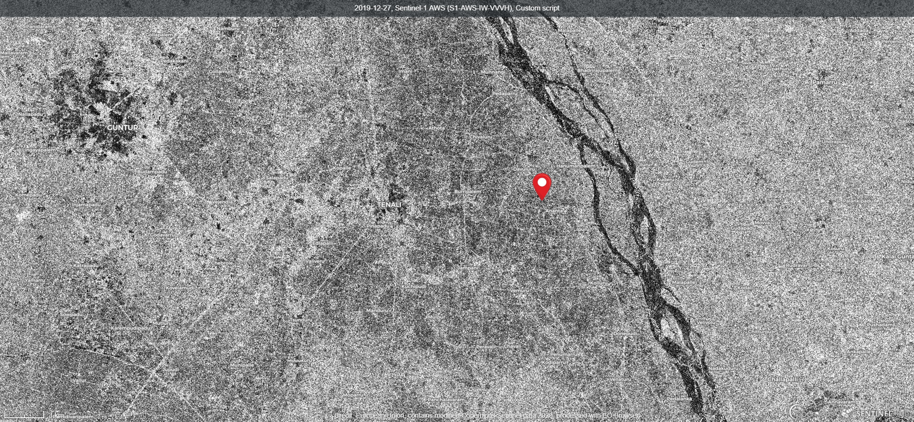

# Radar Vegetation Index Code for Dual Polarimetric Script

<a href="#" id='togglescript'>Show</a> script or [download](script.js){:target="_blank"} it.


      


## Evaluate and visualize   
 - [EO Browser](https://apps.sentinel-hub.com/eo-browser/?lat=15.9973&lng=80.5751&zoom=11&time=2019-11-21&preset=CUSTOM&datasource=Sentinel-1%20AWS%20(S1-AWS-IW-VVVH)&layers=VV,VH,HH&evalscript=LyoKUmFkYXIgVmVnZXRhdGlvbiBpbmRleCBmb3IgU2VudGluZWwtMQpTdWJoYWRpcCBEZXkKSUlUIEJvbWJheQoKVGhpcyBjb2RlIGlzIGJhc2VkIG9uOgpOYXNpcnphZGVoZGl6YWppLCBSb3Vob2xsYWgsIGV0IGFsLiAiU2Vuc2l0aXZpdHkgQW5hbHlzaXMgb2YgTXVsdGktVGVtcG9yYWwgU2VudGluZWwtMSBTQVIgUGFyYW1ldGVycyB0byBDcm9wIEhlaWdodCBhbmQgQ2Fub3B5IENvdmVyYWdlLiIgQXBwbGllZCBTY2llbmNlcyA5LjQgKDIwMTkpOiA2NTUuCiovCgpyZXR1cm4gWyg0KlZIKS8oVlYrVkgpXTs%3D){:target="_blank"} 

## General description of the script

This script computes the vegetation indices over the scene using the VH and VV polarization combinations.  It computes the 4 times normalized VH backscatter to compute the vegetation index. This code is based on Nasirzadehdizaji et al. (2019) work, where HH ~ VV was considered for dual polarization SAR data. This index could be useful for the identification of crop phenological stages. During the growth period the randomness in SAR backscatter increases as crop canopy distribution and density change. This index directly relates the changes in those crop parameters and the randomness in the SAR backscatter. Hence, variation in the index is found depending on the growth stage.

## Details of the script

This index can be applied to retrieve the crop phenological stages and also for different crop type mapping.  However, the bound of this index is from 0 to 4, where 0 means no vegetation coverage and 4 means 100% vegetation coverage. However, this index represents the randomness in SAR backscatter. Hence, prior information about field type, e.g. urban area, vegetation area or water body might be required if one is interested to monitor the temporal changes of some particular type of targets.

See the [supplementary material](supplementary_material.pdf){:target="_blank"} for more details about the script.

## Author of the script

Subhadip Dey

## Description of representative images

The representative images are over Vijayawada, India region. The period of the imaging was from 24-June, 2019 to 27-December, 2019. During this period, rice is majorly sown over all the fields in this area. Also, the monsoon cloudy climatic condition creates hindrance in ground data collection by optical satellites. In this regard, the Sentinel-1 SAR satellite could be an alternative way to monitor the rice phenological stages. It can be seen from the representative images that the RVI for Sentinel-1 visually correlates the changes in the crop phenological stages to a great extent. During the initial period of Jun (24-June) the fields were not cultivated due to which the RVI value was low and hence, a dark appearance in the RVI images can be seen. On 30-July, 2019 some of the fields were cultivated with rice, but still, the majority of the fields were not sown. The sown fields exhibit slightly brighter pixels than others. Hence during this time, a mixture of different RVI values can be noticed.  During 16-September all the fields were at advanced vegetative stage. This time the dense, complex canopy distribution generated high randomness in the SAR backscatter due to which all the rice cultivated fields shows brighter pixels than the previous day. Around 21-November all the fields achieved the advanced reproductive stage. Hence, the rice panicles and the complex geometry of rice crop again increases the randomness in SAR backscatter. Due to this reason, the RVI increased from 16-September to 21-November. Later during the end of December, all the rice fields were harvested, which produced lower RVI values on 27-December. 

1) Temporal variation of RVI(v) depending on the rice phenological stages over Vijayawada, India
using Sentinel-1 SAR data on June 24th 2019.

2) Temporal variation of RVI(v) depending on the rice phenological stages over Vijayawada, India
using Sentinel-1 SAR data on July 30th 2019.

3) Temporal variation of RVI(v) depending on the rice phenological stages over Vijayawada, India
using Sentinel-1 SAR data on September 16th 2019.

4) Temporal variation of RVI(v) depending on the rice phenological stages over Vijayawada, India
using Sentinel-1 SAR data on November 21st 2019.

5) Temporal variation of RVI(v) depending on the rice phenological stages over Vijayawada, India
using Sentinel-1 SAR data on December 27th 2019.

## References

[1] Kim, Y.; van Zyl, J.J. A Time-Series Approach to Estimate Soil Moisture Using Polarimetric Radar Data. IEEE Trans. Geosci. Remote Sens. 2009, 47, 2519ñ2527.

[2] Charbonneau, F.; Trudel, M.; Fernandes, R. Use of Dual Polarization and Multi-Incidence SAR for soil permeability mapping. In Proceedings of the 2005 Advanced Synthetic Aperture Radar (ASAR) Workshop, St-Hubert, QC, Canada, 15ñ17 November 2005.

[3] Nasirzadehdizaji, Rouhollah, et al. "Sensitivity Analysis of Multi-Temporal Sentinel-1 SAR Parameters to Crop Height and Canopy Coverage." Applied Sciences 9.4 (2019): 655.

## Credits

[1] Nasirzadehdizaji, Rouhollah, et al. "Sensitivity Analysis of Multi-Temporal Sentinel-1 SAR Parameters to Crop Height and Canopy Coverage." Applied Sciences 9.4 (2019): 655.