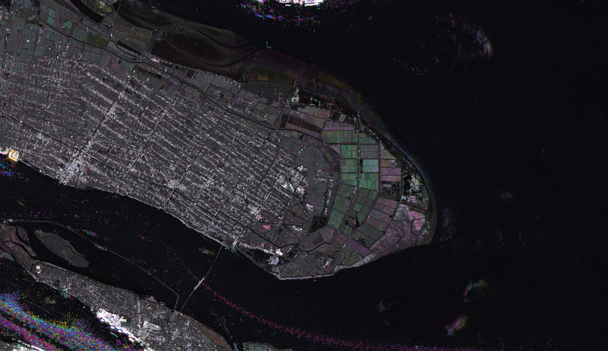

# Reactiv Script

<a href="#" id='togglescript'>Show</a> script or [download](script.js){:target="_blank"} it.


      


## Evaluate and visualize   
 - [EO Browser](https://apps.sentinel-hub.com/eo-browser/?zoom=13&lat=30.5219&lng=114.05371&themeId=DEFAULT-THEME&datasetId=S1_AWS_IW_VVVH&fromTime=2018-01-01T00%3A00%3A00.000Z&toTime=2020-09-11T23%3A59%3A59.999Z&visualizationUrl=https%3A%2F%2Fservices.sentinel-hub.com%2Fogc%2Fwms%2Ff2068f4f-3c75-42cf-84a1-42948340a846&evalscript=Ly9WRVJTSU9OPTMKdmFyIHQyPURhdGUucGFyc2UoJzIwMjAtMDktMTEnKTsgLy9lbmQgZGF0ZQp2YXIgdDE9RGF0ZS5wYXJzZSgnMjAxOC0wMS0wMScpOyAvL3N0YXJ0IGRhdGEKdmFyIHBvbGFyPVsnVlYnLCAnVkgnXTsKdmFyIG9uZV9kYXkgPSAxMDAwICogNjAgKiA2MCAqIDI0IDsKdmFyIHJlZHVjaW5nX2NvZWZmID0gMC44OwoKZnVuY3Rpb24gaHN2MnJnYihoLHMsdikKewogIGggPSAzNjAqaDsKICBsZXQgZiA9IChuLGs9KG4raC82MCklNikgPT4gdiAtIHYqcypNYXRoLm1heCggTWF0aC5taW4oayw0LWssMSksIDApOwogIHJldHVybiBbZig1KSxmKDMpLGYoMSldOwp9CmZ1bmN0aW9uIEhTVnRvUkdCKGgsIHMsIHYpIHsKICB2YXIgciwgZywgYiwgaSwgZiwgcCwgcSwgdDsKICBpZiAoYXJndW1lbnRzLmxlbmd0aCA9PT0gMSkgewogICAgICBzID0gaC5zLCB2ID0gaC52LCBoID0gaC5oOwogIH0KICBpID0gTWF0aC5mbG9vcihoICogNik7CiAgZiA9IGggKiA2IC0gaTsKICBwID0gdiAqICgxIC0gcyk7CiAgcSA9IHYgKiAoMSAtIGYgKiBzKTsKICB0ID0gdiAqICgxIC0gKDEgLSBmKSAqIHMpOwogIHN3aXRjaCAoaSAlIDYpIHsKICAgICAgY2FzZSAwOiByID0gdiwgZyA9IHQsIGIgPSBwOyBicmVhazsKICAgICAgY2FzZSAxOiByID0gcSwgZyA9IHYsIGIgPSBwOyBicmVhazsKICAgICAgY2FzZSAyOiByID0gcCwgZyA9IHYsIGIgPSB0OyBicmVhazsKICAgICAgY2FzZSAzOiByID0gcCwgZyA9IHEsIGIgPSB2OyBicmVhazsKICAgICAgY2FzZSA0OiByID0gdCwgZyA9IHAsIGIgPSB2OyBicmVhazsKICAgICAgY2FzZSA1OiByID0gdiwgZyA9IHAsIGIgPSBxOyBicmVhazsKICB9CiAgcmV0dXJuIFtyLAogICAgICAgICAgZywKICAgICAgICAgIGJdOwp9CmZ1bmN0aW9uIGdldF9kYXRlX2RpZmZlcmVuY2VfaW5fZGF5cyh0MSwgdDIpCnsKICByZXR1cm4gTWF0aC5mbG9vcihNYXRoLmFicyhNYXRoLnJvdW5kKAogICAgICB0MSAtIHQyCiAgICApIC8gb25lX2RheSkpOwp9CnZhciBkZWx0YV9kYXRlID0gZ2V0X2RhdGVfZGlmZmVyZW5jZV9pbl9kYXlzKHQyLCB0MSkvLyBTZWxlY3Rpb24gb2YgcG9sYXJpemF0aW9uCmZ1bmN0aW9uIHNldHVwKCkgewogICAgcmV0dXJuIHsKICAgICAgaW5wdXQ6IFt7CiAgICAgICAgYmFuZHM6IHBvbGFyCiAgICAgIH1dLAogICAgICBvdXRwdXQ6IHsgYmFuZHM6IDMgfSwKICAgICAgbW9zYWlja2luZzogIk9SQklUIgogICAgfQogIH0vLyBTZWxlY3Rpb24gb2YgZGF0ZXMKZnVuY3Rpb24gZmlsdGVyU2NlbmVzIChzY2VuZXMpIHsKICAgIHJldHVybiBzY2VuZXMuZmlsdGVyKAogICAgICBmdW5jdGlvbiAoc2NlbmUpIHsKICAgICAgICByZXR1cm4gc2NlbmUuZGF0ZS5nZXRUaW1lKCk%2BPXQxICYmIHNjZW5lLmRhdGUuZ2V0VGltZSgpPD0gdDI7CiAgICAgfSkKICAgfS8vIFJHQiB2aXN1YWxpemF0aW9uCgpmdW5jdGlvbiBtZWFuKGFycikgewogIC8qCiAgKiBEZWZpbmVzIHRoZSBtZWFuIGNvbXB1dGF0aW9uIGZvciB0aGUgaW5wdXQgYXJyYXkgYXJyCiAgKi8KICByZXR1cm4gYXJyLnJlZHVjZSgoYSxiKSA9PiBhICsgYikgLyBhcnIubGVuZ3RoOwp9CgpmdW5jdGlvbiBzdGQoYXJyLCBtID0gbWVhbihhcnIpKSB7CiAgLyoKICAqIERlZmluZXMgdGhlIHN0YW5kYXJkIGRldmlhdGlvbiBjb21wdXRhdGlvbiBmb3IgdGhlIGlucHV0IGFycmF5IGFyciBhbmQgb3B0aW9uYWwgaW5wdXQgbWVhbgogICovCiAgcmV0dXJuIE1hdGguc3FydChhcnIubWFwKHggPT4gTWF0aC5wb3coeCAtIG0sIDIpKS5yZWR1Y2UoKGEsIGIpID0%2BIGEgKyBiKSAvIGFyci5sZW5ndGgpOwp9CgpmdW5jdGlvbiBjbGFtcChuLCBtaW4sIG1heCkgewogIC8qCiAgKiBEZWZpbmVzIHRoZSBjbGFtcGluZyBmdW5jdGlvbjogZ2l2ZW4gYSBudW1iZXIgbiwgcmV0dXJucyBtaW4gaWYgbiA8IG1pbiBvciBtYXggaWYgbiA%2BIG1heAogICovCiAgcmV0dXJuIG4gPiBtYXggPyBtYXggOiBuIDwgbWluID8gbWluIDogbjsKfQoKZnVuY3Rpb24gZXZhbHVhdGVQaXhlbChzYW1wbGVzLCBzY2VuZXMpIHsKICAvLyBDb21wdXRlIGNvZWZmaWNpZW50IG9mIHZhcmlhdGlvbgogIHZhciBLbWF4ID0gMAogIHZhciBJbWF4ID0gMCAgCgogIC8vLy8vLy8vLy8vLy8vLy8vLy8vLy8vLy8vLy8vLy8vCiAgLy8gQ29tcHV0aW5nIHNhdHVyYXRpb24gdmFsdWUgLy8KICAvLy8vLy8vLy8vLy8vLy8vLy8vLy8vLy8vLy8vLy8vLwogIHZhciBzaWduYWxfdnYgPSBzYW1wbGVzLm1hcCgoYSkgPT4gTWF0aC5zcXJ0KGEuVlYpKTsKICB2YXIgbWVhbl9zaWduYWxfdnYgPSBtZWFuKHNpZ25hbF92dik7CiAgdmFyIHN0ZF9zaWduYWxfdnYgPSBzdGQoc2lnbmFsX3Z2LCBtZWFuX3NpZ25hbF92dik7CiAgdmFyIHZhcmlhdGlvbl9jb2VmZl92diA9IHN0ZF9zaWduYWxfdnYgLyBtZWFuX3NpZ25hbF92djsKCiAgdmFyIHNpZ25hbF92aCA9IHNhbXBsZXMubWFwKChhKSA9PiBNYXRoLnNxcnQoYS5WSCkpOwogIHZhciBtZWFuX3NpZ25hbF92aCA9IG1lYW4oc2lnbmFsX3ZoKTsKICB2YXIgc3RkX3NpZ25hbF92aCA9IHN0ZChzaWduYWxfdmgsIG1lYW5fc2lnbmFsX3ZoKTsKICB2YXIgdmFyaWF0aW9uX2NvZWZmX3ZoID0gc3RkX3NpZ25hbF92aCAvIG1lYW5fc2lnbmFsX3ZoOwoKICAvLyBDb21wYXJpc29uIG9mIHZhcmlhdGlvbiBjb2VmZiBvZiBib3RoIHBvbGFycyB3aXRoIFNBUiBjb25zdGFudHMgZGVkdWNlZCB3aXRoIHRoZSBsb29rIG51bWJlciBMCiAgdmFyIEwgPSA0Ljk7CiAgdmFyIG11ID0gMC4yMjg2OwogIHZhciBhbHBoYSA9IDAuMTYxNi9NYXRoLnNxcnQoc2FtcGxlcy5sZW5ndGgpOwoKICB2YXIgUl92diA9ICh2YXJpYXRpb25fY29lZmZfdnYgLSBtdSkvKGFscGhhKjEwLjApICsgMC4yNTsKICBSX3Z2ID0gY2xhbXAoUl92diwgMCwgMSkKCiAgdmFyIFJfdmggPSAodmFyaWF0aW9uX2NvZWZmX3ZoIC0gbXUpLyhhbHBoYSoxMC4wKSArIDAuMjU7CiAgUl92aCA9IGNsYW1wKFJfdmgsIDAsIDEpCiAgCiAgLy8gUmV0YWluZWQgdmFyaWF0aW9uIGNvZWZmIGlzIHRoZSBtYXhpbXVtIGJldHdlZW4gdGhlIHR3byBwb2xhci13aXNlIHZhcmlhdGlvbiBjb2VmZgogIHZhciBSID0gTWF0aC5tYXgoUl92diwgUl92aCk7CiAgCiAgLy8vLy8vLy8vLy8vLy8vLy8vLy8vLy8vLy8vCiAgLy8gQ29tcHV0aW5nIEh1ZSAmIFZhbHVlIC8vCiAgLy8vLy8vLy8vLy8vLy8vLy8vLy8vLy8vLy8vCgogIC8vIFJldHJpZXZlcyBtYXggZnJvbSBlYWNoIHBvbGFyIHRoZW4gdGhlIG1heCBvZiB0aGUgdHdvIHZhbHVlcwogIHZhciBpbWF4X3Z2ID0gTWF0aC5tYXgoLi4uc2lnbmFsX3Z2KTsKICB2YXIgaW1heF92aCA9IE1hdGgubWF4KC4uLnNpZ25hbF92aCk7CiAgdmFyIGltYXggPSBNYXRoLm1heChpbWF4X3Z2LCBpbWF4X3ZoKTsKICB2YXIgaW1heF9pZHggPSBzaWduYWxfdnYuaW5kZXhPZihpbWF4KTsKICBpZiAoaW1heF9pZHggPT0gLTEpIHsKICAJaW1heF9pZHggPSBzaWduYWxfdmguaW5kZXhPZihpbWF4KTsKICB9CiAgdmFyIGluZGV4ayA9IGdldF9kYXRlX2RpZmZlcmVuY2VfaW5fZGF5cygKICAgIHNjZW5lc1tpbWF4X2lkeF0uZGF0ZS5nZXRUaW1lKCksCiAgICB0MQogICkKICB2YXIgS21heCA9IGluZGV4ayAvIGRlbHRhX2RhdGU7CiAgdmFyIGltYXggPSBjbGFtcCgwLjgqaW1heCwgMCwgMSk7CiAgCiAgLy8vLy8vLy8vLy8vLy8vLy8vLy8vLy8vLy8vLy8vLy8vLy8KICAvLyBDcmVhdGluZyBIU1YgJiBSR0IgY29udmVydGlvbiAvLwogIC8vLy8vLy8vLy8vLy8vLy8vLy8vLy8vLy8vLy8vLy8vLy8vCgogIC8vIFJlZ3VsYXRpbmcgcG90ZW50aWFsIHNhdHVyYXRpb24gYnkgYXZlcmFnaW5nIG1heCBzaWduYWwgdmFsdWUgd2l0aCBhdmVyYWdlIHZhbHVlIG9mIG1heCB2YWx1ZSBhdCBlYWNoIHNpZ25hbCB0aW1lc3RlcAogIHZhciBpbnRlbnNpdGllcyA9IHNhbXBsZXMubWFwKChhKSA9PiBNYXRoLm1heChhLlZWLCBhLlZIKSk7CiAgdmFyIG1lYW5faW50ZW5zaXR5ID0gaW50ZW5zaXRpZXMucmVkdWNlKChhLCBiKSA9PiBhICsgYikgLyBzYW1wbGVzLmxlbmd0aDsKICB2YXIgdmFsdWUgPSAoaW1heCArIDAuOCptZWFuX2ludGVuc2l0eSkvMjsKICBoc3YgPSB7aDowLjkqS21heCwgczpSLCB2OnZhbHVlfTsgLy8gU2V0dGluZyB0aGUgbWF4IHBvc3NpYmxlIGh1ZSB2YWx1ZSB0byAwLjkKICAvL3JnYiA9IFttZWFuX2FtcGxpdHVkZSwgbWVhbl9hbXBsaXR1ZGUsIG1lYW5fYW1wbGl0dWRlXQogIHJnYiA9IEhTVnRvUkdCKGhzdik7CiAgcmV0dXJuIHJnYjsKIH0gLyoKIHNjZW5lcyA9IFt7CiAgIGRhdGU6Li4uLAogICBpZHg6Li4uLAogICBiYW5kQnVmZmVyczouLi4KIH1dIHNhbXBsZXMgPSAgW3sKICAgVlY6Li4uLAogICBWSDouLi4KIH1dIHBpeGVsIHZhbHVlCiAqLw%3D%3D#custom-script){:target="_blank"} 

## General description of the script

### Script Introduction
This code was developed at Onera as part of the MEDUSA project. It is a visualization of a stack of SAR images highlighting change detection. Exploiting the HSV, it focuses on the temporal dimension for calculation and does not rely on any spatial computation. For this project, Sentinel-1 IW VV-VH images were used. The orbit was also fixed whether to ASCENDING or to DESCENDING when manipulating time-series. Its ultimate objective is to synthesize activity information embedded into a temporal data profile, all within a single colored image, emphasizing the presence or absence of significant change in bright colors.

### Intents & Motivations
Difficult to interpret because of their geometry and speckle noise, SAR images are however very useful and effective in change detection. Until the advent of Sentinel-1 data from the Copernicus program, access to temporal stacks of data was scarce, and most algorithms focused on the spatial component of images. The recent context of big data opens many possibilities for SAR image processing, and one of the most remarkable is the access and the analysis of time-series.
Exploiting the time dimension can be useful for filtering speckle noise. Indeed, in the absence of change, we have access, in a single pixel, to N realizations of a random signal.
In the algorithm proposed here, we wish not only to improve the signal-to-noise ratio, but also to detect all the pixels for which a change occurred between the first and the last observation date. These generic changes can be either short changes in time (e.g. boats) or longer/permanent changes (e.g. a construction site).
The REACTIV algorithm can display insights in different circumstances, such as monitoring of:
- port areas, for highlighting maritime shipping routes;
- urban areas, for the observation of city sprawl
- environment, to quickly map changes in forest cover;
- agricultural practices, to monitor the occupation of cultivated plots and improve cultivation methods.

### Script Description

The HSV space consists of 3 components: the Hue, the Saturation and the Value. We detail below how these three components are used in the representation.

See also the [supplementary material](supplementary_material.pdf) for details.

#### The Hue component: the time dimension

The Hue component represents which color of the color wheel is used. The Hue component encodes the dating information of the event. We select the time index of maximum signal value for the pixel pij across all polarisation l. We then calculate a time difference between the maximal time index and this time index, that we then divide by the difference between the maximal and minimal time index. To simplify, we rescale the relative time measure of change event to be between 0 and 1.
Additionally, our Hue color range is defined as a number between 0 and 1. However, we noticed a huge resemblance between the extreme start and end color of the spectrum. For that matter, we decided to fix the maximum value of the interval to a, with a being here 0.9. We do so by multiplying the final Hue value by 0.9 to reduce the initial [0,1] range to a simpler [0, 0.9] range.

#### The Saturation component: change intensity

The Saturation component, responsible for how intense the color picked by the hue value will be, is bound to the change intensity: the bigger the change, the more saturated the color will appear. This means that white spots on the map represent places with low changes over time. The closer to 1, the more vivid the color; oppositely, the closer to 0, the duller the color. See the [supplementary material](supplementary_material.pdf) for details.

#### The Value component: usual radar intensity

Finally, to keep the usual SAR Image look, the value component ranging from dark to bright, represents the maximum value of the input signal over both polarization. We empirically found that this setting does not provide sufficient details for change to be localizable but also contextualized, i.e. for surroundings to be recognizable: hence, the intensity has been averaged with the mean max signal of the pixel at each timestep. See the [supplementary material](supplementary_material.pdf) for details.

## Details of the script

This script was developed using the Sentinel Hub EO Browser and explored the potential of time series analysis using the timespan option of the platform. The script has an adaptive linear change detection range that is expressed in relative values, i.e. between 0 and 1 (0 being closer to the start of the temporal stack and 1 being closer to the end). This enables our algorithm to perform over different periods, of different sizes and to have somewhat comparable results. Additionally, it does not suffer from resolution issues as no spatial computation is performed: it is a fully temporal analysis algorithm and hence is not subject to any problem that may happen when processing spatial SAR information. Furthermore, the PolSAR aspect of the algorithm is not crucial to its functioning: it has been tested on single polarisation data as well by isolating VH and VV data channels for Sentinel-1 imagery. Additionally, it is able to adapt to many different situations and geographical context, as proven with the following pictures. However, it may suffer from noisiness in highly changing regions.

## Authors of the script

Thomas Di Martino, Elise Colin-Koeniguer, Regis Guinvarc'h, Laetitia Thirion-Lefevre

## Description of representative images

1. Maritime Routes: Shanghai Port

In this Shanghai Port image, and thanks to the REACTIV method, maritime routes are very explicit. Additionally, the time dimension represented by the chosen color seems to indicate that the northern entry path to the port is only opened during certain parts of the year as only red and shaded blue boats appear to be there. This provides insights on the functioning of ports and possible maritime legislation.

2. Vegetation monitoring: Shanghai Wetlands

Situated close to the Chongming Dongtan birds national nature reserve in Shanghai, the Shanghai wetlands are a very distinct ecosystem that is usually flooded with water on seasonal occasions, inducing huge variability in its environment and in its dielectric properties, crucial for SAR imagery. This variability is expected to be found and to be localised. As we can see this picture, we do have change being detected cohesively across the different subsurfaces of wetland. This is manifested by regions portrayed as green for some and pink for others. 
When checking the Hue range, we notice that green is located around the first third of the time interval, meaning around the end of 2018 while the pink values are located at the end of the interval, meaning the end of 2020. These similar yearly periods show how the REACTIV method successfully captured a seasonal and periodical event within the Shanghai wetlands.

3. Urban sprawl: Wuhan City

Given recent events and the efforts deployed by the Chinese government to build emergency hospitals, the city of Wuhan displayed interesting results with regards to change detection tasks. Most recent buildings, plots with colors of the end of the Hue spectrum (i.e. shades of pink) are noticeable throughout this map. One particular example is the Huoshenshan Hospital located on the Zhiyinhu Boulevard. As displayed in the zoomed image, we notice violet (shaded dark-pink) which represents high activity spike in the last months of recording, which correlates with the cityís plans to build emergency hospitals. Other locations around the city have similar color spots that most probably also are constructions built in the context of COVID-19.

## Credits

The REACTIV method was developed and presented in [1]. Additionally, a french paper has also been redacted: [2] which received the first price of the french CFPT congress. Finally, existing code implementing this method can be found in the following link with Python and GEE implementations.

## References

[1] Elise Colin Koeniguer, Alexandre Boulch, Pauline Trouve-Peloux and Fabrice Janez. Colored visualization of multitemporal data for change detection: issues and methods. EUSAR, 2018.

[2] Elise Colin Koeniguer, Jean-Marie Nicolas, Beatrice Pinel-Puyssegur, J.-M. Lagrange and Fabrice Janez. Visualisation des changements sur s¥eries temporelles radar : m¥ethode REACTIV ¥evalu¥ee `a lí¥echelle mondiale sous Google Earth Engine. (French) RFPT, N. 217-218, 2018