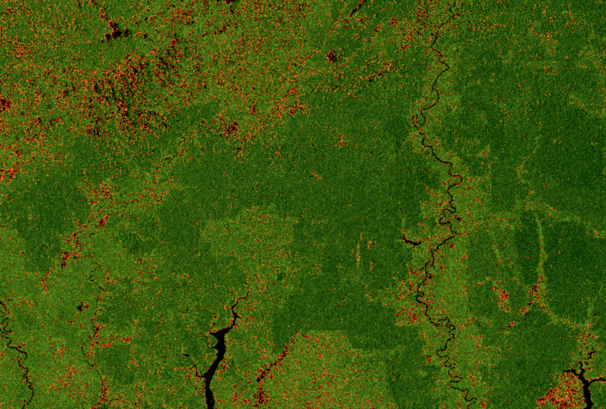
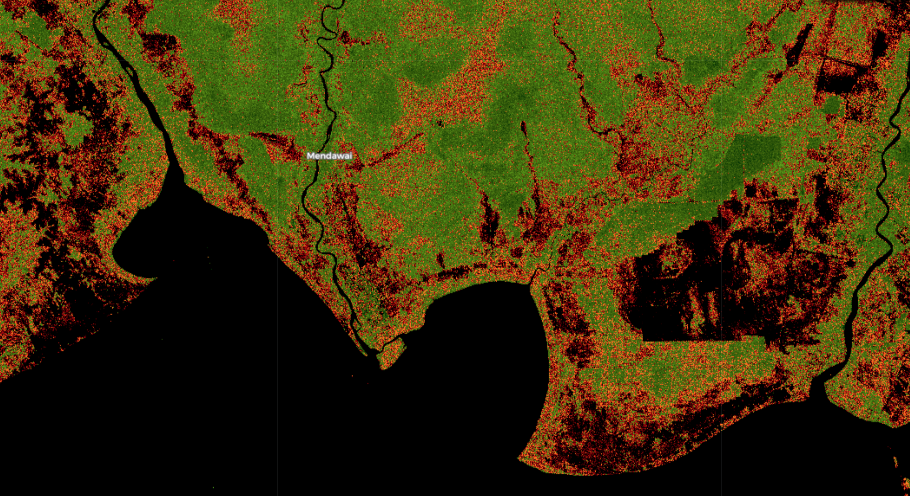

# SAR for Deforestation Detection Script

<a href="#" id='togglescript'>Show</a> script or [download](script.js){:target="_blank"} it.


      


## Evaluate and visualize   
 - [EO Browser](https://apps.sentinel-hub.com/eo-browser/?lat=-3.1254&lng=113.6286&zoom=10&time=2019-11-08&preset=CUSTOM&datasource=Sentinel-1%20AWS%20(S1-AWS-IW-VVVH)&layers=VV,VH,HH&evalscript=Ly8KLy8gU0FSIGZvciBkZWZvcmVzdGF0aW9uIGRldGVjdGlvbgovLyAtLS0tLS0tLS0tLS0KLy8gMjAxOSAtIEFudG9uaW8gQ2FybG9uIFBhcmVkZXMKLy8gTGljZW5zZTogQ0MgQlkgNC4wCi8vIGh0dHBzOi8vY3JlYXRpdmVjb21tb25zLm9yZy9saWNlbnNlcy9ieS80LjAvCi8vCmZ1bmN0aW9uIHNldHVwKGRzKSB7CiAgc2V0SW5wdXRDb21wb25lbnRzKFtkcy5WViwgZHMuVkhdKTsKICBzZXRPdXRwdXRDb21wb25lbnRDb3VudCgzKTsKfQoKY29uc3QgR0FJTiA9IDIuNTsKY29uc3QgV0FURVJfTElNSVQgPSAwLjE7CmNvbnN0IEZPUkVTVF9MSU1JVCA9IDAuMjsKY29uc3QgSU5WRVJTRV9GQUNUT1IgPSAyNTsKCmNvbnN0IEdSRUVOX0dSQURJRU5UID0gWwogICAgWzEuMDAwLCAweDgwRjMwMF0sCiAgICBbMC41MDAsIDB4NDA2NjAwXSwKICAgIFswLjAwMCwgMHgwMDMzMDBdCl0KCmNvbnN0IFJFRF9HUkFESUVOVCA9IFsKICAgIFsxLjAwMCwgMHhGRkZGRkZdLAogICAgWzAuNTI1LCAweEZGODYwMF0sCiAgICBbMC4zMDAsIDB4RkY2RTAwXSwKICAgIFswLjI1MCwgMHhBRTAwMDBdLAogICAgWzAuMDAwLCAweDAwMDAwMF0KXTsKCmNvbnN0IEdSRUVOX1ZJWiA9IG5ldyBDb2xvckdyYWRpZW50VmlzdWFsaXplcihHUkVFTl9HUkFESUVOVCwgMCwgMSk7CmNvbnN0IFJFRF9WSVogPSBuZXcgQ29sb3JHcmFkaWVudFZpc3VhbGl6ZXIoUkVEX0dSQURJRU5ULCAwLCAxKTsKCmNvbnN0IGV2YWx1YXRlUGl4ZWwgPSBmdW5jdGlvbiAoc2FtcGxlcywgc2NlbmVzKSB7CglsZXQgdnYgPSBzYW1wbGVzWzBdLlZWOwoJbGV0IHZoID0gc2FtcGxlc1swXS5WSDsKCiAgICBsZXQgYXJlYSA9IHZ2ICogdmg7CglsZXQgdl9sZW4gPSBNYXRoLnNxcnQodnYgKiB2diArIHZoICogdmgpOwogIAlsZXQgdl9hbmdsZV93ZWlnaHRlZCA9IDA7CglpZiAodnYgPiAwKSB7CgkJdl9hbmdsZV93ZWlnaHRlZCA9IE1hdGguYXRhbih2aC92dikgLyAoTWF0aC5QSSAvIDIpOwoJfQoJbGV0IHZfbGVuX2ludmVyc2UgPSAwOwogIAlpZiAodl9sZW4gPiAwKSB7CgkJdl9sZW5faW52ZXJzZSA9IDEgLyAoSU5WRVJTRV9GQUNUT1IgKiB2X2xlbik7CiAgICB9CgogIAlpZiAodl9sZW4gPCBXQVRFUl9MSU1JVCkgewogICAgCXJldHVybiBbMF07CiAgICB9IGVsc2UgaWYgKHZfbGVuID4gRk9SRVNUX0xJTUlUKSB7CiAgICAgIAlsZXQgaW5kZXggPSBHQUlOICogdl9sZW4gLSB2X2FuZ2xlX3dlaWdodGVkOwogICAgICAgIHJldHVybiBHUkVFTl9WSVoucHJvY2VzcyhpbmRleCk7CiAgICB9IGVsc2UgewogICAgICAgIGxldCBpbmRleCA9IEdBSU4gKiB2X2xlbl9pbnZlcnNlICsgdl9hbmdsZV93ZWlnaHRlZDsKICAgICAgICByZXR1cm4gUkVEX1ZJWi5wcm9jZXNzKGluZGV4KTsKICAgIH0KfTs%3D){:target="_blank"} 

## General description of the script

The script uses the VV and VH bands of the Sentinel-1 and transforms the cartesian space of VV and VH to polar coordinates computing the length and angle of the resulting vector and also the area of the square defined by VV and VH. Then it uses the length of the vector as a classifier to discriminate between water, forest and soil.

The script paints in black the water and bare soil areas, and uses both the length and the angle to draw a scale for the forest (green) and soil (red), drawing a stronger green where more forest has been classified and a stronger red or black where more soil has been found.

## Details of the script

The script only uses the VV and VH bands of the Sentinel 1, so it will identify bare soil as water (black) and is intended to be used in forest area, returning strange results when used in populated areas.

## Author of the script

Antonio Carlón Paredes

## Description of representative images

The images show several zones of Borneo, in areas affected by palm oil deforestation.

