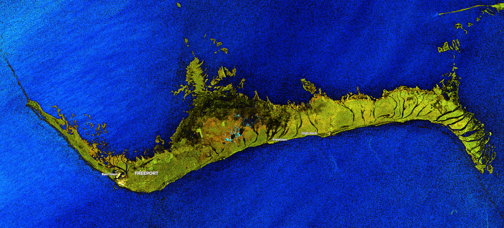

## Description
This script offers different false color visualizations and the ability to easily add more visualizations. Variables allow you to influence the resulting image regarding the content you would like to point out.  
More info [here.](https://pierre-markuse.net/2019/10/22/sentinel-1-sar-data-visualization-in-eo-browser-using-a-custom-script/){:target="_blank"}   

## Description of representative images

Grand Bahama Island Sentinel-1 SAR image

## Contributors:
 - [Pierre Markuse](https://pierre-markuse.net/){:target="_blank"}   

## License

 - [CC BY 4.0 International](https://creativecommons.org/licenses/by/4.0/){:target="_blank"}   

## Examples
 - [Hawaii](https://apps.sentinel-hub.com/eo-browser/?lat=19.5628&lng=-155.4639&zoom=10&time=2019-10-21&preset=CUSTOM&datasource=Sentinel-1%20AWS%20(S1-AWS-IW-VVVH)&layers=VV,VH,HH&evalscript=Ly8gU2VudGluZWwtMSBGYWxzZS1Db2xvciBWaXN1YWxpemF0aW9uIFYxLjAuMAovLyBUd2l0dGVyOiBQaWVycmUgTWFya3VzZSAoQHBpZXJyZV9tYXJrdXNlKQovLyBXZWJzaXRlOiBodHRwczovL3BpZXJyZS1tYXJrdXNlLm5ldC8KLy8gQ0MgQlkgNC4wIEludGVybmF0aW9uYWwgLSBodHRwczovL2NyZWF0aXZlY29tbW9ucy5vcmcvbGljZW5zZXMvYnkvNC4wLwoKZnVuY3Rpb24gc3RyZXRjaCh2YWwsIG1pbiwgbWF4KSAgewoJcmV0dXJuICh2YWwgLSBtaW4pIC8gKG1heCAtIG1pbik7Cn0KCmZ1bmN0aW9uIHNhdEVuaChyZ2JBcnIpIHsKICAgIHZhciBhdmcgPSByZ2JBcnIucmVkdWNlKChhLCBiKSA9PiBhICsgYiwgMCkgLyByZ2JBcnIubGVuZ3RoOwogICAgcmV0dXJuIHJnYkFyci5tYXAoYSA9PiBhdmcgKiAoMSAtIHNhdHVyYXRpb24pICsgYSAqIHNhdHVyYXRpb24pOwp9Cgp2YXIgQkxVRSA9IFswLjAsIDAuMiwgMS4wXTsKdmFyIEdSRUVOID0gWzAuMCwgMC43LCAwLjBdOwp2YXIgQkxBQ0sgPSBbMC4wLCAwLjAsIDAuMF07CnZhciBSRUQgPSBbMS4wLCAwLjAsIDAuMF07Cgp2YXIgd2F0ZXJfbm9ybWFsID0gW3N0cmV0Y2goVlYqMSwwLjAsMC45OSksc3RyZXRjaChWVio4LDAuMCwwLjk5KSwwLjUrVlYqMytzdHJldGNoKFZIKjIwMDAsMC4wLDAuOTkpXTsKdmFyIHdhdGVyX2JyaWdodCA9IFtzdHJldGNoKFZWKjEuMzMsMC4wLDAuOTkpLHN0cmV0Y2goVlYqMTAsMC4wLDAuOTkpLDAuNStWVio0K3N0cmV0Y2goVkgqMzAwMCwwLjAsMC45OSldOwp2YXIgb2lsc3BpbGxfMSA9IFtzdHJldGNoKFZWKjUuMCwwLjIsMC45OSksMC4wK3N0cmV0Y2goVlYqMTAsMC4xMCwwLjUwKSwwLjArc3RyZXRjaChWVioyMCwwLjEwLDAuNTApXTsKdmFyIG9pbHNwaWxsXzIgPSBbc3RyZXRjaChWVio1LjAsMC4yLDAuOTkpLDAuMCtzdHJldGNoKFZWKjEwLDAuMTUsMC40MCksMC4xK3N0cmV0Y2goVlYqMjAsMC4xNSwwLjQwKV07CnZhciBvaWxzcGlsbF8zID0gW3N0cmV0Y2goVlYqNS4wLDAuMiwwLjk5KSwwLjErc3RyZXRjaChWVioxMSwwLjAzLDAuNjApLDAuMStzdHJldGNoKFZWKjIzLDAuMDEsMC41OCldOwp2YXIgbGFuZF9yZWRkZXIgPSBbc3RyZXRjaChWViozLjQsLTAuMCwwLjk5KSwoc3RyZXRjaChWVioxLjEsLTAuMCwwLjk5KStzdHJldGNoKFZIKjguNzUsLTAuMCwwLjk5KSksc3RyZXRjaChWSCoxLjc1LC0wLjAsMC45OSldOwp2YXIgbGFuZF9ub3JtYWwgPSBbc3RyZXRjaChWViozLjAsLTAuMCwwLjk5KSwoc3RyZXRjaChWVioxLjEsLTAuMCwwLjk5KStzdHJldGNoKFZIKjguNzUsLTAuMCwwLjk5KSksc3RyZXRjaChWSCoxLjc1LC0wLjAsMC45OSldOwp2YXIgbGFuZF9ncmVlbmVyID0gW3N0cmV0Y2goVlYqMy4wLC0wLjAsMC45OSksKHN0cmV0Y2goVlYqMS40LC0wLjAsMC45OSkrc3RyZXRjaChWSCo5Ljc1LC0wLjAsMC45OSkpLHN0cmV0Y2goVkgqMS43NSwtMC4wLDAuOTkpXTsKdmFyIGNpdHkgPSBbMC45LVZWLTIqVkgsMC45LVZWLTMqVkgsMC45LTAuMypWVi02KlZIXTsKCgp2YXIgd2F0ZXJ2aXMgPSB3YXRlcl9ub3JtYWw7CnZhciBsYW5kdmlzID0gbGFuZF9ub3JtYWw7CnZhciB3YXRlcl90aHJlc2hvbGQgPSAyNTsgLy9sb3dlciBtZWFucyBtb3JlIHdhdGVyCnZhciBzYXR1cmF0aW9uID0gMS4wOyAvL1N0YW5kYXJkIDEuMAp2YXIgYnJpZ2h0bmVzcyA9IDEuMDsgLy9TdGFuZGFyZCAxLjAKdmFyIGF2b2lkX2RhcmtfbGFuZCA9IDE7IC8vMD1vZmYsMT1vbgp2YXIgYXZvaWRfZGFya19sYW5kX3RocmVzaG9sZCA9IDAuMTsgLy9TdGFuZGFyZCAwLjA1CnZhciBhdm9pZF9kYXJrX3dhdGVyID0gMTsgLy8wPW9mZiwxPW9uCnZhciBhdm9pZF9kYXJrX3dhdGVyX3RocmVzaG9sZCA9IDEuMDA7IC8vU3RhbmRhcmQgMS4wMAp2YXIgbWFudWFsQ29ycmVjdGlvbl93YXRlciA9IFswLjAwLCAwLjAwLCAwLjAwXTsKdmFyIG1hbnVhbENvcnJlY3Rpb25fbGFuZCA9IFswLjAwLCAwLjAwLCAwLjAwXTsKCnZhciBpID0gMDsKd2hpbGUgKGk8Mykgewogd2F0ZXJ2aXNbaV0gPSB3YXRlcnZpc1tpXSArIG1hbnVhbENvcnJlY3Rpb25fd2F0ZXJbaV07CiBsYW5kdmlzW2ldID0gbGFuZHZpc1tpXSArIG1hbnVhbENvcnJlY3Rpb25fbGFuZFtpXTsKIGxhbmR2aXNbaV0gPSBsYW5kdmlzW2ldICogYnJpZ2h0bmVzczsKIGkrKzsKfTsKCnZhciB3YXRlcnZpcyA9IHNhdEVuaCh3YXRlcnZpcyk7CnZhciBsYW5kdmlzID0gc2F0RW5oKGxhbmR2aXMpOwoKaWYgKGF2b2lkX2RhcmtfbGFuZCkgewogdmFyIGRhcmsgPSBsYW5kdmlzWzBdK2xhbmR2aXNbMV0rbGFuZHZpc1syXTsKIGlmIChkYXJrIDwgYXZvaWRfZGFya19sYW5kX3RocmVzaG9sZCkge3ZhciBsYW5kdmlzPUJMVUU7fTsgLy9Ucnkgb3RoZXIgdGhpbmdzIHRoYW4gQkxVRSEKfTsKCmlmIChhdm9pZF9kYXJrX3dhdGVyKSB7CiB2YXIgZGFyayA9IHdhdGVydmlzWzBdK3dhdGVydmlzWzFdK3dhdGVydmlzWzJdOwogaWYgKGRhcmsgPCBhdm9pZF9kYXJrX3dhdGVyX3RocmVzaG9sZCkge3ZhciB3YXRlcnZpcz1CTFVFO307IC8vVHJ5IG90aGVyIHRoaW5ncyB0aGFuIEJMVUUhCn07CgpyZXR1cm4gKChWVi9WSCkgPiB3YXRlcl90aHJlc2hvbGQpCj8gd2F0ZXJ2aXMgOgogbGFuZHZpczs%3D)  
 - [Kailua Kona](https://apps.sentinel-hub.com/eo-browser/?lat=19.5628&lng=-155.4639&zoom=10&time=2019-10-21&preset=CUSTOM&datasource=Sentinel-1%20AWS%20(S1-AWS-IW-VVVH)&layers=VV,VH,HH&evalscript=Ly8gU2VudGluZWwtMSBGYWxzZS1Db2xvciBWaXN1YWxpemF0aW9uIFYxLjAuMAovLyBUd2l0dGVyOiBQaWVycmUgTWFya3VzZSAoQHBpZXJyZV9tYXJrdXNlKQovLyBXZWJzaXRlOiBodHRwczovL3BpZXJyZS1tYXJrdXNlLm5ldC8KLy8gQ0MgQlkgNC4wIEludGVybmF0aW9uYWwgLSBodHRwczovL2NyZWF0aXZlY29tbW9ucy5vcmcvbGljZW5zZXMvYnkvNC4wLwoKZnVuY3Rpb24gc3RyZXRjaCh2YWwsIG1pbiwgbWF4KSAgewoJcmV0dXJuICh2YWwgLSBtaW4pIC8gKG1heCAtIG1pbik7Cn0KCmZ1bmN0aW9uIHNhdEVuaChyZ2JBcnIpIHsKICAgIHZhciBhdmcgPSByZ2JBcnIucmVkdWNlKChhLCBiKSA9PiBhICsgYiwgMCkgLyByZ2JBcnIubGVuZ3RoOwogICAgcmV0dXJuIHJnYkFyci5tYXAoYSA9PiBhdmcgKiAoMSAtIHNhdHVyYXRpb24pICsgYSAqIHNhdHVyYXRpb24pOwp9Cgp2YXIgQkxVRSA9IFswLjAsIDAuMiwgMS4wXTsKdmFyIEdSRUVOID0gWzAuMCwgMC43LCAwLjBdOwp2YXIgQkxBQ0sgPSBbMC4wLCAwLjAsIDAuMF07CnZhciBSRUQgPSBbMS4wLCAwLjAsIDAuMF07Cgp2YXIgd2F0ZXJfbm9ybWFsID0gW3N0cmV0Y2goVlYqMSwwLjAsMC45OSksc3RyZXRjaChWVio4LDAuMCwwLjk5KSwwLjUrVlYqMytzdHJldGNoKFZIKjIwMDAsMC4wLDAuOTkpXTsKdmFyIHdhdGVyX2JyaWdodCA9IFtzdHJldGNoKFZWKjEuMzMsMC4wLDAuOTkpLHN0cmV0Y2goVlYqMTAsMC4wLDAuOTkpLDAuNStWVio0K3N0cmV0Y2goVkgqMzAwMCwwLjAsMC45OSldOwp2YXIgb2lsc3BpbGxfMSA9IFtzdHJldGNoKFZWKjUuMCwwLjIsMC45OSksMC4wK3N0cmV0Y2goVlYqMTAsMC4xMCwwLjUwKSwwLjArc3RyZXRjaChWVioyMCwwLjEwLDAuNTApXTsKdmFyIG9pbHNwaWxsXzIgPSBbc3RyZXRjaChWVio1LjAsMC4yLDAuOTkpLDAuMCtzdHJldGNoKFZWKjEwLDAuMTUsMC40MCksMC4xK3N0cmV0Y2goVlYqMjAsMC4xNSwwLjQwKV07CnZhciBvaWxzcGlsbF8zID0gW3N0cmV0Y2goVlYqNS4wLDAuMiwwLjk5KSwwLjErc3RyZXRjaChWVioxMSwwLjAzLDAuNjApLDAuMStzdHJldGNoKFZWKjIzLDAuMDEsMC41OCldOwp2YXIgbGFuZF9yZWRkZXIgPSBbc3RyZXRjaChWViozLjQsLTAuMCwwLjk5KSwoc3RyZXRjaChWVioxLjEsLTAuMCwwLjk5KStzdHJldGNoKFZIKjguNzUsLTAuMCwwLjk5KSksc3RyZXRjaChWSCoxLjc1LC0wLjAsMC45OSldOwp2YXIgbGFuZF9ub3JtYWwgPSBbc3RyZXRjaChWViozLjAsLTAuMCwwLjk5KSwoc3RyZXRjaChWVioxLjEsLTAuMCwwLjk5KStzdHJldGNoKFZIKjguNzUsLTAuMCwwLjk5KSksc3RyZXRjaChWSCoxLjc1LC0wLjAsMC45OSldOwp2YXIgbGFuZF9ncmVlbmVyID0gW3N0cmV0Y2goVlYqMy4wLC0wLjAsMC45OSksKHN0cmV0Y2goVlYqMS40LC0wLjAsMC45OSkrc3RyZXRjaChWSCo5Ljc1LC0wLjAsMC45OSkpLHN0cmV0Y2goVkgqMS43NSwtMC4wLDAuOTkpXTsKdmFyIGNpdHkgPSBbMC45LVZWLTIqVkgsMC45LVZWLTMqVkgsMC45LTAuMypWVi02KlZIXTsKCgp2YXIgd2F0ZXJ2aXMgPSBCTEFDSzsKdmFyIGxhbmR2aXMgPSBsYW5kX25vcm1hbDsKdmFyIHdhdGVyX3RocmVzaG9sZCA9IDI1OyAvL2xvd2VyIG1lYW5zIG1vcmUgd2F0ZXIKdmFyIHNhdHVyYXRpb24gPSAxLjA7IC8vU3RhbmRhcmQgMS4wCnZhciBicmlnaHRuZXNzID0gMS4wOyAvL1N0YW5kYXJkIDEuMAp2YXIgYXZvaWRfZGFya19sYW5kID0gMDsgLy8wPW9mZiwxPW9uCnZhciBhdm9pZF9kYXJrX2xhbmRfdGhyZXNob2xkID0gMC4xOyAvL1N0YW5kYXJkIDAuMDUKdmFyIGF2b2lkX2Rhcmtfd2F0ZXIgPSAwOyAvLzA9b2ZmLDE9b24KdmFyIGF2b2lkX2Rhcmtfd2F0ZXJfdGhyZXNob2xkID0gMS4wMDsgLy9TdGFuZGFyZCAxLjAwCnZhciBtYW51YWxDb3JyZWN0aW9uX3dhdGVyID0gWzAuMDAsIDAuMDAsIDAuMDBdOwp2YXIgbWFudWFsQ29ycmVjdGlvbl9sYW5kID0gWzAuMDAsIDAuMDAsIDAuMDBdOwoKdmFyIGkgPSAwOwp3aGlsZSAoaTwzKSB7CiB3YXRlcnZpc1tpXSA9IHdhdGVydmlzW2ldICsgbWFudWFsQ29ycmVjdGlvbl93YXRlcltpXTsKIGxhbmR2aXNbaV0gPSBsYW5kdmlzW2ldICsgbWFudWFsQ29ycmVjdGlvbl9sYW5kW2ldOwogbGFuZHZpc1tpXSA9IGxhbmR2aXNbaV0gKiBicmlnaHRuZXNzOwogaSsrOwp9OwoKdmFyIHdhdGVydmlzID0gc2F0RW5oKHdhdGVydmlzKTsKdmFyIGxhbmR2aXMgPSBzYXRFbmgobGFuZHZpcyk7CgppZiAoYXZvaWRfZGFya19sYW5kKSB7CiB2YXIgZGFyayA9IGxhbmR2aXNbMF0rbGFuZHZpc1sxXStsYW5kdmlzWzJdOwogaWYgKGRhcmsgPCBhdm9pZF9kYXJrX2xhbmRfdGhyZXNob2xkKSB7dmFyIGxhbmR2aXM9QkxVRTt9OyAvL1RyeSBvdGhlciB0aGluZ3MgdGhhbiBCTFVFIQp9OwoKaWYgKGF2b2lkX2Rhcmtfd2F0ZXIpIHsKIHZhciBkYXJrID0gd2F0ZXJ2aXNbMF0rd2F0ZXJ2aXNbMV0rd2F0ZXJ2aXNbMl07CiBpZiAoZGFyayA8IGF2b2lkX2Rhcmtfd2F0ZXJfdGhyZXNob2xkKSB7dmFyIHdhdGVydmlzPUJMVUU7fTsgLy9Ucnkgb3RoZXIgdGhpbmdzIHRoYW4gQkxVRSEKfTsKCnJldHVybiAoKFZWL1ZIKSA%2BIHdhdGVyX3RocmVzaG9sZCkKPyB3YXRlcnZpcyA6CiBsYW5kdmlzOw%3D%3D )  
 - [Grand Bahama Island](https://apps.sentinel-hub.com/eo-browser/?lat=26.6503&lng=-78.3852&zoom=11&time=2019-10-13&preset=CUSTOM&datasource=Sentinel-1%20AWS%20(S1-AWS-IW-VVVH)&layers=VV,VH,HH&evalscript=Ly8gU2VudGluZWwtMSBGYWxzZS1Db2xvciBWaXN1YWxpemF0aW9uIFYxLjAuMAovLyBUd2l0dGVyOiBQaWVycmUgTWFya3VzZSAoQHBpZXJyZV9tYXJrdXNlKQovLyBXZWJzaXRlOiBodHRwczovL3BpZXJyZS1tYXJrdXNlLm5ldC8KLy8gQ0MgQlkgNC4wIEludGVybmF0aW9uYWwgLSBodHRwczovL2NyZWF0aXZlY29tbW9ucy5vcmcvbGljZW5zZXMvYnkvNC4wLwoKZnVuY3Rpb24gc3RyZXRjaCh2YWwsIG1pbiwgbWF4KSAgewoJcmV0dXJuICh2YWwgLSBtaW4pIC8gKG1heCAtIG1pbik7Cn0KCmZ1bmN0aW9uIHNhdEVuaChyZ2JBcnIpIHsKICAgIHZhciBhdmcgPSByZ2JBcnIucmVkdWNlKChhLCBiKSA9PiBhICsgYiwgMCkgLyByZ2JBcnIubGVuZ3RoOwogICAgcmV0dXJuIHJnYkFyci5tYXAoYSA9PiBhdmcgKiAoMSAtIHNhdHVyYXRpb24pICsgYSAqIHNhdHVyYXRpb24pOwp9Cgp2YXIgQkxVRSA9IFswLjAsIDAuMiwgMS4wXTsKdmFyIEdSRUVOID0gWzAuMCwgMC43LCAwLjBdOwp2YXIgQkxBQ0sgPSBbMC4wLCAwLjAsIDAuMF07CnZhciBSRUQgPSBbMS4wLCAwLjAsIDAuMF07Cgp2YXIgd2F0ZXJfbm9ybWFsID0gW3N0cmV0Y2goVlYqMSwwLjAsMC45OSksc3RyZXRjaChWVio4LDAuMCwwLjk5KSwwLjUrVlYqMytzdHJldGNoKFZIKjIwMDAsMC4wLDAuOTkpXTsKdmFyIHdhdGVyX2JyaWdodCA9IFtzdHJldGNoKFZWKjEuMzMsMC4wLDAuOTkpLHN0cmV0Y2goVlYqMTAsMC4wLDAuOTkpLDAuNStWVio0K3N0cmV0Y2goVkgqMzAwMCwwLjAsMC45OSldOwp2YXIgb2lsc3BpbGxfMSA9IFtzdHJldGNoKFZWKjUuMCwwLjIsMC45OSksMC4wK3N0cmV0Y2goVlYqMTAsMC4xMCwwLjUwKSwwLjArc3RyZXRjaChWVioyMCwwLjEwLDAuNTApXTsKdmFyIG9pbHNwaWxsXzIgPSBbc3RyZXRjaChWVio1LjAsMC4yLDAuOTkpLDAuMCtzdHJldGNoKFZWKjEwLDAuMTUsMC40MCksMC4xK3N0cmV0Y2goVlYqMjAsMC4xNSwwLjQwKV07CnZhciBvaWxzcGlsbF8zID0gW3N0cmV0Y2goVlYqNS4wLDAuMiwwLjk5KSwwLjErc3RyZXRjaChWVioxMSwwLjAzLDAuNjApLDAuMStzdHJldGNoKFZWKjIzLDAuMDEsMC41OCldOwp2YXIgbGFuZF9yZWRkZXIgPSBbc3RyZXRjaChWViozLjQsLTAuMCwwLjk5KSwoc3RyZXRjaChWVioxLjEsLTAuMCwwLjk5KStzdHJldGNoKFZIKjguNzUsLTAuMCwwLjk5KSksc3RyZXRjaChWSCoxLjc1LC0wLjAsMC45OSldOwp2YXIgbGFuZF9ub3JtYWwgPSBbc3RyZXRjaChWViozLjAsLTAuMCwwLjk5KSwoc3RyZXRjaChWVioxLjEsLTAuMCwwLjk5KStzdHJldGNoKFZIKjguNzUsLTAuMCwwLjk5KSksc3RyZXRjaChWSCoxLjc1LC0wLjAsMC45OSldOwp2YXIgbGFuZF9ncmVlbmVyID0gW3N0cmV0Y2goVlYqMy4wLC0wLjAsMC45OSksKHN0cmV0Y2goVlYqMS40LC0wLjAsMC45OSkrc3RyZXRjaChWSCo5Ljc1LC0wLjAsMC45OSkpLHN0cmV0Y2goVkgqMS43NSwtMC4wLDAuOTkpXTsKdmFyIGNpdHkgPSBbMC45LVZWLTIqVkgsMC45LVZWLTMqVkgsMC45LTAuMypWVi02KlZIXTsKCgp2YXIgd2F0ZXJ2aXMgPSB3YXRlcl9ub3JtYWw7CnZhciBsYW5kdmlzID0gbGFuZF9ub3JtYWw7CnZhciB3YXRlcl90aHJlc2hvbGQgPSAyNTsgLy9sb3dlciBtZWFucyBtb3JlIHdhdGVyCnZhciBzYXR1cmF0aW9uID0gMS4wOyAvL1N0YW5kYXJkIDEuMAp2YXIgYnJpZ2h0bmVzcyA9IDEuMDsgLy9TdGFuZGFyZCAxLjAKdmFyIGF2b2lkX2RhcmtfbGFuZCA9IDE7IC8vMD1vZmYsMT1vbgp2YXIgYXZvaWRfZGFya19sYW5kX3RocmVzaG9sZCA9IDAuMTsgLy9TdGFuZGFyZCAwLjA1CnZhciBhdm9pZF9kYXJrX3dhdGVyID0gMTsgLy8wPW9mZiwxPW9uCnZhciBhdm9pZF9kYXJrX3dhdGVyX3RocmVzaG9sZCA9IDEuMDA7IC8vU3RhbmRhcmQgMS4wMAp2YXIgbWFudWFsQ29ycmVjdGlvbl93YXRlciA9IFswLjAwLCAwLjAwLCAwLjAwXTsKdmFyIG1hbnVhbENvcnJlY3Rpb25fbGFuZCA9IFswLjAwLCAwLjAwLCAwLjAwXTsKCnZhciBpID0gMDsKd2hpbGUgKGk8Mykgewogd2F0ZXJ2aXNbaV0gPSB3YXRlcnZpc1tpXSArIG1hbnVhbENvcnJlY3Rpb25fd2F0ZXJbaV07CiBsYW5kdmlzW2ldID0gbGFuZHZpc1tpXSArIG1hbnVhbENvcnJlY3Rpb25fbGFuZFtpXTsKIGxhbmR2aXNbaV0gPSBsYW5kdmlzW2ldICogYnJpZ2h0bmVzczsKIGkrKzsKfTsKCnZhciB3YXRlcnZpcyA9IHNhdEVuaCh3YXRlcnZpcyk7CnZhciBsYW5kdmlzID0gc2F0RW5oKGxhbmR2aXMpOwoKaWYgKGF2b2lkX2RhcmtfbGFuZCkgewogdmFyIGRhcmsgPSBsYW5kdmlzWzBdK2xhbmR2aXNbMV0rbGFuZHZpc1syXTsKIGlmIChkYXJrIDwgYXZvaWRfZGFya19sYW5kX3RocmVzaG9sZCkge3ZhciBsYW5kdmlzPUJMVUU7fTsgLy9Ucnkgb3RoZXIgdGhpbmdzIHRoYW4gQkxVRSEKfTsKCmlmIChhdm9pZF9kYXJrX3dhdGVyKSB7CiB2YXIgZGFyayA9IHdhdGVydmlzWzBdK3dhdGVydmlzWzFdK3dhdGVydmlzWzJdOwogaWYgKGRhcmsgPCBhdm9pZF9kYXJrX3dhdGVyX3RocmVzaG9sZCkge3ZhciB3YXRlcnZpcz1CTFVFO307IC8vVHJ5IG90aGVyIHRoaW5ncyB0aGFuIEJMVUUhCn07CgpyZXR1cm4gKChWVi9WSCkgPiB3YXRlcl90aHJlc2hvbGQpCj8gd2F0ZXJ2aXMgOgogbGFuZHZpczs%3D
)
- [Kamchatka]( https://apps.sentinel-hub.com/eo-browser/?lat=55.7348&lng=159.1090&zoom=10&time=2019-10-18&preset=CUSTOM&datasource=Sentinel-1%20AWS%20(S1-AWS-IW-VVVH)&layers=VV,VH,HH&evalscript=Ly8gU2VudGluZWwtMSBGYWxzZS1Db2xvciBWaXN1YWxpemF0aW9uIFYxLjAuMAovLyBUd2l0dGVyOiBQaWVycmUgTWFya3VzZSAoQHBpZXJyZV9tYXJrdXNlKQovLyBXZWJzaXRlOiBodHRwczovL3BpZXJyZS1tYXJrdXNlLm5ldC8KLy8gQ0MgQlkgNC4wIEludGVybmF0aW9uYWwgLSBodHRwczovL2NyZWF0aXZlY29tbW9ucy5vcmcvbGljZW5zZXMvYnkvNC4wLwoKZnVuY3Rpb24gc3RyZXRjaCh2YWwsIG1pbiwgbWF4KSAgewoJcmV0dXJuICh2YWwgLSBtaW4pIC8gKG1heCAtIG1pbik7Cn0KCmZ1bmN0aW9uIHNhdEVuaChyZ2JBcnIpIHsKICAgIHZhciBhdmcgPSByZ2JBcnIucmVkdWNlKChhLCBiKSA9PiBhICsgYiwgMCkgLyByZ2JBcnIubGVuZ3RoOwogICAgcmV0dXJuIHJnYkFyci5tYXAoYSA9PiBhdmcgKiAoMSAtIHNhdHVyYXRpb24pICsgYSAqIHNhdHVyYXRpb24pOwp9Cgp2YXIgQkxVRSA9IFswLjAsIDAuMiwgMS4wXTsKdmFyIEdSRUVOID0gWzAuMCwgMC43LCAwLjBdOwp2YXIgQkxBQ0sgPSBbMC4wLCAwLjAsIDAuMF07CnZhciBSRUQgPSBbMS4wLCAwLjAsIDAuMF07Cgp2YXIgd2F0ZXJfbm9ybWFsID0gW3N0cmV0Y2goVlYqMSwwLjAsMC45OSksc3RyZXRjaChWVio4LDAuMCwwLjk5KSwwLjUrVlYqMytzdHJldGNoKFZIKjIwMDAsMC4wLDAuOTkpXTsKdmFyIHdhdGVyX2JyaWdodCA9IFtzdHJldGNoKFZWKjEuMzMsMC4wLDAuOTkpLHN0cmV0Y2goVlYqMTAsMC4wLDAuOTkpLDAuNStWVio0K3N0cmV0Y2goVkgqMzAwMCwwLjAsMC45OSldOwp2YXIgb2lsc3BpbGxfMSA9IFtzdHJldGNoKFZWKjUuMCwwLjIsMC45OSksMC4wK3N0cmV0Y2goVlYqMTAsMC4xMCwwLjUwKSwwLjArc3RyZXRjaChWVioyMCwwLjEwLDAuNTApXTsKdmFyIG9pbHNwaWxsXzIgPSBbc3RyZXRjaChWVio1LjAsMC4yLDAuOTkpLDAuMCtzdHJldGNoKFZWKjEwLDAuMTUsMC40MCksMC4xK3N0cmV0Y2goVlYqMjAsMC4xNSwwLjQwKV07CnZhciBvaWxzcGlsbF8zID0gW3N0cmV0Y2goVlYqNS4wLDAuMiwwLjk5KSwwLjErc3RyZXRjaChWVioxMSwwLjAzLDAuNjApLDAuMStzdHJldGNoKFZWKjIzLDAuMDEsMC41OCldOwp2YXIgbGFuZF9yZWRkZXIgPSBbc3RyZXRjaChWViozLjQsLTAuMCwwLjk5KSwoc3RyZXRjaChWVioxLjEsLTAuMCwwLjk5KStzdHJldGNoKFZIKjguNzUsLTAuMCwwLjk5KSksc3RyZXRjaChWSCoxLjc1LC0wLjAsMC45OSldOwp2YXIgbGFuZF9ub3JtYWwgPSBbc3RyZXRjaChWViozLjAsLTAuMCwwLjk5KSwoc3RyZXRjaChWVioxLjEsLTAuMCwwLjk5KStzdHJldGNoKFZIKjguNzUsLTAuMCwwLjk5KSksc3RyZXRjaChWSCoxLjc1LC0wLjAsMC45OSldOwp2YXIgbGFuZF9ncmVlbmVyID0gW3N0cmV0Y2goVlYqMy4wLC0wLjAsMC45OSksKHN0cmV0Y2goVlYqMS40LC0wLjAsMC45OSkrc3RyZXRjaChWSCo5Ljc1LC0wLjAsMC45OSkpLHN0cmV0Y2goVkgqMS43NSwtMC4wLDAuOTkpXTsKdmFyIGNpdHkgPSBbMC45LVZWLTIqVkgsMC45LVZWLTMqVkgsMC45LTAuMypWVi02KlZIXTsKCgp2YXIgd2F0ZXJ2aXMgPSB3YXRlcl9ub3JtYWw7CnZhciBsYW5kdmlzID0gY2l0eTsKdmFyIHdhdGVyX3RocmVzaG9sZCA9IDI1OyAvL2xvd2VyIG1lYW5zIG1vcmUgd2F0ZXIKdmFyIHNhdHVyYXRpb24gPSAxLjA7IC8vU3RhbmRhcmQgMS4wCnZhciBicmlnaHRuZXNzID0gMS4wOyAvL1N0YW5kYXJkIDEuMAp2YXIgYXZvaWRfZGFya19sYW5kID0gMDsgLy8wPW9mZiwxPW9uCnZhciBhdm9pZF9kYXJrX2xhbmRfdGhyZXNob2xkID0gMC4xOyAvL1N0YW5kYXJkIDAuMDUKdmFyIGF2b2lkX2Rhcmtfd2F0ZXIgPSAwOyAvLzA9b2ZmLDE9b24KdmFyIGF2b2lkX2Rhcmtfd2F0ZXJfdGhyZXNob2xkID0gMS4wMDsgLy9TdGFuZGFyZCAxLjAwCnZhciBtYW51YWxDb3JyZWN0aW9uX3dhdGVyID0gWzAuMDAsIDAuMDAsIDAuMDBdOwp2YXIgbWFudWFsQ29ycmVjdGlvbl9sYW5kID0gWzAuMDAsIDAuMDAsIDAuMDBdOwoKdmFyIGkgPSAwOwp3aGlsZSAoaTwzKSB7CiB3YXRlcnZpc1tpXSA9IHdhdGVydmlzW2ldICsgbWFudWFsQ29ycmVjdGlvbl93YXRlcltpXTsKIGxhbmR2aXNbaV0gPSBsYW5kdmlzW2ldICsgbWFudWFsQ29ycmVjdGlvbl9sYW5kW2ldOwogbGFuZHZpc1tpXSA9IGxhbmR2aXNbaV0gKiBicmlnaHRuZXNzOwogaSsrOwp9OwoKdmFyIHdhdGVydmlzID0gc2F0RW5oKHdhdGVydmlzKTsKdmFyIGxhbmR2aXMgPSBzYXRFbmgobGFuZHZpcyk7CgppZiAoYXZvaWRfZGFya19sYW5kKSB7CiB2YXIgZGFyayA9IGxhbmR2aXNbMF0rbGFuZHZpc1sxXStsYW5kdmlzWzJdOwogaWYgKGRhcmsgPCBhdm9pZF9kYXJrX2xhbmRfdGhyZXNob2xkKSB7dmFyIGxhbmR2aXM9QkxVRTt9OyAvL1RyeSBvdGhlciB0aGluZ3MgdGhhbiBCTFVFIQp9OwoKaWYgKGF2b2lkX2Rhcmtfd2F0ZXIpIHsKIHZhciBkYXJrID0gd2F0ZXJ2aXNbMF0rd2F0ZXJ2aXNbMV0rd2F0ZXJ2aXNbMl07CiBpZiAoZGFyayA8IGF2b2lkX2Rhcmtfd2F0ZXJfdGhyZXNob2xkKSB7dmFyIHdhdGVydmlzPUJMVUU7fTsgLy9Ucnkgb3RoZXIgdGhpbmdzIHRoYW4gQkxVRSEKfTsKCnJldHVybiAoKFZWL1ZIKSA%2BIHdhdGVyX3RocmVzaG9sZCkKPyB3YXRlcnZpcyA6CiBsYW5kdmlzOw%3D%3D)
- [Kolkata](https://apps.sentinel-hub.com/eo-browser/?lat=21.9106&lng=88.9872&zoom=11&time=2019-10-16&preset=CUSTOM&datasource=Sentinel-1%20AWS%20(S1-AWS-IW-VVVH)&layers=VV,VH,HH&evalscript=Ly8gU2VudGluZWwtMSBGYWxzZS1Db2xvciBWaXN1YWxpemF0aW9uIFYxLjAuMAovLyBUd2l0dGVyOiBQaWVycmUgTWFya3VzZSAoQHBpZXJyZV9tYXJrdXNlKQovLyBXZWJzaXRlOiBodHRwczovL3BpZXJyZS1tYXJrdXNlLm5ldC8KLy8gQ0MgQlkgNC4wIEludGVybmF0aW9uYWwgLSBodHRwczovL2NyZWF0aXZlY29tbW9ucy5vcmcvbGljZW5zZXMvYnkvNC4wLwoKZnVuY3Rpb24gc3RyZXRjaCh2YWwsIG1pbiwgbWF4KSAgewoJcmV0dXJuICh2YWwgLSBtaW4pIC8gKG1heCAtIG1pbik7Cn0KCmZ1bmN0aW9uIHNhdEVuaChyZ2JBcnIpIHsKICAgIHZhciBhdmcgPSByZ2JBcnIucmVkdWNlKChhLCBiKSA9PiBhICsgYiwgMCkgLyByZ2JBcnIubGVuZ3RoOwogICAgcmV0dXJuIHJnYkFyci5tYXAoYSA9PiBhdmcgKiAoMSAtIHNhdHVyYXRpb24pICsgYSAqIHNhdHVyYXRpb24pOwp9Cgp2YXIgQkxVRSA9IFswLjAsIDAuMiwgMS4wXTsKdmFyIEdSRUVOID0gWzAuMCwgMC43LCAwLjBdOwp2YXIgQkxBQ0sgPSBbMC4wLCAwLjAsIDAuMF07CnZhciBSRUQgPSBbMS4wLCAwLjAsIDAuMF07Cgp2YXIgd2F0ZXJfbm9ybWFsID0gW3N0cmV0Y2goVlYqMSwwLjAsMC45OSksc3RyZXRjaChWVio4LDAuMCwwLjk5KSwwLjUrVlYqMytzdHJldGNoKFZIKjIwMDAsMC4wLDAuOTkpXTsKdmFyIHdhdGVyX2JyaWdodCA9IFtzdHJldGNoKFZWKjEuMzMsMC4wLDAuOTkpLHN0cmV0Y2goVlYqMTAsMC4wLDAuOTkpLDAuNStWVio0K3N0cmV0Y2goVkgqMzAwMCwwLjAsMC45OSldOwp2YXIgb2lsc3BpbGxfMSA9IFtzdHJldGNoKFZWKjUuMCwwLjIsMC45OSksMC4wK3N0cmV0Y2goVlYqMTAsMC4xMCwwLjUwKSwwLjArc3RyZXRjaChWVioyMCwwLjEwLDAuNTApXTsKdmFyIG9pbHNwaWxsXzIgPSBbc3RyZXRjaChWVio1LjAsMC4yLDAuOTkpLDAuMCtzdHJldGNoKFZWKjEwLDAuMTUsMC40MCksMC4xK3N0cmV0Y2goVlYqMjAsMC4xNSwwLjQwKV07CnZhciBvaWxzcGlsbF8zID0gW3N0cmV0Y2goVlYqNS4wLDAuMiwwLjk5KSwwLjErc3RyZXRjaChWVioxMSwwLjAzLDAuNjApLDAuMStzdHJldGNoKFZWKjIzLDAuMDEsMC41OCldOwp2YXIgbGFuZF9yZWRkZXIgPSBbc3RyZXRjaChWViozLjQsLTAuMCwwLjk5KSwoc3RyZXRjaChWVioxLjEsLTAuMCwwLjk5KStzdHJldGNoKFZIKjguNzUsLTAuMCwwLjk5KSksc3RyZXRjaChWSCoxLjc1LC0wLjAsMC45OSldOwp2YXIgbGFuZF9ub3JtYWwgPSBbc3RyZXRjaChWViozLjAsLTAuMCwwLjk5KSwoc3RyZXRjaChWVioxLjEsLTAuMCwwLjk5KStzdHJldGNoKFZIKjguNzUsLTAuMCwwLjk5KSksc3RyZXRjaChWSCoxLjc1LC0wLjAsMC45OSldOwp2YXIgbGFuZF9ncmVlbmVyID0gW3N0cmV0Y2goVlYqMy4wLC0wLjAsMC45OSksKHN0cmV0Y2goVlYqMS40LC0wLjAsMC45OSkrc3RyZXRjaChWSCo5Ljc1LC0wLjAsMC45OSkpLHN0cmV0Y2goVkgqMS43NSwtMC4wLDAuOTkpXTsKdmFyIGNpdHkgPSBbMC45LVZWLTIqVkgsMC45LVZWLTMqVkgsMC45LTAuMypWVi02KlZIXTsKCgp2YXIgd2F0ZXJ2aXMgPSB3YXRlcl9ub3JtYWw7CnZhciBsYW5kdmlzID0gbGFuZF9ub3JtYWw7CnZhciB3YXRlcl90aHJlc2hvbGQgPSAyNTsgLy9sb3dlciBtZWFucyBtb3JlIHdhdGVyCnZhciBzYXR1cmF0aW9uID0gMS4wOyAvL1N0YW5kYXJkIDEuMAp2YXIgYnJpZ2h0bmVzcyA9IDEuMDsgLy9TdGFuZGFyZCAxLjAKdmFyIGF2b2lkX2RhcmtfbGFuZCA9IDE7IC8vMD1vZmYsMT1vbgp2YXIgYXZvaWRfZGFya19sYW5kX3RocmVzaG9sZCA9IDAuMTsgLy9TdGFuZGFyZCAwLjA1CnZhciBhdm9pZF9kYXJrX3dhdGVyID0gMTsgLy8wPW9mZiwxPW9uCnZhciBhdm9pZF9kYXJrX3dhdGVyX3RocmVzaG9sZCA9IDEuMDA7IC8vU3RhbmRhcmQgMS4wMAp2YXIgbWFudWFsQ29ycmVjdGlvbl93YXRlciA9IFswLjAwLCAwLjAwLCAwLjAwXTsKdmFyIG1hbnVhbENvcnJlY3Rpb25fbGFuZCA9IFswLjAwLCAwLjAwLCAwLjAwXTsKCnZhciBpID0gMDsKd2hpbGUgKGk8Mykgewogd2F0ZXJ2aXNbaV0gPSB3YXRlcnZpc1tpXSArIG1hbnVhbENvcnJlY3Rpb25fd2F0ZXJbaV07CiBsYW5kdmlzW2ldID0gbGFuZHZpc1tpXSArIG1hbnVhbENvcnJlY3Rpb25fbGFuZFtpXTsKIGxhbmR2aXNbaV0gPSBsYW5kdmlzW2ldICogYnJpZ2h0bmVzczsKIGkrKzsKfTsKCnZhciB3YXRlcnZpcyA9IHNhdEVuaCh3YXRlcnZpcyk7CnZhciBsYW5kdmlzID0gc2F0RW5oKGxhbmR2aXMpOwoKaWYgKGF2b2lkX2RhcmtfbGFuZCkgewogdmFyIGRhcmsgPSBsYW5kdmlzWzBdK2xhbmR2aXNbMV0rbGFuZHZpc1syXTsKIGlmIChkYXJrIDwgYXZvaWRfZGFya19sYW5kX3RocmVzaG9sZCkge3ZhciBsYW5kdmlzPUJMVUU7fTsgLy9Ucnkgb3RoZXIgdGhpbmdzIHRoYW4gQkxVRSEKfTsKCmlmIChhdm9pZF9kYXJrX3dhdGVyKSB7CiB2YXIgZGFyayA9IHdhdGVydmlzWzBdK3dhdGVydmlzWzFdK3dhdGVydmlzWzJdOwogaWYgKGRhcmsgPCBhdm9pZF9kYXJrX3dhdGVyX3RocmVzaG9sZCkge3ZhciB3YXRlcnZpcz1CTFVFO307IC8vVHJ5IG90aGVyIHRoaW5ncyB0aGFuIEJMVUUhCn07CgpyZXR1cm4gKChWVi9WSCkgPiB3YXRlcl90aHJlc2hvbGQpCj8gd2F0ZXJ2aXMgOgogbGFuZHZpczs%3D  )
