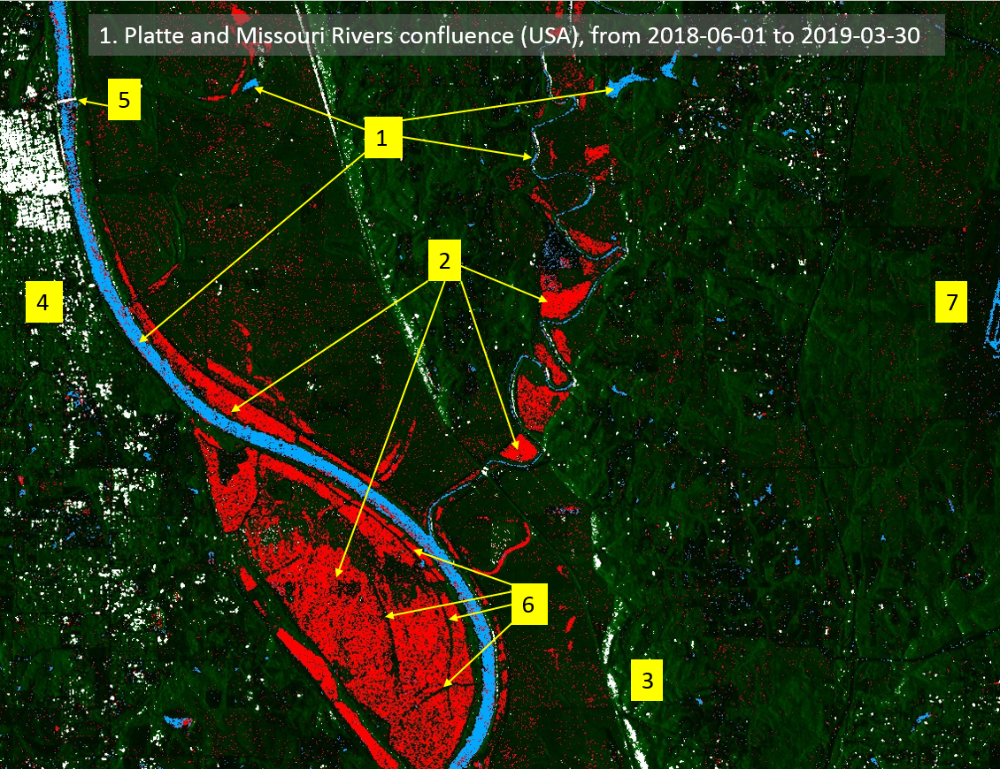
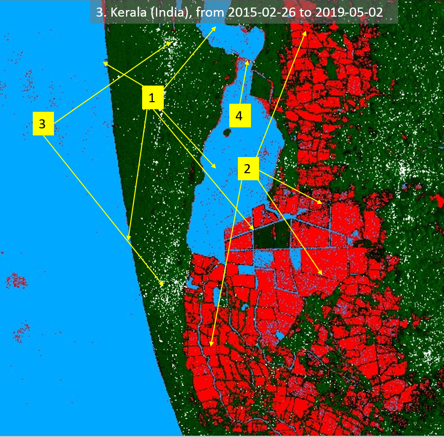
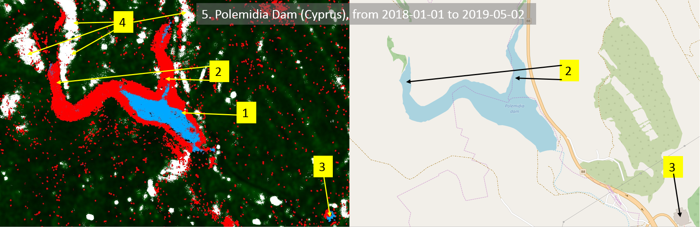

# Seldom and Regular Water Surface Detection Script

<a href="#" id='togglescript'>Show</a> script or [download](script.js){:target="_blank"} it.


      


## Evaluate and visualize
- [Example 1](https://sentinel-hub.github.io/custom-scripts/sentinel-1/seldom_and_regular_water_surface_detection/example1.html){:target="_blank"}

## General description of the script

The main goal of the script is to identify possible seldom water zones (flood areas, karst lakes, sinkholes, springs, etc.; red colour) and regular water zones (lake, river, etc.; blue colour) in a selected timeline. In addition, the script identifies locations with high inclinations of terrain (building, road, bridge, ridge, cliff, mountain, hill, etc.; white colour).

Results of the script can be used as a basic tool for warning flood maps. Alternately, the script can be also used for monitoring water surface extend in (artificial) lakes or open reservoirs. Therefore, the script is used as disaster management and prevention regarding floods and water resources. 

The script must be used only in multi-temporal processing with a fair number of samples (cca. 30). Value of data (VV, VH, etc.) varies strongly with satellite orbit in mountain areas. Therefore, the script might not be as useful as in flat or low hills areas. In addition, detection of flash floods is almost impossible as a result of resolution (10m) and time limit (usually maximum is only one image per day).

It is important to point out that also false detections of water areas are present. Therefore, identification of flood zones should be focused on wider unified areas. In combination with other data (e.g. Sentinel-2, DEM), identification of seldom water zones could be improved. Further, limiting parameters for classification could be adjusted for different areas around the world. Reasonably, other data (VH, HH) and detailed analysis (statistics, machine learning, etc.) could be used to improve the script. In the interest of simplicity and performance, only VV data was used.

Considerable limitation for multi-temporal analysis is orbit boundary where NaN value is returned as the maximum value of the selected data (VV, VH, etc.). Therefore, the script is not applicable in areas with orbit boundary. The script is based on Sentinel-1 data, which has a considerable advantage over some other data (e.g. Sentinel-2) as it is not affected by rainfall, clouds or illumination.

The script works on the basis of simple summary values of VV (avg, min, max, 95th percentile, VVi*50) for every pixel in the selected timeline. Recommended limiting parameters are VVminLim=0.02, VV50lim=1, percLim=0.1 and onlySeldomWater=false. However, limiting parameters might need to be adjusted depending on the location around world (usual orbit of the satellite, general inclination of the terrain, climate, etc.). Every pixel is checked if it is outside Map bounds (VVmin==VVmax). Water presence (regular or seldom) is identified with conditions VVmin<=VVminLim and VV50<VV50lim. VV50 variable is lower in case of higher probability for water surface. On the basis of water presence classification, seldom water presence classification is done with condition VV 95th >= percLim. Pixels without water presence are checked for high inclination classification on basis of condition VV 95th >= 0.8.

Needed WMS settings in a layer are described in a comment of the script.

## Author of the script

Mohor Gartner

## Description of representative images

1. Platte and Missouri Rivers confluence (USA)

In the middle of March 2019, snow melt with heavy rainfall caused widespread flooding in the USA. With a custom script, a wide area of the Missouri and Platte Rivers confluence was analyzed for a timeline from 1.6.2018 to 30.03.2019. Main channels of the rivers and some regularly inundated areas are marked with blue colour (1). Wider red colour zones represent flood zones and zones with seldom presence of water (2). Smaller zones with high inclination are marked with white colour. Some of the higher inclinations are visible near road MO-45 (3). Further, the city center of Leavenworth (Kansas) with taller and sizable buildings is identified (4). Even the bridge over Missouri River can be found (5). On the widest flood zone, there is a possibility that roads are higher than the flood water level was, therefore roads are not identified as flood zone (6). On the east part of the analyzed area, there is false detection of regular water zone. In reality that is the location of Kansas City International Airport runway (7). It is usually hard to separate detection of water and smooth surfaces, therefore this kind of false detection is expected. In addition, the general noise of false water surface detection can be seen as individual pixels or small surfaces are coloured blue and red. Although, in case of high rainfall, later false detections could also mean water surface presence in reality.

2. Intermittent Lake Cerknica (Slovenia)

Lake Cerknica is situated on karst area. Therefore, it can happen that in the summer, the lake disappears. With a custom script, the area was analyzed from 1.6.2018 to 28.4.2019. As lake level and extend varies regularly, there are just small zones identified with regular water presence (1). Other identified water surface is seldom in red. Compared to OpenStreetMap, the outer boundary of the lake is similar to lake boundary defined by a custom script (2). East side of the lake shows the identification of seldom water presence (red) and high inclination (white) (3). In reality, the high inclination is detected when the lake is dry as uneven terrain is present, probably by presence of uvalas (karst depressions). It seems that custom script or even Sentinel cannot detect narrow streams because of resolution (10m) or even because of dense vegetation is present. It can even be implied, that some of the streams are not even detected with seldom water presence (4). Although, it seems that parallel with identified streams, there are roads and dense vegetation which potentially could have a higher elevation than maximum water elevation of the lake in the analyzed timeline. That would explain custom script not identifying the area with water presence. Dense urban areas are identified as some of the white zones as the high inclination is detected because of buildings (5). As explained in the script description, areas with hills or mountains could be problematic. In the example, some high inclination is identified where there are hills west and south from the lake (6).

3. South Kerala (India)

India is a country, which has the most people exposed to floods on average each year. With the custom script, south part of Kerala state was analyzed from 26.2.2015 to 2.5.2019. The coastline, lagoon boundary, and water channels are clearly seen and identified as regular water presence (1). In the analyzed area, there is a strong presence of seldom water zones (2). Later is the result of farming lands (rice fields) and floods, especially severe floods in from July to August 2018. As the analyzed area is mostly flat, high inclination identification mostly highlights dense urban infrastructure (3; Allapuzha, Cherthala) or bridges (4). 

4. The Villages (USA)

The Villages (Florida) is the fastest growing city in the USA. With the custom script, the area was analyzed from 21.9.2015 to 2.5.2019.  Identification of bigger regular water areas is sufficient (1). In general, it would seem there are numerous false identifications of water presence. Although, analyzed area and timeline are extensive, and in general area is flat. Therefore, with small rainfall, wide shallow streams of water are generated. It is observed, that green areas with probable only seldom water presence are identified as areas with regular water presence (2). For better identification, parameters in the custom script should be better calibrated. Nevertheless, bigger water (seldom) areas are identified and should be included in the future urban development of the city. Numerous urban infrastructure is detected as a high inclination (white colour). On the other hand, highways are falsely detected as water areas because of the smooth surfaces (3).

5. Polemidia Dam (Cyprus)

Cyprus has repetitive trouble with fresh water resources. With the custom script, Polemidia Dam was analyzed from 1.1.2018 to 2.5.2019. Minimum (1) and maximum (2) extend of water behind the dam are effectively identified. Later, it is similar to extend of water on OpenStreetMap (2). In 2018 Cyprus experienced high drought. On the contrary, 2019 started with high amounts of rainfall and in April 2019, water reservoirs were full in Cyprus. Nevertheless, there are small areas with false identification of water presence, which could be also explained that they were detected in rainfall event. Although, the flat roof of the stadium is falsely identified as water area (3). As this is a mountainous area, the high inclination was also detected (4).
