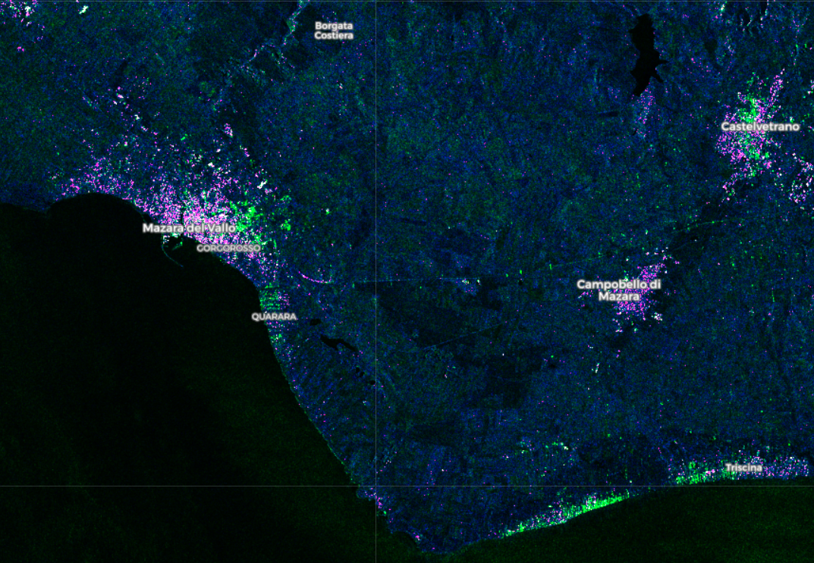

# Urban Areas Script

## Evaluate and visualize   
 - [EO Browser](https://apps.sentinel-hub.com/eo-browser/?lat=44.51260&lng=11.35008&zoom=13&time=2019-05-26&preset=CUSTOM&datasource=Sentinel-1%20AWS%20(S1-AWS-IW-VVVH)&layers=VV,VH,HH&evalscript=cmV0dXJuIFs1LjUgKiBWSCA%2BIDAuNSwgVlYsIFZIICogOF07){:target="_blank"}
 Constrains: the script works only on data located on AWS.

## General description of the script

The script is useful for locating urban areas and individual buildings. It uses VH and VV polarizations to highlight different buildings and topology orientations with purple and green colors. Radar is very accurate; it detects almost every building and is not obstructed by clouds. It can be used to track urban expansion, to detect illegally built buildings, estimate building type or locate buildings in high-risk areas (such as floods).

The script is useful for land cover/use classification, including soil and rock type classification on barren grounds. It shows land cover and land use in a natural and pleasing way, separating various vegetation types, agriculture, barren ground, water, snow, and dwellings. The barren ground is colored in hues from yellow to dark brown, depending on soil or rock type. Urban areas also appear brown or orange. Completely barren ground, such as landslides, stone quarries or barren agriculture fields appear bright orange and are thus easy to differentiate. For example, stone quarries pop out especially clearly. Water bodies appear black and are easily differentiated from other elements. Forests have various shades of green, ranging from dark green to aqua, based on vegetation type and health, since color variations look like those of infrared false color composite. Grass fields are always relatively lighter green. Other types of vegetation, such as dry grass or makia have different, darker colors.

The script is especially useful in developing regions and remote areas, where vector data about buildings are not readily available. It should be noted, that the script recognizes only the top layer, be it vegetation, soil, sand or rock. Rock or soil types can only be differentiated, if they are not covered in vegetation or sand (such as in The Eye of Sahara). For example, an area might at a first glance seem barren and thus to have a different mineral structure but is in reality covered in dry grass. However, it does not work in high elevation areas, where snow and high elevation differences are also highlighted and it becomes difficult to separate urban areas from them. The script does not work well under clouds, which are colored differently, ranging from white, yellow, pink, red and blue, due to the water vapor band. Although it might be useful for cloud identification, smaller clouds can mislead about what is on the surface.

## Author of the script

Monja Sebela

## Description of representative images

Visualization of urban areas in Bologna, Italy with the urban areas script:
