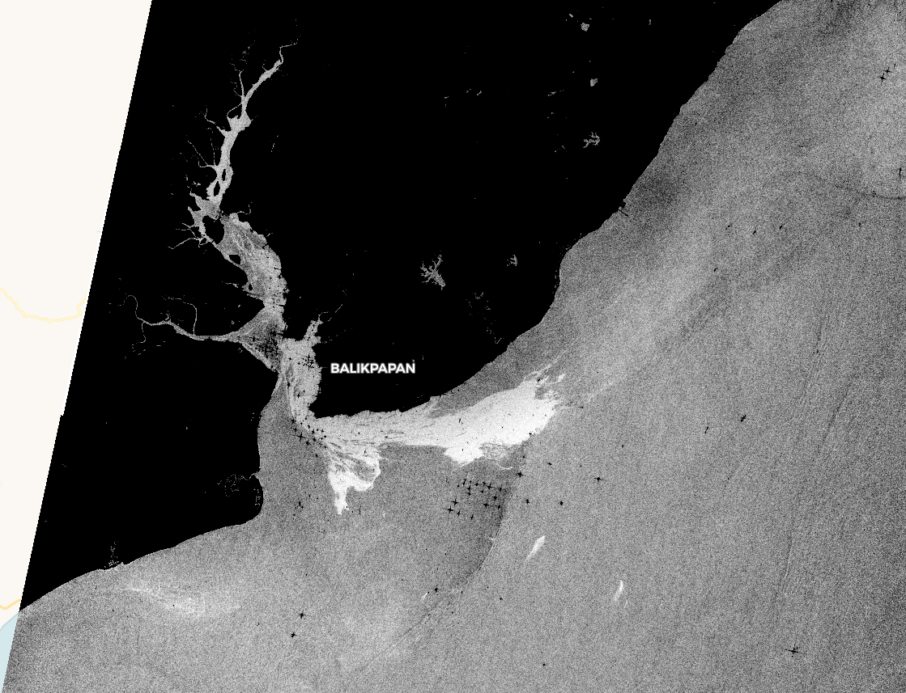
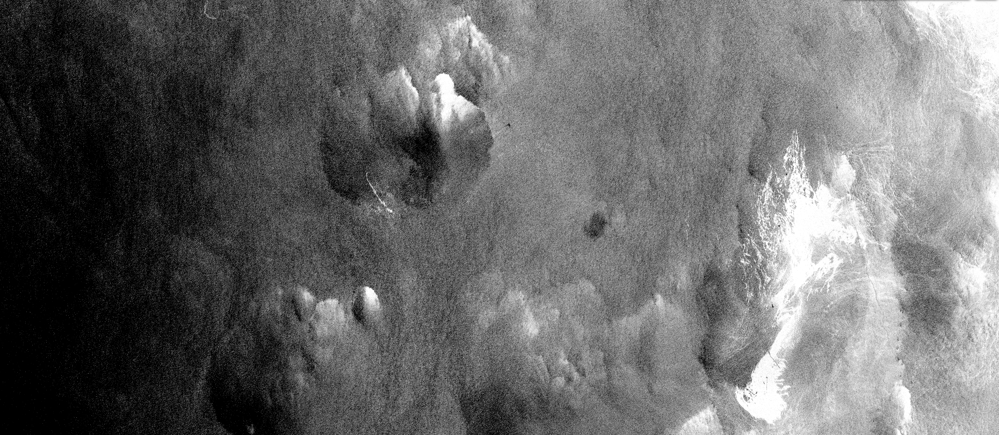

## Description
The script visualizes the Water Surface Roughness from Sentinel-1 data. It helps in maritime monitoring (ship monitoring, oil pollution monitoring, sea currents, ...).

## Contributors:
- [Annamaria Luongo](https://twitter.com/annamaria_84){:target="_blank"}   

## Examples:
### Oil Spill Balikpapan Indonesia, 1/4/2018  
- [EO Browser](https://apps.sentinel-hub.com/eo-browser/?lat=-1.2304&lng=116.8942&zoom=11&time=2018-04-01&preset=CUSTOM&datasource=Sentinel-1%20AWS%20(S1-AWS-IW-VVVH)&layers=VV,VH,HH&evalscript=Ly8gc2NyaXB0IFdhdGVyIHN1cmZhY2Ugcm91Z2huZXNzCnZhbCA9IE1hdGgubG9nKDAuMDUvKDAuMDE4K1ZWKjEuNSkpOwpyZXR1cm4gW3ZhbF07){:target="_blank"}   

### Oil Spill Grande America, 19/3/2019
- [EO Browser](https://apps.sentinel-hub.com/eo-browser/?lat=45.6409&lng=-5.0050&zoom=10&time=2019-03-19&preset=CUSTOM&datasource=Sentinel-1%20AWS%20(S1-AWS-IW-VVVH)&layers=VV,VH,HH&evalscript=Ly8gc2NyaXB0IFdhdGVyIHN1cmZhY2Ugcm91Z2huZXNzCnZhbCA9IE1hdGgubG9nKDAuMDUvKDAuMDE4K1ZWKjEuNSkpOwpyZXR1cm4gW3ZhbF07 ){:target="_blank"}   

### Adriatic Sea Currents  

- [EO Browser](https://apps.sentinel-hub.com/eo-browser/?lat=44.823&lng=13.646&zoom=9&time=2018-07-07&preset=CUSTOM&datasource=Sentinel-1%20AWS%20(S1-AWS-IW-VVVH)&layers=VV,VH,HH&evalscript=Ly8gc2NyaXB0IFdhdGVyIHN1cmZhY2Ugcm91Z2huZXNzCnZhbCA9IE1hdGgubG9nKDAuMDUvKDAuMDE4K1ZWKjEuNSkpOwpyZXR1cm4gW3ZhbF07 ){:target="_blank"}   

