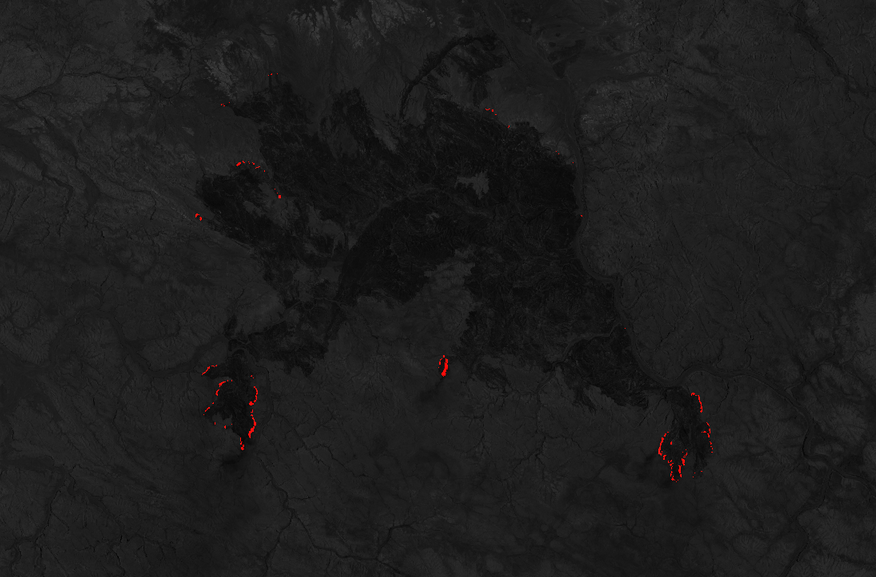

## General description

The script for Sentinel-2 identifies active fire points, offering valuable information for monitoring fire spots in any area. The data output of this script is equivalent to generating an online database of active fire points, such as firms.modaps.eosdis.nasa.gov, but for a smaller range and with a time interval of once every 5 days.

This script is also available for [Sentinel-3 SLSTR](https://custom-scripts.sentinel-hub.com/slstr/active_fire_points_detection/).

## Author of the script

 - [TIZNEGAR Startup co](https://tiznegar.com/)

## Description of representative images

[California wildfires, 2018](https://apps.sentinel-hub.com/eo-browser/?zoom=11&lat=37.67429&lng=-119.76883&themeId=WILDFIRES-NORMAL-MODE&datasetId=S2L2A&fromTime=2018-08-05T00%3A00%3A00.000Z&toTime=2018-08-05T23%3A59%3A59.999Z&visualizationUrl=https%3A%2F%2Fservices.sentinel-hub.com%2Fogc%2Fwms%2Faae18701-6b25-4001-8b2a-b98a1b3806c1&evalscript=Ly9JZGVudGlmeSBhY3RpdmUgZmlyZSBwb2ludHMKLy9ieSBUaXpuZ2VyIHN0YXJ0dXAgY28KLy93d3cudGl6bmVnYXIuY29tCgovL1RvIGluY3JlYXNlIHRoZSBhY2N1cmFjeSBvZiBhbHRpdHVkZSA8M2ttIE9yIHpvb20gPjEyCi8vRm9yIFNlbnRpbmVsLTIKLy9DbG91ZCBtYXNrCnZhciBOR0RSID0gaW5kZXgoQjAyLCBCMDMpOwp2YXIgSW52ZXJzZSA9IChCMDIgLSAwLjIpIC8gKDAuNSAtIDAuMik7Ci8vRmlyZSBpbmRpY2F0b3IKdmFyIFNBSE1fSU5ERVg9ICgoQjEyIC0gQjExKSAvIChCMTIgKyBCMTEpKTsKCmlmIChJbnZlcnNlID4gMSkgeyAKICAgIHJldHVybiBbMC41ICogQjA0LCAwLjUgKiBCMDMsIDIwICogQjAyIF07Cn0KCmlmIChJbnZlcnNlID4gMCAmJiBOR0RSPjApIHsgCiAgICByZXR1cm4gWzAuNSAqIEIwNCAgLCAwLjUgKiBCMDMsIDIwICogQjAyXTsKfQoKaWYoKFNBSE1fSU5ERVg%2BMC40KXx8KEIxMj4xKSl7CiAgcmV0dXJuWzIwKkIwNCwgMSpCMDMsIDEqQjAyXTsKfQoKZWxzZSB7CiByZXR1cm4gW0IwNCxCMDQsQjA0XQp9CgovL1JlZCBjb2xvciBpbmRpY2F0ZXMgYWN0aXZlIGZpcmUgYXJlYXMgYW5kIHBvaW50cwovL1RoZSBibHVlIHJhbmdlIGlzIGEgY2xvdWQgbWFzaw%3D%3D&upsampling=BILINEAR#custom-script), acquired on August 5, 2019, processed by Sentinel Hub.

[Croatia wildfires, 2017](https://apps.sentinel-hub.com/eo-browser/?zoom=11&lat=43.4918&lng=16.619&themeId=WILDFIRES-NORMAL-MODE&datasetId=S2L2A&fromTime=2017-07-17T00%3A00%3A00.000Z&toTime=2017-07-17T23%3A59%3A59.999Z&visualizationUrl=https%3A%2F%2Fservices.sentinel-hub.com%2Fogc%2Fwms%2Faae18701-6b25-4001-8b2a-b98a1b3806c1&evalscript=Ly9JZGVudGlmeSBhY3RpdmUgZmlyZSBwb2ludHMKLy9ieSBUaXpuZ2VyIHN0YXJ0dXAgY28KLy93d3cudGl6bmVnYXIuY29tCgovL1RvIGluY3JlYXNlIHRoZSBhY2N1cmFjeSBvZiBhbHRpdHVkZSA8M2ttIE9yIHpvb20gPjEyCi8vRm9yIFNlbnRpbmVsLTIKLy9DbG91ZCBtYXNrCnZhciBOR0RSID0gaW5kZXgoQjAyLCBCMDMpOwp2YXIgSW52ZXJzZSA9IChCMDIgLSAwLjIpIC8gKDAuNSAtIDAuMik7Ci8vRmlyZSBpbmRpY2F0b3IKdmFyIFNBSE1fSU5ERVg9ICgoQjEyIC0gQjExKSAvIChCMTIgKyBCMTEpKTsKCmlmIChJbnZlcnNlID4gMSkgeyAKICAgIHJldHVybiBbMC41ICogQjA0LCAwLjUgKiBCMDMsIDIwICogQjAyIF07Cn0KCmlmIChJbnZlcnNlID4gMCAmJiBOR0RSPjApIHsgCiAgICByZXR1cm4gWzAuNSAqIEIwNCAgLCAwLjUgKiBCMDMsIDIwICogQjAyXTsKfQoKaWYoKFNBSE1fSU5ERVg%2BMC40KXx8KEIxMj4xKSl7CiAgcmV0dXJuWzIwKkIwNCwgMSpCMDMsIDEqQjAyXTsKfQoKZWxzZSB7CiByZXR1cm4gW0IwNCxCMDQsQjA0XQp9CgovL1JlZCBjb2xvciBpbmRpY2F0ZXMgYWN0aXZlIGZpcmUgYXJlYXMgYW5kIHBvaW50cwovL1RoZSBibHVlIHJhbmdlIGlzIGEgY2xvdWQgbWFzaw%3D%3D&upsampling=BILINEAR#custom-script), acquired on July 17, 2017, processed by Sentinel Hub.

[Australia wildfires, 2019](https://apps.sentinel-hub.com/eo-browser/?zoom=12&lat=-21.9374&lng=116.6572&themeId=WILDFIRES-NORMAL-MODE&datasetId=S2L2A&fromTime=2019-01-05T00%3A00%3A00.000Z&toTime=2019-01-05T23%3A59%3A59.999Z&visualizationUrl=https%3A%2F%2Fservices.sentinel-hub.com%2Fogc%2Fwms%2Faae18701-6b25-4001-8b2a-b98a1b3806c1&evalscript=Ly9JZGVudGlmeSBhY3RpdmUgZmlyZSBwb2ludHMKLy9ieSBUaXpuZ2VyIHN0YXJ0dXAgY28KLy93d3cudGl6bmVnYXIuY29tCgovL1RvIGluY3JlYXNlIHRoZSBhY2N1cmFjeSBvZiBhbHRpdHVkZSA8M2ttIE9yIHpvb20gPjEyCi8vRm9yIFNlbnRpbmVsLTIKLy9DbG91ZCBtYXNrCnZhciBOR0RSID0gaW5kZXgoQjAyLCBCMDMpOwp2YXIgSW52ZXJzZSA9IChCMDIgLSAwLjIpIC8gKDAuNSAtIDAuMik7Ci8vRmlyZSBpbmRpY2F0b3IKdmFyIFNBSE1fSU5ERVg9ICgoQjEyIC0gQjExKSAvIChCMTIgKyBCMTEpKTsKCmlmIChJbnZlcnNlID4gMSkgeyAKICAgIHJldHVybiBbMC41ICogQjA0LCAwLjUgKiBCMDMsIDIwICogQjAyIF07Cn0KCmlmIChJbnZlcnNlID4gMCAmJiBOR0RSPjApIHsgCiAgICByZXR1cm4gWzAuNSAqIEIwNCAgLCAwLjUgKiBCMDMsIDIwICogQjAyXTsKfQoKaWYoKFNBSE1fSU5ERVg%2BMC40KXx8KEIxMj4xKSl7CiAgcmV0dXJuWzIwKkIwNCwgMSpCMDMsIDEqQjAyXTsKfQoKZWxzZSB7CiByZXR1cm4gW0IwNCxCMDQsQjA0XQp9CgovL1JlZCBjb2xvciBpbmRpY2F0ZXMgYWN0aXZlIGZpcmUgYXJlYXMgYW5kIHBvaW50cwovL1RoZSBibHVlIHJhbmdlIGlzIGEgY2xvdWQgbWFzaw%3D%3D&upsampling=BILINEAR#custom-script), acquired on January 5, 2019, processed by Sentinel Hub.

